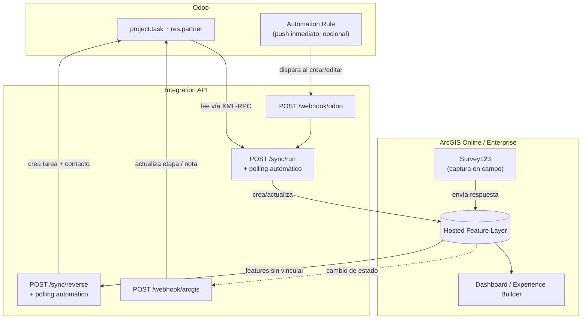
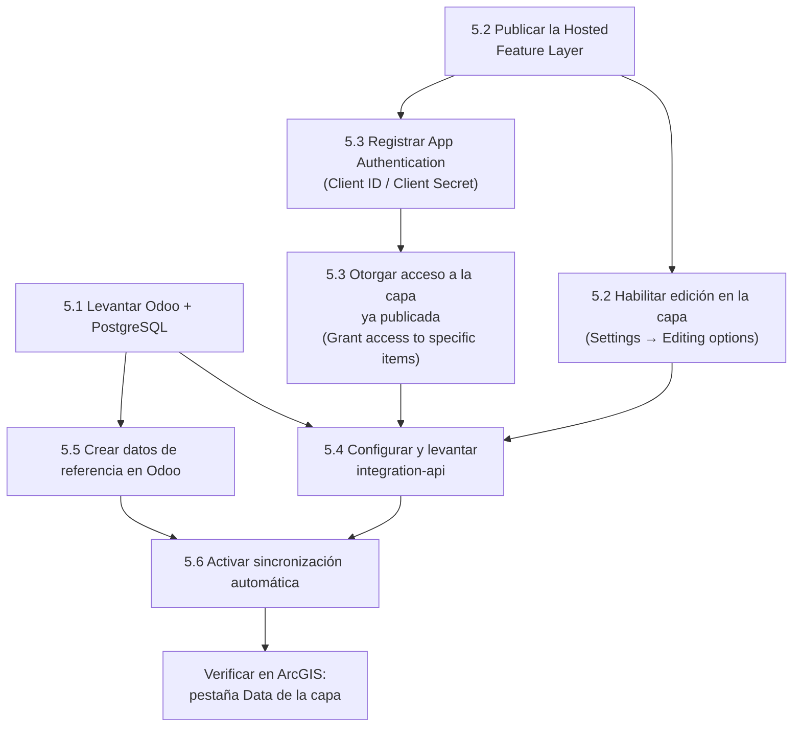
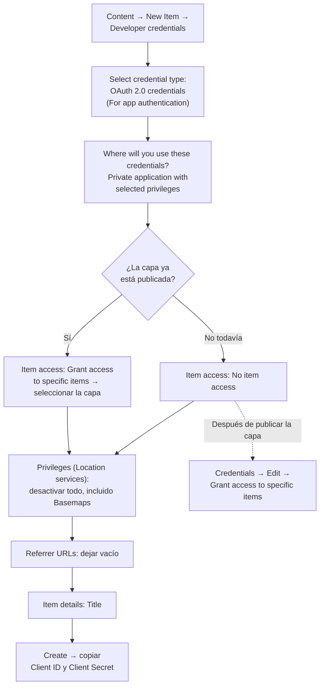

# Integración Odoo ↔ ArcGIS Online / Enterprise — flujo de extremo a extremo

Este proyecto muestra una integración entre **Odoo** y **ArcGIS Online / ArcGIS Enterprise** mediante un microservicio encargado de sincronizar información en ambos sentidos.

El flujo incorpora también **Survey123** para captura de información en campo y **Dashboard / Experience Builder** para consultar y visualizar los datos desde una misma fuente.

El caso de uso utilizado como referencia corresponde a la gestión de **solicitudes ciudadanas** dentro de un entorno municipal.

---

## 1. Caso de uso

Cada solicitud ciudadana se registra en Odoo como un `project.task`. La tarea se relaciona con un contacto (`res.partner`) que representa al ciudadano que realizó la solicitud.

El contacto puede almacenar, además de sus datos básicos, las coordenadas geográficas de su ubicación mediante los campos `partner_latitude` y `partner_longitude`, proporcionados por `base_geolocalize`.

### 1.1 Modelo de datos

La información del ciudadano y la solicitud se mantiene separada porque cumplen funciones diferentes dentro de Odoo:

- `res.partner`: representa al ciudadano y contiene información como nombre, dirección, teléfono y coordenadas.
- `project.task`: representa la solicitud y contiene su descripción, estado y relación con el ciudadano mediante `partner_id`.

De esta forma, una persona puede tener varias solicitudes a lo largo del tiempo sin duplicar su información de contacto.

El ejemplo utiliza el módulo **Project** disponible en Odoo Community. Para activarlo:

**Apps → Project → Activate**

No es necesario utilizar módulos de pago ni desarrollar módulos personalizados para reproducir el flujo descrito en este proyecto.

Para un escenario productivo, sería recomendable implementar un modelo de negocio específico que permita manejar aspectos como SLA, archivos adjuntos, responsables y asignación de cuadrillas. Esta alternativa se comenta en la sección [11. Consideraciones para producción](#11-consideraciones-para-producción).

---

## 2. Arquitectura del flujo

La integración utiliza un microservicio intermedio para mantener sincronizados Odoo y ArcGIS.



La sincronización se puede ejecutar de cuatro maneras:

| Endpoint | Dirección | Cuándo se ejecuta |
|---|---|---|
| `POST /sync/run` | Odoo → ArcGIS | Manualmente, mediante polling o desde `/webhook/odoo` |
| `POST /webhook/odoo` | Odoo → ArcGIS | Cuando una Automation Rule de Odoo detecta una creación o modificación |
| `POST /sync/reverse` | ArcGIS → Odoo | Manualmente o mediante polling para detectar nuevos registros |
| `POST /webhook/arcgis` | ArcGIS → Odoo | Cuando cambia el estado de una entidad ya vinculada |

El polling permite mantener el ejemplo sencillo y no depende de configuraciones adicionales. Los webhooks pueden utilizarse cuando se necesita una actualización más inmediata.

---

## 3. Estructura del proyecto

```text
IntegracionOdooArcGIS/
├── docker-compose.yml
├── .env.example
├── odoo/
│   ├── config/odoo.conf
│   └── addons/
├── integration-api/
│   ├── Dockerfile
│   ├── requirements.txt
│   ├── .env.example
│   └── app/
│       ├── main.py               # endpoints + scheduler
│       ├── config.py             # configuración y App Authentication
│       ├── schemas.py
│       ├── odoo_client.py        # XML-RPC: project.task + res.partner
│       ├── arcgis_client.py      # ArcGIS API for Python
│       └── sync.py               # lógica de sincronización
├── scripts/
│   ├── requirements.txt
│   ├── seed_odoo_demo_data.py
│   ├── create_arcgis_feature_layer.py
│   └── plantilla_capa_arcgis.csv
└── README.md
```

El proyecto está separado en tres partes principales:

- **Odoo + PostgreSQL**: almacena las solicitudes y los ciudadanos.
- **Integration API**: contiene la lógica que conecta ambos sistemas.
- **Scripts**: permiten preparar datos de demostración y crear la capa de ArcGIS.

---

## 4. Requisitos previos

Antes de iniciar el proyecto se necesita contar con:

- Docker y Docker Compose v2.
- Una organización de **ArcGIS Online** con permisos para publicar Hosted Feature Layers, o una instalación de **ArcGIS Enterprise** con permisos equivalentes.
- Python 3.10–3.13 para ejecutar los scripts auxiliares.
- Puerto `8069` disponible para Odoo.
- Puerto `8000` disponible para la Integration API.

Si la cuenta de ArcGIS utiliza **MFA o SSO corporativo**, no se debe asumir que el inicio de sesión mediante usuario y contraseña funcionará. En ese caso, es necesario utilizar **App Authentication**, explicado en la sección [5.3](#53-configuración-de-autenticación).

---

# 5. Despliegue

El despliegue está dividido en varios pasos porque algunas configuraciones dependen de recursos creados previamente.

En particular, primero debe existir la Hosted Feature Layer antes de poder limitar el acceso de una aplicación a ese elemento.



Los pasos **5.1** y **5.2/5.3** pueden realizarse de forma independiente.

Dentro de ArcGIS, en cambio, la secuencia importante es:

1. Publicar la capa.
2. Configurar su edición.
3. Registrar la aplicación.
4. Dar a la aplicación acceso a la capa.

---

## 5.1 Levantar Odoo y PostgreSQL

Desde la raíz del proyecto:

```bash
cp .env.example .env
docker compose up -d db odoo
docker compose logs -f odoo
```

Es necesario esperar hasta que Odoo indique que el servicio HTTP está disponible, por ejemplo:

```text
HTTP service (werkzeug) running
```

Luego se puede acceder desde:

```text
http://localhost:8069
```

Durante la configuración inicial crea una base de datos llamada:

```text
odoo_demo
```

El nombre debe coincidir con el valor definido en `ODOO_DB` y con la configuración de `dbfilter` utilizada en `odoo.conf`.

Una vez creada la base, activa el módulo:

**Apps → Project → Activate**

---

## 5.2 Crear la Hosted Feature Layer en ArcGIS

La capa puede crearse automáticamente utilizando el script incluido en el proyecto.

Desde la carpeta `scripts`:

```bash
cd scripts
python -m venv .venv
```

En Windows:

```bash
.venv\Scripts\activate
```

En Linux/macOS:

```bash
source .venv/bin/activate
```

Instala las dependencias:

```bash
pip install -r requirements.txt
```

Copia el archivo de configuración:

```bash
cp ../integration-api/.env.example .env
```

Completa los valores correspondientes:

```text
ARCGIS_USERNAME
ARCGIS_PASSWORD
ARCGIS_URL
```

Finalmente:

```bash
python create_arcgis_feature_layer.py
```

El script crea la Hosted Feature Layer con las capacidades necesarias:

```text
Create,Delete,Query,Update,Editing
```

Por lo tanto, cuando la capa se crea mediante el script no es necesario habilitar manualmente la edición.

### Publicación manual

La publicación manual es especialmente útil cuando la organización utiliza **MFA**, SSO o cuando el Hosting Server de Enterprise presenta problemas durante la creación automática.

El procedimiento es:

1. Entrar a ArcGIS Online o Portal.
2. Ir a **Content → New Item**.
3. Seleccionar la opción para cargar un archivo.
4. Utilizar:

```text
scripts/plantilla_capa_arcgis.csv
```

5. Continuar con el asistente de publicación.
6. ArcGIS reconocerá los campos `latitude` y `longitude` para crear la geometría de puntos.
7. Publicar la capa.

Después de publicarla, guarda el **Item ID**. Se puede identificar directamente desde la URL:

```text
.../home/item.html?id=XXXXXXXX
```

La Integration API utiliza ese identificador para localizar la capa.

Ambos métodos de publicación son compatibles con el resto del proyecto.

El código también identifica de forma dinámica el campo `ObjectID`, por lo que puede trabajar tanto con:

```text
OBJECTID
```

como con:

```text
objectid
```

### Habilitar edición después de una publicación mediante CSV

Cuando la capa se publica desde un CSV, la edición puede quedar deshabilitada inicialmente.

En ese caso:

1. Abrir la capa.
2. Ir a **Settings**.
3. Buscar **Editing options**.
4. Activar **Enable editing**.
5. En las capacidades de edición permitir al menos:
   - Add
   - Update
   - Attributes
   - Geometry
6. Guardar los cambios.

Este paso es necesario porque, aunque el usuario o la aplicación tengan permisos sobre el elemento, una capa que no permite edición no aceptará llamadas como `edit_features()`.

Cuando esto ocurre, la API puede devolver:

```text
This operation is not supported
```

con código:

```text
400
```

---

## 5.3 Configuración de autenticación

La Integration API puede autenticarse contra ArcGIS de dos formas:

| Escenario | Configuración |
|---|---|
| Cuenta sin MFA | `ARCGIS_USERNAME` / `ARCGIS_PASSWORD` |
| MFA o SSO corporativo | `ARCGIS_CLIENT_ID` / `ARCGIS_CLIENT_SECRET` |
| Enterprise con certificado autofirmado | Configuración anterior + `ARCGIS_VERIFY_CERT=False` |

Para entornos donde se utiliza MFA o SSO, se recomienda **App Authentication**, ya que el microservicio no necesita realizar un inicio de sesión interactivo.

### Crear las credenciales de la aplicación

En ArcGIS:

**Content → My Content → New item → Developer credentials**

Selecciona:

```text
OAuth 2.0 credentials
```

y específicamente la opción:

```text
For app authentication
```

No se debe seleccionar la opción destinada al inicio de sesión interactivo de usuarios.

El flujo completo es:



### Configuración paso a paso

**1. Crear las credenciales**

Ve a:

**Content → My Content → New item → Developer credentials**

---

**2. Seleccionar el tipo de credencial**

Selecciona:

```text
OAuth 2.0 credentials
```

y dentro de esta opción:

```text
For app authentication
```

Esta es la modalidad utilizada por el backend para autenticarse sin intervención de un usuario.

---

**3. Definir dónde se utilizarán las credenciales**

Selecciona:

```text
Private application with selected privileges
```

No es necesario otorgar todos los privilegios disponibles.

---

**4. Configurar el acceso a elementos**

Si la capa todavía no existe:

```text
No item access
```

Si la capa ya fue publicada:

```text
Grant access to specific items
```

Después:

```text
Browse items
```

y selecciona la Hosted Feature Layer creada en el paso anterior.

Si la aplicación se creó antes que la capa, el acceso se puede configurar posteriormente editando las credenciales.

---

**5. Configurar los privilegios**

El proyecto solamente necesita consultar y modificar entidades de la capa.

No utiliza servicios de:

- Basemaps
- Geocoding
- Routing
- Data enrichment

Por lo tanto, estos privilegios pueden permanecer desactivados, incluido **Basemaps**.

---

**6. Referrer URLs**

Para esta integración se deja el campo vacío.

La razón es que el `Client Secret` se utiliza exclusivamente desde el backend y nunca se expone al navegador.

---

**7. Información de la aplicación**

Define un título, por ejemplo:

```text
integration-api-odoo
```

El título es obligatorio.

Después selecciona:

```text
Create
```

---

**8. Guardar las credenciales**

En la sección de la aplicación aparecerán:

```text
Client ID
Client Secret
```

Guárdalos en un lugar seguro.

El `Client Secret` debe tratarse con el mismo cuidado que una contraseña. En particular, no debe incluirse en el repositorio, capturas de pantalla o archivos compartidos.

Si inicialmente seleccionaste `No item access`, una vez publicada la capa puedes volver a:

**Credentials → Edit → Grant access to specific items**

y seleccionar la capa correspondiente.

### Dos permisos diferentes

Es importante distinguir entre:

**Acceso de la aplicación al elemento**

y

**Capacidad de edición de la capa**.

El primero se configura mediante:

```text
Grant access to specific items
```

El segundo se configura desde:

```text
Settings → Editing
```

Si falta el acceso al elemento, es posible obtener un:

```text
403
```

Si la aplicación tiene acceso, pero la capa no permite edición, una operación de edición puede devolver:

```text
400 - This operation is not supported
```

### ArcGIS Enterprise

En ArcGIS Enterprise el procedimiento es equivalente.

La diferencia principal es que `ARCGIS_URL` debe apuntar a la URL del Portal accesible mediante el Web Adaptor, en lugar de:

```text
https://www.arcgis.com
```

La disponibilidad de algunas opciones puede variar según la versión y configuración de Enterprise.

Una vez configurado `ARCGIS_CLIENT_ID` y `ARCGIS_CLIENT_SECRET`, `arcgis_client.py` utiliza estas credenciales para conectarse sin solicitar un inicio de sesión interactivo.

---

## 5.4 Configurar y levantar la Integration API

Desde la raíz del proyecto:

```bash
cd integration-api
cp .env.example .env
```

Completa las variables relacionadas con:

```text
ODOO_*
ARCGIS_*
```

y añade el identificador de la capa:

```text
ARCGIS_FEATURE_LAYER_ITEM_ID
```

Este valor corresponde al Item ID obtenido durante la publicación de la Hosted Feature Layer.

Después vuelve a la raíz del proyecto:

```bash
cd ..
docker compose up -d --build integration-api
```

Para revisar el arranque:

```bash
docker compose logs -f integration-api
```

La API debería quedar disponible en:

```text
http://localhost:8000
```

Puedes comprobar el estado con:

```text
http://localhost:8000/health
```

La respuesta esperada es:

```json
{
  "status": "ok"
}
```

La documentación interactiva de FastAPI está disponible en:

```text
http://localhost:8000/docs
```

---

## 5.5 Crear datos de referencia en Odoo

El proyecto incluye un script para generar información de demostración.

Desde la carpeta `scripts`:

```bash
python seed_odoo_demo_data.py
```

El script crea ocho solicitudes de ejemplo, incluyendo:

- proyecto;
- tareas;
- contactos;
- relación entre las tareas y sus respectivos ciudadanos;
- coordenadas de referencia en Quito.

### Alternativa manual

También es posible crear las solicitudes directamente desde Odoo.

1. Ir a **Project**.
2. Abrir el proyecto configurado en `ODOO_PROJECT_NAME`.
3. Por defecto, el proyecto se llama:

```text
Solicitudes Ciudadanas
```

4. Crear una nueva tarea.
5. Asignar un cliente/contacto existente o crear uno nuevo.
6. Verificar que el contacto tenga coordenadas.
7. Guardar la tarea.

Las coordenadas pueden gestionarse desde los campos correspondientes de `res.partner`.

Para una demostración resulta más práctico utilizar los contactos generados por `seed_odoo_demo_data.py`, ya que ya contienen coordenadas.

Una vez creada la tarea, la sincronización la enviará a ArcGIS según el intervalo configurado.

También es posible ejecutar la sincronización manualmente mediante:

```text
POST /sync/run
```

---

## 5.6 Activar la sincronización automática

La Integration API incorpora un scheduler que ejecuta periódicamente la sincronización en ambas direcciones.

El intervalo se define mediante:

```text
SYNC_INTERVAL_MINUTES
```

Por ejemplo:

```text
SYNC_INTERVAL_MINUTES=2
```

Después de modificar `.env`, es importante recrear el contenedor:

```bash
docker compose up -d --force-recreate integration-api
```

En este caso se utiliza `--force-recreate` en lugar de `restart`, ya que un simple reinicio del contenedor no garantiza que se vuelvan a cargar los valores modificados del `.env`.

En los logs debería aparecer un mensaje similar a:

```text
Sincronización automática (ambas direcciones) activada cada 2 minutos
```

A partir de ese momento, una solicitud creada o modificada en Odoo debería aparecer en la Hosted Feature Layer dentro del intervalo configurado.

### Push inmediato desde Odoo

También se puede complementar el polling con una **Automation Rule** para enviar inmediatamente las modificaciones a la Integration API.

En Odoo:

1. Activar el modo desarrollador.
2. Ir a **Technical → Automations**.
3. Crear una nueva regla.
4. Seleccionar el modelo **Project Task**.
5. Configurar el disparador para creación/modificación.
6. Añadir una acción de tipo webhook.
7. Utilizar:

```text
http://integration-api:8000/webhook/odoo
```

Cuando Odoo y la API están dentro de Docker Compose, se debe utilizar el nombre del servicio:

```text
integration-api
```

y no:

```text
localhost
```

---

## 5.7 Ejecutar una sincronización manual

Si se quiere probar el flujo sin esperar al scheduler:

```bash
curl -X POST http://localhost:8000/sync/run
```

Una respuesta correcta puede tener esta estructura:

```json
{
  "ok": true,
  "fetched_from_odoo": 8,
  "created_in_arcgis": 8,
  "updated_in_arcgis": 0,
  "skipped_no_coordinates": 0,
  "errors": []
}
```

Los campos permiten comprobar rápidamente qué ocurrió durante la ejecución:

- `fetched_from_odoo`: registros obtenidos desde Odoo.
- `created_in_arcgis`: entidades nuevas creadas en ArcGIS.
- `updated_in_arcgis`: entidades existentes que fueron actualizadas.
- `skipped_no_coordinates`: registros descartados por no tener coordenadas.
- `errors`: errores encontrados durante el proceso.

---

# 6. Flujo inverso: ArcGIS / Survey123 → Odoo

La integración también funciona en sentido contrario.

Una entidad creada directamente en ArcGIS puede convertirse en una nueva solicitud de Odoo.

Esto permite, por ejemplo, que una persona registre información desde Survey123 y que esa información termine generando automáticamente una tarea en Odoo.

---

## 6.1 Actualizar el estado de una solicitud existente

Cuando una entidad de ArcGIS ya está vinculada con una tarea de Odoo, un cambio de estado puede reflejarse nuevamente en Odoo.

Para una implementación con **Feature Layer Webhooks**, la capa debe tener habilitado el seguimiento de cambios.

En la configuración de la capa:

**Settings → Editing → Keep track of changes to data**

Después se puede configurar un webhook con:

```text
http://<host-accesible>:8000/webhook/arcgis
```

y utilizar el evento:

```text
FeaturesUpdated
```

El payload enviado por un webhook nativo de ArcGIS no tiene necesariamente la misma estructura que el modelo simplificado utilizado por `ArcGISWebhookPayload` en `schemas.py`.

Por eso, para producción sería necesario incorporar un adaptador que transforme el payload nativo antes de procesarlo.

### Prueba manual

Para probar el comportamiento sin configurar un webhook nativo:

```bash
curl -X POST http://localhost:8000/webhook/arcgis \
  -H "Content-Type: application/json" \
  -d '{"odoo_task_id": 3, "new_status": "Approved", "note": "Cuadrilla atendió el reporte"}'
```

El valor de:

```text
new_status
```

debe coincidir exactamente con una etapa existente en:

```text
project.task.type
```

Por ejemplo:

```text
In Progress
Approved
Done
```

Si la etapa no coincide, el cambio de estado no podrá aplicarse directamente. La información recibida todavía puede registrarse como una nota en el chatter de la tarea.

---

## 6.2 Detectar nuevas entidades en ArcGIS

Para revisar si existen entidades que todavía no están vinculadas con Odoo:

```bash
curl -X POST http://localhost:8000/sync/reverse
```

Una respuesta típica es:

```json
{
  "ok": true,
  "created_in_odoo": 2,
  "errors": []
}
```

El proceso busca entidades que no tengan valor en:

```text
odoo_partner_id
```

Cuando encuentra una entidad nueva:

1. crea el contacto en Odoo;
2. crea la tarea asociada;
3. relaciona la tarea con el contacto;
4. escribe el identificador correspondiente en ArcGIS.

De esta manera, la misma entidad no vuelve a procesarse en las siguientes ejecuciones.

---

## 6.3 Incorporar Survey123

No es necesario modificar el código de la Integration API para incorporar Survey123.

El formulario puede utilizar directamente la Hosted Feature Layer creada anteriormente.

El flujo básico es:

1. Abrir **Survey123 Connect** o el diseñador web.
2. Crear un nuevo formulario.
3. Seleccionar la Hosted Feature Layer existente.
4. Mapear las preguntas con los campos de la capa.
5. Publicar el formulario.

Para este ejemplo se pueden utilizar campos como:

```text
name
address
city
phone
email
```

Survey123 obtiene automáticamente la geometría GPS cuando el formulario se configura para capturar la ubicación.

Cada respuesta genera una nueva entidad en la Hosted Feature Layer.

Como inicialmente esa entidad no tiene:

```text
odoo_partner_id
```

la siguiente ejecución de `run_reverse_sync()` la identifica como un nuevo registro y puede crear la información correspondiente en Odoo.

Esto puede ejecutarse mediante polling o de forma manual con:

```text
POST /sync/reverse
```

---

# 7. Visualización con Dashboard / Experience Builder

Una vez que Odoo y ArcGIS comparten la misma capa, se puede utilizar esa información directamente para construir una interfaz de consulta.

No se requiere código adicional para esta parte.

Desde ArcGIS:

1. Crear un **Web Map** utilizando la Hosted Feature Layer.
2. Simbolizar las entidades según el campo `status`.
3. Crear un elemento de tipo **Dashboard** o **Experience Builder**.
4. Añadir componentes como:
   - mapa;
   - lista de entidades;
   - tabla;
   - conteos por estado;
   - filtros.

La misma aplicación puede mostrar tanto las solicitudes originadas en Odoo como aquellas capturadas desde Survey123.

Esto permite utilizar ArcGIS como la vista geográfica y de seguimiento de un proceso cuyo sistema de gestión principal continúa siendo Odoo.

---

# 8. ArcGIS Online frente a ArcGIS Enterprise

La Integration API está diseñada para trabajar con ambos entornos.

| Aspecto | ArcGIS Online | ArcGIS Enterprise |
|---|---|---|
| `ARCGIS_URL` | `https://www.arcgis.com` | URL del Portal mediante Web Adaptor |
| MFA | App Authentication | Depende de la configuración del Portal |
| Certificados | Administrados por Esri | Administrados por la organización |
| Webhooks de capas | Disponibles según configuración | Dependen de versión y componentes |
| Publicación | Hosting administrado por ArcGIS Online | Requiere un Hosting Server configurado |

La lógica de `arcgis_client.py` no cambia entre ambos escenarios.

La diferencia principal se maneja mediante la configuración de:

```text
ARCGIS_URL
```

y las credenciales utilizadas.

En Enterprise también es importante considerar la configuración de certificados y la disponibilidad de un **federated Hosting Server** para publicar Hosted Feature Layers.

---

# 9. Seguridad

Este proyecto está pensado como una referencia técnica y de demostración. Para un entorno productivo deben añadirse controles adicionales.

Algunas consideraciones importantes:

### Variables de entorno

Los archivos `.env` reales no deben subirse al repositorio.

El `.gitignore` ayuda a evitar commits accidentales, pero no protege frente a compartir manualmente el archivo, incluirlo en una captura o enviarlo por otro medio.

### Client Secret

El:

```text
ARCGIS_CLIENT_SECRET
```

debe tratarse como una contraseña.

No debe aparecer en:

- Git;
- README;
- logs;
- capturas de pantalla;
- archivos de configuración compartidos.

### Permisos de la aplicación

La aplicación debe tener únicamente acceso a los elementos que realmente necesita.

Para este proyecto basta con dar acceso específico a la Hosted Feature Layer.

Los privilegios de servicios de ubicación que no se utilizan pueden permanecer deshabilitados.

### Certificados

La opción:

```text
ARCGIS_VERIFY_CERT=False
```

puede ser útil en un laboratorio cuando Enterprise utiliza certificados autofirmados.

No debería utilizarse como configuración permanente en producción.

Desactivar la verificación de certificados puede permitir ataques de tipo **man-in-the-middle** si el tráfico atraviesa redes no confiables.

### Credenciales de Odoo

La contraseña del administrador de Odoo no debería reutilizarse como contraseña para la cuenta utilizada por la Integration API.

Para producción es preferible utilizar una cuenta de servicio con los permisos estrictamente necesarios.

### Webhooks

Los endpoints:

```text
/webhook/arcgis
/webhook/odoo
```

no deberían quedar expuestos públicamente sin algún mecanismo adicional de protección.

Algunas alternativas son:

- shared secret;
- autenticación;
- restricción por origen;
- mTLS;
- reverse proxy con controles de acceso.

---

# 10. Solución de problemas

## La Integration API no inicia

Revisar primero los logs:

```bash
docker compose logs -f integration-api
```

Una causa frecuente es que falte el archivo `.env` o que no esté definido:

```text
ARCGIS_FEATURE_LAYER_ITEM_ID
```

---

## ArcGIS devuelve `Invalid username/password`

Si las credenciales son correctas pero ArcGIS rechaza el inicio de sesión, revisa si la organización utiliza:

- MFA;
- SSO;
- autenticación corporativa.

En estos casos se debe utilizar App Authentication:

```text
ARCGIS_CLIENT_ID
ARCGIS_CLIENT_SECRET
```

---

## `NameResolutionError` con ArcGIS Enterprise

Si el hostname de Enterprise funciona desde Windows, pero no desde el contenedor, puede tratarse de un nombre `.local` resuelto mediante mDNS/LLMNR.

El contenedor puede necesitar una entrada como:

```yaml
extra_hosts:
  - "host:host-gateway"
```

La solución concreta depende de cómo esté publicado el Portal dentro de la red.

---

## `SSLCertVerificationError`

Cuando Enterprise utiliza un certificado autofirmado, Python puede rechazar la conexión.

Para un laboratorio controlado se puede utilizar:

```text
ARCGIS_VERIFY_CERT=False
```

No se recomienda mantener esta configuración en producción.

---

## No se encuentra `OBJECTID`

La publicación de la capa puede producir diferentes variantes del nombre del campo.

El cliente intenta detectar dinámicamente:

```text
OBJECTID
```

o:

```text
objectid
```

Si continúa fallando, revisa la estructura de la Hosted Feature Layer desde:

**Layer → Data**

---

## `This operation is not supported` — Error 400

Si `/sync/run` devuelve:

```text
This operation is not supported
```

normalmente la capa no tiene habilitada la edición.

Revisa:

**Settings → Editing options**

y habilita:

```text
Enable editing
```

con permisos para:

```text
Add
Update
```

Además, comprueba que la aplicación tenga acceso al elemento.

---

## La sincronización inversa no crea registros

Comprueba primero que las entidades nuevas tengan:

```text
odoo_partner_id IS NULL
```

El flujo inverso utiliza ese campo para distinguir las entidades que todavía no han sido enviadas a Odoo.

---

## No se puede crear el webhook

Para determinados webhooks de Feature Layer es necesario activar:

```text
Keep track of changes to data
```

desde:

**Settings → Editing**

Activa el seguimiento de cambios y vuelve a intentar crear el webhook.

---

## El webhook recibe el estado pero la tarea no cambia

El valor enviado en:

```text
new_status
```

debe coincidir exactamente con el nombre de una etapa existente en Odoo.

Por ejemplo:

```text
Approved
```

no es equivalente a:

```text
approved
```

ni a:

```text
Aprobado
```

si la etapa configurada en Odoo tiene otro nombre.

---

## Odoo deja de aceptar la contraseña

Los datos de PostgreSQL se mantienen en el volumen:

```text
odoo-db-data
```

Por este motivo, cambiar las variables del `.env` no modifica automáticamente las credenciales que ya fueron almacenadas en una base existente.

Después de modificar el archivo de configuración se puede intentar:

```bash
docker compose up -d --force-recreate db odoo
```

Si la base todavía no es necesaria y el problema persiste, una alternativa es eliminar el volumen y crear nuevamente el entorno.

**Esto elimina los datos almacenados en la base de Odoo**, por lo que solamente debe hacerse en un entorno de demostración.

---

## Comandos de diagnóstico

Estos comandos permiten revisar rápidamente el estado de los servicios:

```bash
docker compose ps
```

Logs de la API:

```bash
docker compose logs -f integration-api
```

Estado del servicio:

```bash
curl -s http://localhost:8000/health
```

Última sincronización Odoo → ArcGIS:

```bash
curl -s http://localhost:8000/sync/last
```

Última sincronización ArcGIS → Odoo:

```bash
curl -s http://localhost:8000/sync/reverse/last
```

---

# 11. Consideraciones para producción

El proyecto está pensado como una implementación de referencia y demostración. Para llevarlo a un entorno productivo, sería conveniente revisar al menos los siguientes puntos.

### 1. Modelo de negocio

En lugar de utilizar directamente `project.task`, se podría crear un módulo específico para las solicitudes ciudadanas.

Esto permitiría incorporar funcionalidades como:

- SLA;
- asignación de responsables;
- cuadrillas;
- archivos adjuntos;
- categorías;
- prioridades;
- historial;
- reglas de negocio específicas.

### 2. Webhooks nativos

El proyecto utiliza un payload simplificado para facilitar las pruebas.

En producción debería implementarse un adaptador como:

```python
adapt_agol_payload()
```

que transforme el payload real enviado por ArcGIS al modelo utilizado internamente por la API.

### 3. Certificados

Los entornos Enterprise productivos deberían utilizar certificados válidos y confiables.

La configuración:

```text
ARCGIS_VERIFY_CERT=False
```

debe eliminarse.

### 4. Protección de endpoints

Los endpoints `/webhook/*` deberían estar protegidos mediante mecanismos de autenticación o controles de red.

Dependiendo de la arquitectura, pueden utilizarse:

- shared secrets;
- mTLS;
- reverse proxy;
- restricciones de red;
- autenticación basada en tokens.

### 5. Volumen de información

Para volúmenes pequeños, el polling resulta suficiente para este ejemplo.

Si el número de registros aumenta considerablemente, conviene revisar:

- procesamiento por lotes;
- uso de `edit_features`;
- idempotencia;
- paginación;
- control de errores;
- reintentos.

### 6. Colas de mensajes

Si el volumen de eventos crece, una arquitectura basada únicamente en polling puede dejar de ser adecuada.

En ese escenario se puede incorporar una cola como:

```text
RabbitMQ
```

o:

```text
Redis
```

para desacoplar la recepción de eventos del procesamiento.

### 7. Observabilidad

En producción también sería recomendable centralizar:

- logs;
- métricas;
- errores;
- tiempos de ejecución;
- número de registros procesados;
- fallos de sincronización;
- reintentos.

---

# 12. Alcance y licenciamiento

Este repositorio funciona como una **referencia técnica para una prueba de concepto**.

No constituye una implementación certificada para producción ni incluye garantías sobre configuraciones específicas de Odoo, ArcGIS Online o ArcGIS Enterprise.

Antes de utilizar la arquitectura en un entorno productivo se deben validar las condiciones de licenciamiento y las capacidades disponibles en la versión concreta de ArcGIS Online / ArcGIS Enterprise.

El ejemplo utiliza **Odoo Community**, bajo licencia LGPL.

Las funcionalidades de ArcGIS utilizadas en el proyecto pueden requerir licenciamiento o capacidades específicas dependiendo de si la implementación se realiza en ArcGIS Online o ArcGIS Enterprise.

---

## Flujo completo resumido

El flujo principal puede entenderse de la siguiente manera:

```text
                     ┌──────────────────────┐
                     │        Odoo          │
                     │                      │
                     │  Ciudadano           │
                     │       ↓              │
                     │  Solicitud           │
                     │   project.task       │
                     └──────────┬───────────┘
                                │
                                │ XML-RPC
                                ▼
                     ┌──────────────────────┐
                     │  Integration API     │
                     │                      │
                     │  /sync/run           │
                     │  /sync/reverse       │
                     │  /webhook/odoo       │
                     │  /webhook/arcgis     │
                     └──────────┬───────────┘
                                │
                                │ ArcGIS API
                                ▼
                  ┌────────────────────────────┐
                  │   Hosted Feature Layer     │
                  │                            │
                  │  Solicitudes geográficas   │
                  └─────────────┬──────────────┘
                                │
                  ┌─────────────┴──────────────┐
                  │                            │
                  ▼                            ▼
        ┌──────────────────┐        ┌─────────────────────┐
        │    Survey123     │        │ Dashboard /         │
        │                  │        │ Experience Builder  │
        │ Captura en campo │        │                     │
        └──────────────────┘        │ Consulta y análisis │
                                    └─────────────────────┘
```

De esta manera, **Odoo mantiene la gestión operativa de las solicitudes**, mientras que **ArcGIS incorpora el componente geográfico, la captura en campo y la visualización espacial**. La Integration API actúa como punto de enlace entre ambos sistemas y mantiene la información sincronizada en las dos direcciones.