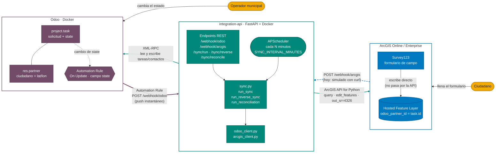
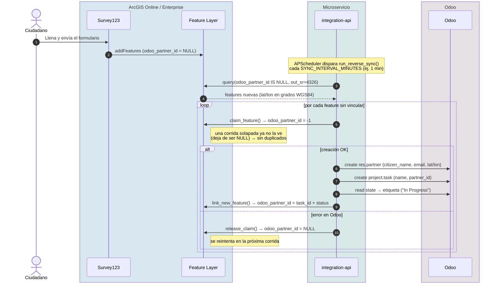
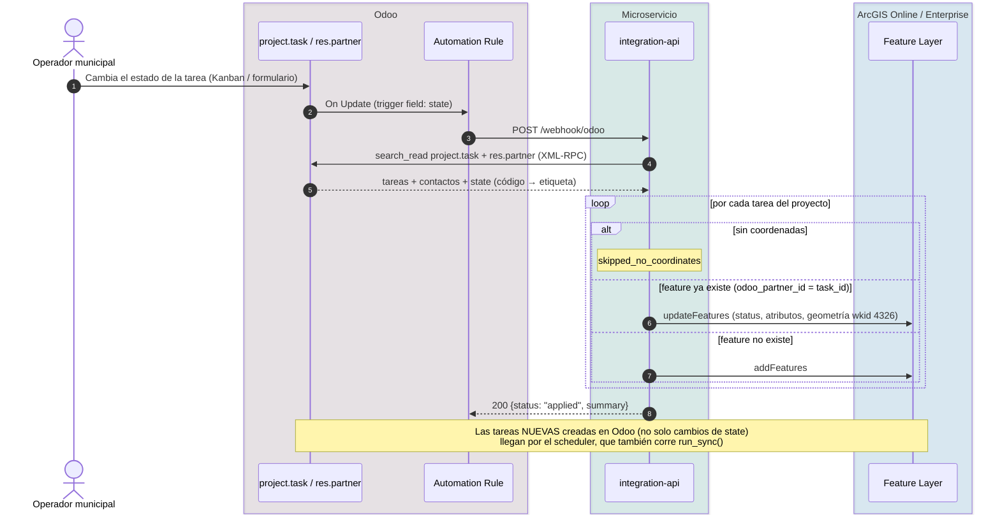
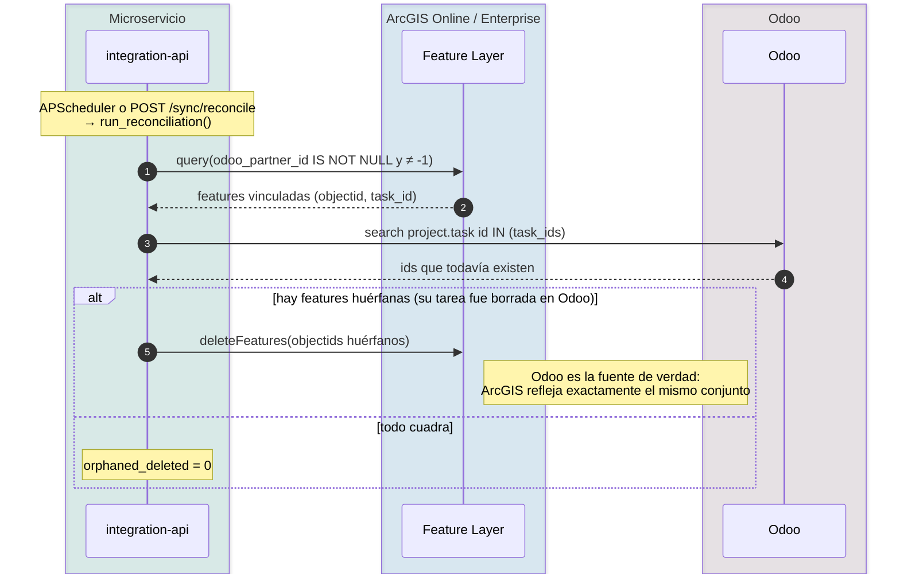
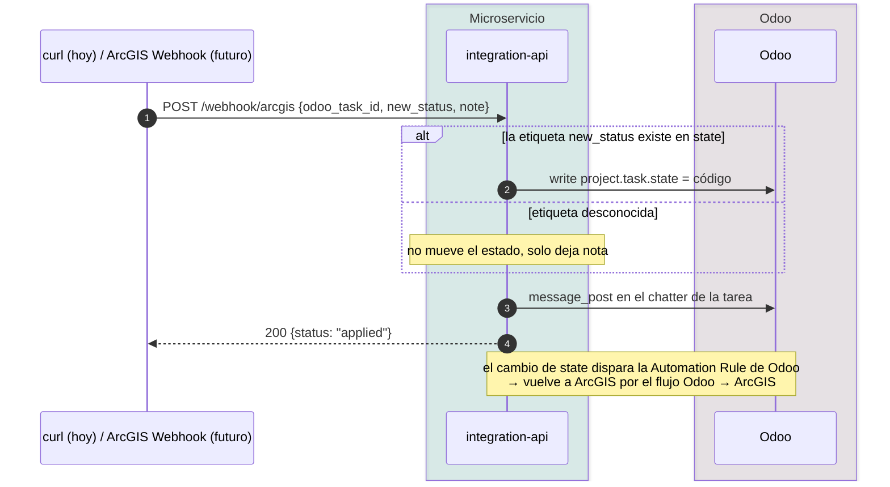
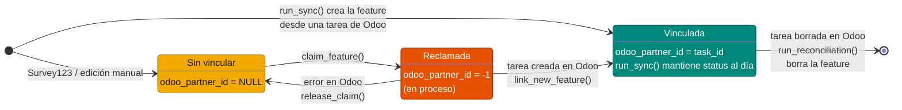

# Integración Odoo ↔ ArcGIS Online / Enterprise

Demo técnica de integración bidireccional entre **Odoo** (gestión de
solicitudes ciudadanas) y **ArcGIS Online / Enterprise** (visualización
geoespacial + captura de datos de campo con **Survey123**), a través de un
microservicio propio en **FastAPI**.

## Arquitectura



- **Flecha gruesa morada:** push instantáneo de Odoo al microservicio (Automation Rule → `POST /webhook/odoo`).
- **Flechas verdes:** llamadas que **siempre inicia `integration-api`** (XML-RPC a Odoo, ArcGIS API for Python a la capa).
- **Flecha punteada azul:** `POST /webhook/arcgis` — el endpoint existe, pero hoy solo se dispara simulado con `curl` (sería real con ArcGIS Webhooks).
- **Survey123 escribe directo en la capa**; nunca pasa por el microservicio. El microservicio detecta esos registros nuevos por polling (APScheduler).

> Los diagramas están en **Mermaid**. GitHub y GitLab los renderizan de forma nativa. En VS Code hace falta la extensión
> *Markdown Preview Mermaid Support* (`bierner.markdown-mermaid`) para verlos en la vista previa.

Cada solicitud ciudadana es una tarea (`project.task`) dentro de un
proyecto de Odoo, vinculada a un contacto (`res.partner`) que representa
al ciudadano y lleva la geolocalización (`partner_latitude` /
`partner_longitude`, módulo `base_geolocalize`). Esa misma solicitud
existe como una **feature** (punto) en una Hosted Feature Layer de
ArcGIS, enlazada a su tarea de Odoo por el campo `odoo_partner_id`
(guarda el `id` de la `project.task`, no de un `res.partner` — nombre
histórico conservado por compatibilidad con capas ya publicadas).

---

## 1. Flujos de sincronización

| Sentido | Qué lo dispara | Qué hace | Función |
|---|---|---|---|
| Odoo → ArcGIS | Automation Rule de Odoo (push, cambio de `state`) · scheduler · `POST /sync/run` | crea/actualiza la feature (`upsert`, por `task_id`) | `sync.run_sync()` |
| ArcGIS → Odoo (registro nuevo) | scheduler (polling) · `POST /sync/reverse` | crea contacto + tarea en Odoo y escribe de vuelta el vínculo + status inicial | `sync.run_reverse_sync()` |
| ArcGIS → Odoo (cambio de estado) | `POST /webhook/arcgis` (hoy simulado con `curl`) | mueve el `state` de la tarea y deja nota en el chatter | `sync.handle_arcgis_status_webhook()` |
| Reconciliación | scheduler · `POST /sync/reconcile` | borra en ArcGIS las features cuya tarea de Odoo ya no existe | `sync.run_reconciliation()` |

El scheduler (`APScheduler`, arrancado en `main.py`) corre **`run_sync`,
`run_reverse_sync` y `run_reconciliation`** cada `SYNC_INTERVAL_MINUTES`.
`handle_arcgis_status_webhook` **no** está en el scheduler: solo corre
cuando llega un `POST /webhook/arcgis`. Ver sección 6 para el setup
semi-automático / automático.

### 1.1. Survey123 → Odoo: registro nuevo (semi-automático, idempotente)



### 1.2. Odoo → ArcGIS: cambio de estado (push instantáneo)



### 1.3. Reconciliación: limpieza de huérfanos en ArcGIS



### 1.4. Cambio de estado desde ArcGIS (`/webhook/arcgis`)



---|---|---|---|
| Odoo → ArcGIS | tarea nueva o cambio de campos | crea/actualiza la feature (`upsert`, por `task_id`) | `sync.run_sync()` |
| ArcGIS → Odoo | feature nueva sin `odoo_partner_id` (Survey123 o edición manual) | crea contacto + tarea en Odoo, y escribe de vuelta el vínculo + status inicial | `sync.run_reverse_sync()` |
| ArcGIS → Odoo | cambio de estado recibido por webhook (real o simulado) | mueve el `state` de la tarea y deja nota en el chatter | `sync.handle_arcgis_status_webhook()` |
| Reconciliación | periódica | borra en ArcGIS las features cuya tarea de Odoo ya no existe | `sync.run_reconciliation()` |

Las tres primeras están detrás de endpoints manuales (`POST /sync/run`,
`POST /sync/reverse`, `POST /webhook/arcgis`) y las tres primeras + la
reconciliación corren también **automáticamente** cada
`SYNC_INTERVAL_MINUTES` vía un scheduler (`APScheduler`) arrancado en
`main.py`. Ver sección 6 para cómo dejar esto en modo semi-automático /
automático de verdad.

---

## 2. Modelo de datos

| Campo Odoo | Campo ArcGIS | Notas |
|---|---|---|
| `project.task.id` | `odoo_partner_id` | clave de enlace entre ambos sistemas |
| `project.task.name` | `name` | descripción del problema/solicitud — **no** es el nombre del ciudadano |
| `project.task.state` | `status` | Selection field; se resuelve código→etiqueta con `fields_get` |
| `res.partner.name` | `citizen_name` | nombre del ciudadano |
| `res.partner.street` | `address` | |
| `res.partner.city` | `city` | |
| `res.partner.phone` | `phone` | |
| `res.partner.email` | `email` | |
| `res.partner.partner_latitude/longitude` | geometría (punto, WGS84) | |

### 2.1. `state` vs `stage_id` (Odoo)

`project.task` tiene **dos** conceptos de "estado" distintos:

- `stage_id`: la columna Kanban (`many2one` a `project.task.type`).
- `state`: un campo `Selection` con un código interno por valor (p. ej.
  `"01_in_progress"`), independiente del Kanban.

Esta integración usa **`state`**, no `stage_id`. El código interno nunca
se hardcodea: `OdooClient._get_state_label_map()` lo resuelve
dinámicamente vía `fields_get(["state"], ["selection"])`, así que
funciona aunque el proyecto personalice las etiquetas.

### 2.2. `citizen_name` vs `name` (bug corregido en esta sesión)

Al crear una tarea desde una feature de ArcGIS/Survey123
(`create_task_from_arcgis`), el nombre del **contacto** (`res.partner`)
debe salir de `citizen_name` (lo que la persona escribió en "Tu nombre
completo" en el formulario). `name` es la descripción del problema y se
usa solo como título de la tarea. Antes se usaba `name` para ambos, así
que el contacto terminaba llamándose "Robo" o "Un lindo gatito en la
avenida" en vez del nombre real del ciudadano.

---

## 3. Requisitos previos

- Odoo (Community/Enterprise) con el módulo `project` y
  `base_geolocalize` instalados, con un proyecto dedicado a las
  solicitudes ciudadanas.
- Usuario técnico de Odoo con acceso a `project.task` y `res.partner`
  (XML-RPC External API habilitado — viene por defecto).
- ArcGIS Online o Enterprise 10.9+ con una Hosted Feature Layer
  publicada con, como mínimo, los campos: `odoo_partner_id` (numérico),
  `name`, `citizen_name`, `address`, `city`, `phone`, `email`, `status`
  (texto), y geometría de punto.
- Credenciales de ArcGIS: usuario/contraseña, o preferible **App
  Authentication (OAuth 2.0 client credentials)** — no depende de un
  usuario humano ni se ve afectada por MFA. Requiere que la app OAuth
  tenga acceso concedido al item de la capa.
- Docker + Docker Compose para desplegar `integration-api`.
- (Opcional, para captura de campo) Survey123 Connect apuntando a la
  misma Hosted Feature Layer.

---

## 4. Variables de entorno (`integration-api/.env`)

```env
# Odoo
ODOO_URL=https://tu-instancia-odoo.com
ODOO_DB=nombre_bd
ODOO_USERNAME=usuario_tecnico
ODOO_PASSWORD=************
ODOO_PROJECT_NAME=Solicitudes Ciudadanas

# ArcGIS
ARCGIS_URL=https://www.arcgis.com          # o tu portal Enterprise
ARCGIS_FEATURE_LAYER_ITEM_ID=xxxxxxxxxxxxxxxxxxxxxxxxxxxxxxxx
ARCGIS_VERIFY_CERT=true

# Opción A: usuario/contraseña
ARCGIS_USERNAME=usuario
ARCGIS_PASSWORD=************

# Opción B (recomendada): App Authentication
ARCGIS_CLIENT_ID=************
ARCGIS_CLIENT_SECRET=************

# Sincronización automática (minutos). Ver sección 6.
SYNC_INTERVAL_MINUTES=1
```

> **Seguridad:** nunca commitear `.env` al repo. Las credenciales que se
> compartieron durante las pruebas de esta demo deben rotarse antes de
> mostrarla a un municipio real.

---

## 5. Despliegue

```bash
docker compose up -d --build integration-api
```

### ⚠️ Gotcha recurrente: `--force-recreate` NO reconstruye la imagen

`docker compose up -d --force-recreate integration-api` recrea el
**contenedor** a partir de la **imagen ya existente en caché**. Como el
`Dockerfile` copia el código fuente dentro de la imagen en build-time,
**editar los `.py` en disco no tiene ningún efecto hasta que la imagen
se reconstruye explícitamente**. Durante esta sesión, varios "bugs"
reportados (nombre de contacto sin corregir, `/sync/reconcile`
devolviendo 404 pese a que `/health` respondía bien) en realidad eran el
contenedor sirviendo código viejo tras un `--force-recreate` sin
`--build`.

**Siempre que cambies código:**

```bash
docker compose up -d --build --force-recreate integration-api
```

---

## 6. Sincronización automática / semi-automática

Estado actual (sin ArcGIS Webhooks disponibles — ver nota al final de
esta sección): el sentido **ArcGIS → Odoo** funciona por **polling**
ajustado a un intervalo corto, y el sentido **Odoo → ArcGIS** funciona
por **push instantáneo** vía una Automation Rule nativa de Odoo. No hace
falta tocar código en ninguno de los dos casos — ambos endpoints y el
scheduler ya existen.

### 6.1. ArcGIS → Odoo: nuevo registro en la capa (semi-automático, polling)

El scheduler de `main.py` ya ejecuta `run_reverse_sync()` (además de
`run_sync()` y `run_reconciliation()`) cada `SYNC_INTERVAL_MINUTES`.
Para que un registro nuevo en la capa (cargado desde Survey123 o
editado manualmente) llegue a Odoo casi al instante, basta con bajar el
intervalo:

```env
SYNC_INTERVAL_MINUTES=1
```

y redesplegar:

```bash
docker compose up -d --build --force-recreate integration-api
```

Con esto, cualquier envío de Survey123 tarda como máximo ~1 minuto en
aparecer como tarea en Odoo, con su contacto, estado inicial y
coordenadas correctas.

No es push real (no hay notificación instantánea desde ArcGIS), pero
para una demo es indistinguible de "automático": el ciudadano llena el
formulario y en menos de un minuto la solicitud ya está en Odoo.

**Alternativa real (push), para cuando esté disponible:** ArcGIS
Enterprise 11.x+ o AGOL con **Webhooks** habilitados permite que la capa
misma notifique al microservicio en el instante de un `Add`. En ese caso
se agregaría un endpoint `POST /webhook/arcgis/feature-added` que
registre la feature vía la API de Webhooks de la capa (`POST
.../registerWebhook`) y dispare `run_reverse_sync()` (o, mejor, procese
solo la feature notificada) al recibir el evento — eliminando el
polling por completo. No implementado en esta demo porque el ambiente
actual no tiene Webhooks habilitados.

### 6.2. Odoo → ArcGIS: cambio de estado (automático, push real)

Para este sentido **sí** existe push real y sin polling, usando la
funcionalidad nativa de Odoo. El endpoint `POST /webhook/odoo` ya existe
en `main.py` y simplemente ejecuta `sync.run_sync()` (sincroniza todas
las tareas del proyecto — es idempotente, así que no hay costo en
sincronizar de más).

**Pasos en Odoo** (Ajustes → Técnico → Automatizaciones /
*Settings → Technical → Automation → Automation Rules*; requiere modo
desarrollador activado):

1. **Nueva automatización** → *Model*: `Project Task` (`project.task`).
2. *Trigger*: **On Update** (*Al actualizar*).
3. *Trigger Fields* (campos disparadores): `state` — así la regla solo
   se dispara cuando cambia el estado, no en cualquier edición de la
   tarea.
4. (Opcional pero recomendado) *Apply on* / dominio: limita a las tareas
   del proyecto de esta integración, ej. `[('project_id.name', '=',
   'Solicitudes Ciudadanas')]`, para no disparar sync en tareas de otros
   proyectos.
5. En **Acciones** → **Añadir una acción** → tipo **"Enviar notificación
   webhook"** (*Send Webhook Notification*):
   - **URL**: `http://integration-api:8000/webhook/odoo` si Odoo y
     `integration-api` están en la misma red de Docker Compose (ej. red
     `backend`); si Odoo corre fuera de ese Docker Compose, usa la URL
     pública/accesible del microservicio, ej.
     `https://tu-dominio.com/webhook/odoo`.
   - **Método**: `POST`.
   - **Cuerpo**: no requiere ningún campo específico — el endpoint
     ignora el payload y simplemente corre la sincronización completa.
6. Guardar y activar la regla.

Con esto, apenas alguien cambia el `state` de una tarea en Odoo (por el
Kanban, el formulario, o programáticamente), Odoo llama de inmediato al
microservicio y la feature en ArcGIS queda actualizada en segundos, sin
esperar al ciclo del scheduler.

> Si tu versión de Odoo no tiene la acción nativa "Enviar notificación
> webhook" (viene desde Odoo 17), la alternativa es una acción de
> servidor en Python (*Execute Python Code*) que haga un `requests.post`
> a la misma URL, o quedarte con el polling de `run_sync()` cada
> `SYNC_INTERVAL_MINUTES` igual que en el sentido inverso.

---

## 7. Idempotencia y reconciliación

Implementadas a pedido explícito para garantizar que **una misma
feature nunca genere dos tareas duplicadas en Odoo**, y que **ArcGIS
nunca quede con referencias a tareas que ya no existen en Odoo**.

### Ciclo de vida de `odoo_partner_id` en una feature



### 7.1. Claim/release (evita duplicados en `run_reverse_sync`)

Antes de crear la tarea en Odoo para una feature sin vincular, se
"reclama" la feature escribiendo un valor centinela (`-1`, ningún
`project.task` real tiene ese id) en `odoo_partner_id`
(`ArcGISClient.claim_feature`). Si dos corridas se solapan (el
scheduler y un `POST /sync/reverse` manual al mismo tiempo, por
ejemplo), la segunda ya no ve esa feature como "sin vincular"
(`get_unlinked_features` filtra por `odoo_partner_id IS NULL`) y no crea
una tarea duplicada. Si la creación en Odoo falla después del claim, se
revierte (`release_claim`, vuelve a `NULL`) para que se reintente en la
próxima corrida en vez de quedar huérfana para siempre con el centinela.

### 7.2. Reconciliación (limpia huérfanos en ArcGIS)

`sync.run_reconciliation()` (job periódico + `POST /sync/reconcile`)
recorre las features **vinculadas** en ArcGIS
(`odoo_partner_id IS NOT NULL` y distinto del centinela), verifica
contra Odoo cuáles `task_id` siguen existiendo
(`OdooClient.filter_existing_task_ids`), y **borra** en ArcGIS las
features cuya tarea ya no existe (por ejemplo, al borrar manualmente en
Odoo un registro de prueba duplicado). Lo que hay en Odoo es la fuente
de verdad; ArcGIS debe reflejar exactamente ese conjunto.

> **Fuera de alcance, a propósito:** la deduplicación de envíos
> *legítimos pero repetidos* de un mismo ciudadano (dos submits de
> Survey123 con contenido parecido, ej. "Un lindo gatito en la avenida"
> enviado dos veces por error del cliente) **no** se implementó. Sería
> una heurística de similitud de contenido/ubicación/tiempo, con riesgo
> real de fusionar dos reportes distintos de dos ciudadanos distintos.
> Si el municipio lo pide, es una función aparte y explícita, no un
> efecto colateral de la reconciliación.

---

## 8. Referencia de endpoints

| Método | Ruta | Qué hace |
|---|---|---|
| `GET` | `/health` | healthcheck |
| `POST` | `/sync/run` | fuerza Odoo → ArcGIS |
| `GET` | `/sync/last` | último resultado de `/sync/run` |
| `POST` | `/sync/reverse` | fuerza ArcGIS → Odoo (features sin vincular) |
| `GET` | `/sync/reverse/last` | último resultado de `/sync/reverse` |
| `POST` | `/sync/reconcile` | fuerza la reconciliación (borra huérfanos en ArcGIS) |
| `GET` | `/sync/reconcile/last` | último resultado de la reconciliación |
| `POST` | `/webhook/arcgis` | aplica un cambio de estado recibido desde ArcGIS (real o simulado con `curl`) |
| `POST` | `/webhook/odoo` | disparado por la Automation Rule de Odoo; corre `run_sync()` |

---

## 9. Survey123 / XLSForm

El archivo `Survey_Odoo.xlsx` (entregado en esta sesión) es el XLSForm
listo para importar en Survey123 Connect, apuntando a la misma Hosted
Feature Layer que usa esta integración.

### 9.1. Lección: pegar por nombre de columna, no por posición

Si conectas Survey123 Connect a una capa existente ("Advanced" /
generar formulario desde capa), Survey123 genera su **propio** template
con muchas más columnas reservadas que un XLSForm mínimo
(`guidance_hint`, `required_message`, `readonly`, `calculation`,
`bind::esri:fieldType`, `bind::esri:fieldAlias`, etc.) y en un **orden
distinto** al de un XLSForm genérico. Pegar datos de otra fuente
asumiendo el mismo orden de columnas produce dos problemas a la vez:

1. Un header duplicado real si la fuente trae su propia columna
   `instance_name` además de la que Survey123 ya generó (error
   *"Duplicate column header: instance_name"*).
2. Valores en la columna equivocada (ej. "yes"/"no" cayendo en
   `guidance_hint` en vez de `required`) aunque no haya error de
   importación — el formulario "funciona" pero mal.

**Regla:** siempre mapear por **nombre de columna del header real**,
nunca por posición, al combinar datos de dos XLSForms distintos.

### 9.2. Validación local

```bash
pip install pyxform --break-system-packages
python3 -m pyxform.xls2xform Survey_Odoo.xlsx test_output.xml
```

Si no tira error, el XLSForm es válido (aunque Survey123 Connect puede
ser ligeramente más estricto/distinto en algunos casos — es un
stand-in, no un reemplazo de probar la importación real).

---

## 10. Troubleshooting — bugs ya encontrados y corregidos

| Síntoma | Causa real | Fix |
|---|---|---|
| Coordenadas absurdas (`lat ≈ -20000`, `lon ≈ -8700000`) en tareas creadas desde Survey123 | `layer.query()` sin `out_sr` devuelve geometría en la referencia espacial nativa de almacenamiento (Web Mercator/3857), no en grados | `out_sr=4326` explícito en `get_unlinked_features()` |
| Contacto se llama igual que la descripción del problema ("Robo") | `create_task_from_arcgis` usaba `name` (descripción) también para el contacto | usar `citizen_name` para el `res.partner`, `name` solo para el título de la tarea |
| `status` vacío en ArcGIS para tareas creadas vía Survey123 hasta el siguiente ciclo | `set_odoo_id()` solo escribía el vínculo, no el status | `link_new_feature()` escribe vínculo + status inicial en una sola llamada, en la misma pasada de `run_reverse_sync` |
| Tareas duplicadas en Odoo por una misma feature | corridas de `run_reverse_sync` solapadas sin protección | patrón claim/release con valor centinela |
| Features en ArcGIS con `odoo_partner_id` apuntando a una tarea ya borrada | nada limpiaba referencias huérfanas | `run_reconciliation()` + endpoints `/sync/reconcile*` |
| "El fix no funciona" tras editar código y correr `--force-recreate` | recrea el contenedor desde la imagen cacheada, no reconstruye la imagen | usar siempre `--build --force-recreate` tras editar código |
| *"Duplicate column header: instance_name"* al importar el XLSForm | se pegaron datos en el template propio de Survey123 (que ya tenía su columna `instance_name`) asumiendo el orden de columnas de otro XLSForm | reconstruir el archivo mapeando cada valor por nombre de columna del header real, no por posición |
| Conteo de tareas no coincide entre Odoo y ArcGIS | falso positivo: filtro "Open Tasks" activo en la vista Kanban de Odoo ocultaba una tarea en estado Cancelado | quitar el filtro; no es un bug de sincronización |

---

## 11. Seguridad

- Nunca commitear `.env`.
- Rotar toda credencial (Odoo, ArcGIS) que haya sido compartida en texto
  plano durante el desarrollo/pruebas de esta demo, antes de mostrarla a
  un municipio real.
- Preferir **App Authentication (OAuth client credentials)** en ArcGIS
  sobre usuario/contraseña para el microservicio.
- El usuario técnico de Odoo debe tener el mínimo de permisos necesarios
  (acceso a `project.task` y `res.partner` del proyecto en cuestión).