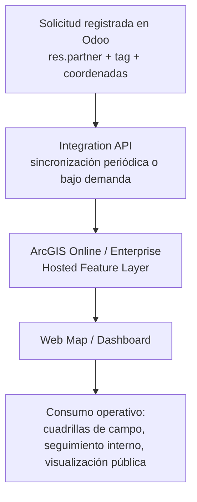
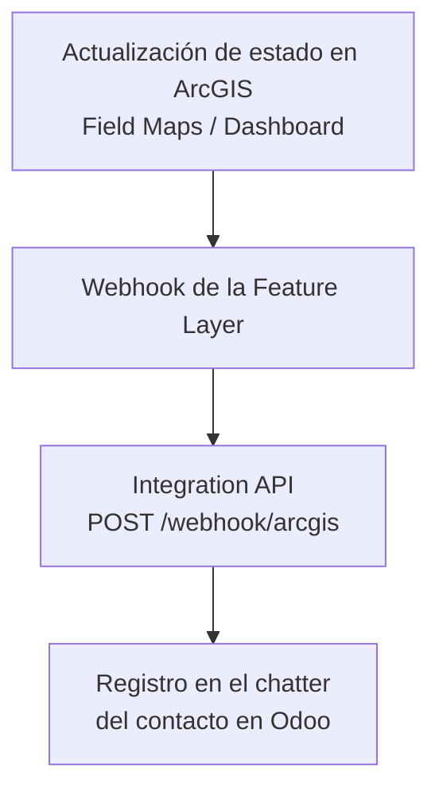
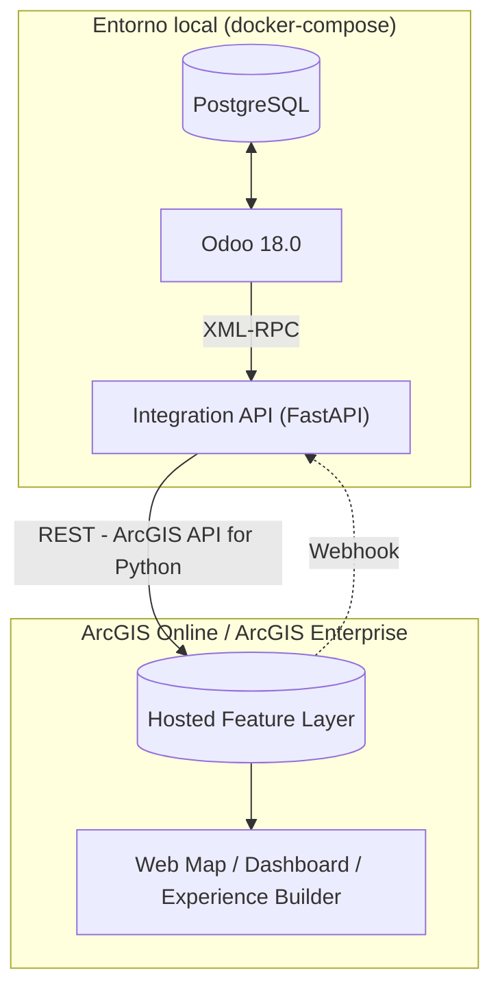

# Integración Odoo ↔ ArcGIS (Online / Enterprise)

Documentación técnica y proyecto de referencia sobre la integración entre
**Odoo** (ERP) y **ArcGIS Online (AGOL)** / **ArcGIS Enterprise**, mediante
un microservicio intermediario que sincroniza datos de negocio hacia una
capa geoespacial y procesa actualizaciones en sentido inverso.

El caso de uso documentado corresponde a la gestión de solicitudes
ciudadanas en un municipio: un escenario representativo para instituciones
que operan Odoo y evalúan incorporar capacidades de análisis y
visualización espacial sin reemplazar el ERP ni duplicar procesos de
negocio.

---

## 1. Caso de uso de referencia

Las solicitudes ciudadanas (baches, alumbrado público, fugas de agua, poda
de árboles, etc.) se registran en Odoo como contactos (`res.partner`)
geolocalizados, clasificados mediante la etiqueta `Solicitud Ciudadana`.

### 1.1. Flujo directo: Odoo → ArcGIS



### 1.2. Flujo inverso: ArcGIS → Odoo



La combinación de ambos flujos evidencia que la integración es
bidireccional: el estado de una solicitud puede modificarse desde ArcGIS y
queda reflejado en Odoo, en lugar de operar como una exportación
unidireccional estática.

> El caso de uso emplea `res.partner` en lugar de un modelo de negocio
> dedicado, dado que Odoo Community incluye por defecto los campos
> `partner_latitude` / `partner_longitude` (módulo `base_geolocalize`). Para
> un despliegue productivo se recomienda un modelo propio (`project.task`,
> `helpdesk.ticket` o un módulo custom) — ver sección
> [10. Consideraciones para un despliegue productivo](#10-consideraciones-para-un-despliegue-productivo).

---

## 2. Arquitectura

La integración se compone de tres bloques: el entorno Odoo (contenedorizado
localmente), un microservicio de integración, y la plataforma ArcGIS
(externa, no contenerizada).



**Componentes:**

| Componente         | Rol                                                                                                  |
|--------------------|----------------------------------------------------------------------------------------------------------|
| `db`               | PostgreSQL exclusivo para el motor de Odoo                                                             |
| `odoo`             | Instancia Odoo Community 18.0; fuente de verdad de los datos de negocio                                |
| `integration-api`  | Microservicio FastAPI que traduce entre el modelo de datos de Odoo y el modelo de features de ArcGIS   |
| ArcGIS (externo)   | AGOL o Enterprise; no se contenedoriza, se accede vía API REST / ArcGIS API for Python                 |

ArcGIS Enterprise no se despliega en Docker en este proyecto, dado que
requiere licenciamiento e infraestructura propia de Esri. El microservicio
de integración está escrito para operar indistintamente contra AGOL o
Enterprise mediante una única variable de configuración (`ARCGIS_URL`).

---

## 3. Estructura del proyecto

```text
IntegracionOdooArcGIS/
├── docker-compose.yml
├── .env.example                  # credenciales de la BD de Odoo
├── odoo/
│   ├── config/odoo.conf
│   └── addons/                   # para módulos custom futuros
├── integration-api/
│   ├── Dockerfile
│   ├── requirements.txt
│   ├── .env.example              # credenciales Odoo + ArcGIS
│   └── app/
│       ├── main.py               # FastAPI: endpoints + scheduler
│       ├── config.py             # settings (pydantic-settings)
│       ├── schemas.py            # modelos Pydantic
│       ├── odoo_client.py        # cliente XML-RPC hacia Odoo
│       ├── arcgis_client.py      # cliente ArcGIS API for Python
│       └── sync.py               # orquestación del sync bidireccional
├── scripts/
│   ├── requirements.txt
│   ├── seed_odoo_demo_data.py    # crea contactos de referencia geolocalizados
│   └── create_arcgis_feature_layer.py  # crea la Hosted Feature Layer
└── README.md
```

---

## 4. Prerrequisitos

- Docker y Docker Compose v2
- Cuenta ArcGIS Online (developer/trial es suficiente) o acceso a un
  ArcGIS Enterprise con permisos para publicar Hosted Feature Layers
- Python 3.10+ para la ejecución de los scripts en `scripts/` (fuera de
  Docker)
- Puertos disponibles: `8069` (Odoo), `8000` (Integration API)

---

## 5. Despliegue

### 5.1. Odoo y PostgreSQL

```bash
cp .env.example .env
# Editar .env para modificar el password de PostgreSQL si corresponde

docker compose up -d db odoo
docker compose logs -f odoo   # esperar "HTTP service (werkzeug) running"
```

En `http://localhost:8069`, creación de la base de datos:

- **Nombre de base de datos:** `odoo_demo` (debe coincidir con `ODOO_DB` en
  `integration-api/.env` y con `dbfilter` en `odoo/config/odoo.conf`)
- Usuario/contraseña de administrador: de libre elección, siempre que se
  reflejen en `ODOO_USERNAME` / `ODOO_PASSWORD` de `integration-api/.env`

El módulo **Contactos** está activo por defecto; no se requieren módulos
adicionales para este caso de uso.

### 5.2. Hosted Feature Layer en ArcGIS

```bash
cd scripts
python -m venv .venv && source .venv/bin/activate   # equivalente en Windows: .venv\Scripts\activate
pip install -r requirements.txt

cp ../integration-api/.env.example .env
# Completar .env con las credenciales de ArcGIS y Odoo

python create_arcgis_feature_layer.py
```

El script imprime el `Item ID` de la capa creada, requerido en el paso
siguiente.

### 5.3. Microservicio de integración

```bash
cd ../integration-api
cp .env.example .env
# Completar ODOO_* (según 5.1) y ARCGIS_* (incluyendo el Item ID de 5.2)

cd ..
docker compose up -d --build integration-api
docker compose logs -f integration-api
```

Verificación: `http://localhost:8000/health` → `{"status": "ok"}`
Documentación interactiva (Swagger) en `http://localhost:8000/docs`.

### 5.4. Datos de referencia en Odoo

```bash
cd scripts
python seed_odoo_demo_data.py
```

El script crea 8 registros de ejemplo geolocalizados (coordenadas de
referencia en Quito; editables directamente en el archivo).

### 5.5. Ejecución de la sincronización

```bash
curl -X POST http://localhost:8000/sync/run
```

Respuesta esperada:

```json
{
  "ok": true,
  "fetched_from_odoo": 8,
  "created_in_arcgis": 8,
  "updated_in_arcgis": 0,
  "skipped_no_coordinates": 0,
  "errors": []
}
```

La capa resultante se visualiza en ArcGIS Online (Content → búsqueda por
título) y admite la creación de un **Web Map** o **Dashboard** sobre ella.

### 5.6. Sincronización periódica (opcional)

Definiendo `SYNC_INTERVAL_MINUTES` (por ejemplo, `5`) en
`integration-api/.env` y reiniciando el contenedor
(`docker compose restart integration-api`) se activa la sincronización
automática en segundo plano.

---

## 6. Configuración del flujo inverso (webhook)

El flujo inverso se implementa exponiendo `POST /webhook/arcgis` (ver
`app/schemas.py::ArcGISWebhookPayload`) y configurándolo como **Webhook**
de la Feature Layer en ArcGIS Online (Content → capa → Settings →
Webhooks → `FeaturesUpdated`). El payload nativo de AGOL difiere del
esquema simplificado usado en este proyecto; en un entorno productivo se
requiere una función `adapt_agol_payload()` en `sync.py` para mapear el
JSON real de Esri al esquema esperado.

Para pruebas sin depender de la configuración del webhook en AGOL, el
flujo puede simularse directamente:

```bash
curl -X POST http://localhost:8000/webhook/arcgis \
  -H "Content-Type: application/json" \
  -d '{"odoo_partner_id": 12, "new_status": "Resuelto", "note": "Cuadrilla atendió el reporte"}'
```

La aplicación del cambio se verifica en Odoo → Contactos → contacto
correspondiente → chatter: se registra la nota enviada.

---

## 7. AGOL vs. Enterprise — diferencias de configuración

| Aspecto                      | ArcGIS Online                          | ArcGIS Enterprise                                          |
|-------------------------------|-------------------------------------------|------------------------------------------------------------|
| `ARCGIS_URL`                  | `https://www.arcgis.com`                 | URL del Web Adaptor de Portal (`https://host/portal`)      |
| Autenticación recomendada     | OAuth 2.0 (app registrada) o built-in    | OAuth 2.0, IWA o PKI, según configuración del Portal        |
| Publicación de Feature Layer  | Hosting automático en AGOL                | Requiere Hosting Server federado configurado                |
| Certificados                  | Gestionados por Esri                     | Responsabilidad de la organización (SSL/TLS propio)         |
| Escenario de uso típico       | Pilotos, pruebas de concepto              | Datos sensibles, alta disponibilidad, despliegue on-premise |

El código de `arcgis_client.py` no cambia entre ambos escenarios: el
paquete `arcgis` (ArcGIS API for Python) abstrae la diferencia. Las
variaciones se limitan a la URL de conexión y al método de autenticación.

---

## 8. Seguridad

- Los archivos `.env` reales no deben incluirse en control de versiones
  (excluidos vía `.gitignore`); `.env.example` se usa como plantilla.
- Este proyecto emplea autenticación básica (usuario/password) contra
  ArcGIS por simplicidad. En un entorno productivo corresponde migrar a
  OAuth 2.0:
  - AGOL: aplicación registrada en el portal de desarrollador, con
    `client_id` / `client_secret` (`GIS(url, client_id=..., client_secret=...)`).
  - Enterprise: evaluar IWA (Windows Integrated Auth) o certificados PKI
    según la infraestructura disponible.
- El `admin_passwd` de `odoo/config/odoo.conf` corresponde únicamente a
  desarrollo local; debe modificarse y protegerse si el contenedor se
  expone fuera de la red local.
- El endpoint `/webhook/arcgis` no debe exponerse públicamente sin
  autenticación adicional (validación de secreto compartido o restricción
  por origen) en un entorno productivo.
- Si Odoo se expone fuera de la red local, se requiere Nginx como reverse
  proxy con TLS (no cubierto en este proyecto).

---

## 9. Troubleshooting

| Síntoma                                            | Causa probable                                                       | Verificación                                                                 |
|------------------------------------------------------|--------------------------------------------------------------------------|----------------------------------------------------------------------------------|
| `integration-api` no arranca                         | Falta `.env` o falta `ARCGIS_FEATURE_LAYER_ITEM_ID`                     | `docker compose logs integration-api`                                           |
| Error de autenticación con Odoo                      | `ODOO_DB` no coincide con la BD creada, o password incorrecto           | Login manual en `http://localhost:8069`                                         |
| `/sync/run` devuelve `skipped_no_coordinates` alto    | Contactos sin `partner_latitude` / `partner_longitude`                  | Odoo → Contactos → pestaña de geolocalización                                   |
| Error del paquete `arcgis` al conectar               | Credenciales incorrectas o Web Adaptor de Enterprise mal configurado    | `python -c "from arcgis.gis import GIS; GIS(url, user, pwd)"` en shell local     |
| Feature Layer no se actualiza sin error reportado     | El `Item ID` en `.env` apunta a otra capa                               | Confirmar el Item ID impreso por `create_arcgis_feature_layer.py`               |
| Contenedor `odoo` reinicia en bucle                   | Conflicto entre `dbfilter` de `odoo.conf` y el nombre real de la BD     | Ajustar `dbfilter` en `odoo/config/odoo.conf`                                   |

Comandos de diagnóstico:

```bash
docker compose ps
docker compose logs -f odoo
docker compose logs -f integration-api
curl -s http://localhost:8000/health
curl -s http://localhost:8000/sync/last
```

---

## 10. Consideraciones para un despliegue productivo

Este proyecto constituye una prueba de concepto técnica y omite
deliberadamente varios mecanismos requeridos en un entorno de producción.
Para un despliegue productivo corresponde evaluar, como mínimo:

1. **Modelo de negocio propio en Odoo**, en lugar de `res.partner`: módulo
   custom (p. ej. `municipio_solicitudes`) con estados, SLA, adjuntos y
   relación a `project.task` para asignación de cuadrillas.
2. **OAuth 2.0** en ambos extremos (Odoo vía módulo `oauth2` / API keys;
   ArcGIS vía App Registration).
3. **Idempotencia robusta**: reemplazar el matching por `OBJECTID`
   consultado en cada request por un campo indexado único y `upsert` en
   lote (`edit_features` admite arrays; en este proyecto se procesa
   registro por registro por claridad).
4. **Cola de mensajes** (RabbitMQ/Redis) si el volumen de solicitudes lo
   justifica, en lugar de sincronización por polling.
5. **Adaptador de webhook AGOL** (`adapt_agol_payload()`), dado que el
   payload nativo de Esri difiere del esquema simplificado usado aquí.
6. **Nginx + TLS** como reverse proxy si Odoo o el microservicio se
   exponen fuera de la red interna de la organización.
7. **Dashboard público de solo lectura**, separado del Web Map operativo
   interno, si se requiere exposición ciudadana.
8. **Logging y métricas centralizadas** (stack ELK, Grafana Loki u
   equivalente) para operación en producción.

---

## 11. Alcance y licenciamiento

Proyecto de referencia técnica, sin garantías, orientado a pruebas de
concepto. Un despliegue productivo requiere validar el licenciamiento de
ArcGIS Enterprise/Online con Esri, así como el de Odoo Enterprise si
aplica (este proyecto usa Odoo Community, LGPL).