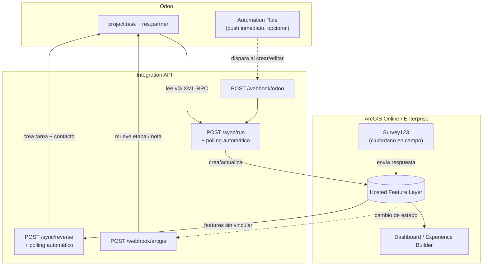

# Integración Odoo ↔ ArcGIS (Online / Enterprise) — flujo end-to-end

Documentación técnica y proyecto de referencia sobre la integración entre
**Odoo** (ERP) y **ArcGIS Online (AGOL)** / **ArcGIS Enterprise**, mediante
un microservicio intermediario que sincroniza datos en ambas direcciones,
e incorpora **Survey123** (captura de campo) y un **Dashboard /
Experience Builder** (visualización unificada) para demostrar
interoperabilidad completa, no solo una exportación unidireccional.

El caso de uso documentado corresponde a la gestión de solicitudes
ciudadanas en municipios.

---

## 1. Caso de uso de referencia

Cada solicitud ciudadana es una tarea (`project.task`) dentro de un
proyecto de Odoo, vinculada a un contacto (`res.partner`) que representa
al ciudadano y lleva la geolocalización (`partner_latitude` /
`partner_longitude`, del módulo `base_geolocalize`).

### 1.1. Justificación del modelo de datos

Una versión anterior de este proyecto usaba únicamente `res.partner`
(contactos) para representar la solicitud completa — es decir, mezclaba
el directorio de contactos de la organización con los trámites. Eso es
conceptualmente incorrecto: una solicitud no es un contacto, es un caso
con estado y ciclo de vida propios.

El modelo actual separa ambas cosas correctamente:

| Entidad Odoo | Representa |
|---|---|
| `res.partner` | El ciudadano — nombre, dirección, teléfono, coordenadas |
| `project.task` | La solicitud — descripción, etapa (`In Progress`, `Approved`, `Done`, etc.), vinculada al ciudadano vía `partner_id` |

Usa el módulo **Project**, incluido en Odoo Community (Apps → Project →
Activate) — no requiere módulos de pago ni desarrollo custom. Para
producción, la alternativa más robusta sigue siendo un módulo propio con
SLA y adjuntos — ver sección 11.

---

## 2. Arquitectura end-to-end



**Cuatro mecanismos de sincronización, cada uno resuelve un caso distinto:**

| Endpoint | Dirección | Cuándo se dispara |
|---|---|---|
| `POST /sync/run` | Odoo → ArcGIS | Bajo demanda, por polling (`SYNC_INTERVAL_MINUTES`), o vía `/webhook/odoo` |
| `POST /webhook/odoo` | Odoo → ArcGIS | Automation Rule de Odoo al crear/editar una tarea (push inmediato) |
| `POST /sync/reverse` | ArcGIS → Odoo | Bajo demanda o por polling — detecta features nuevas (Survey123, edición manual) |
| `POST /webhook/arcgis` | ArcGIS → Odoo | Webhook real de la Feature Layer, o simulado con `curl`, al cambiar el estado de una feature ya vinculada |

---

## 3. Estructura del proyecto

```text
IntegracionOdooArcGIS/
├── docker-compose.yml
├── .env.example
├── odoo/
│   ├── config/odoo.conf
│   └── addons/
├── integration-api/
│   ├── Dockerfile
│   ├── requirements.txt
│   ├── .env.example
│   └── app/
│       ├── main.py               # endpoints + scheduler (ambas direcciones)
│       ├── config.py             # settings, incluye App Authentication
│       ├── schemas.py
│       ├── odoo_client.py        # XML-RPC: project.task + res.partner
│       ├── arcgis_client.py      # ArcGIS API for Python, esquema dinámico
│       └── sync.py               # orquestación forward + reverse
├── scripts/
│   ├── requirements.txt
│   ├── seed_odoo_demo_data.py
│   ├── create_arcgis_feature_layer.py
│   └── plantilla_capa_arcgis.csv # para publicar la capa a mano
└── README.md
```

---

## 4. Prerrequisitos

- Docker y Docker Compose v2
- ArcGIS Online (developer/trial u organización) **o** ArcGIS Enterprise
  con permisos para publicar Hosted Feature Layers
- Python 3.10 – 3.13 para los scripts en `scripts/` (el paquete `arcgis`
  no soporta versiones más nuevas)
- Puertos disponibles: `8069` (Odoo), `8000` (Integration API)
- Si tu cuenta de ArcGIS tiene MFA/SSO, revisa la sección 5.3 antes de
  intentar el login por usuario/password — no va a funcionar

---

## 5. Despliegue

### 5.1. Odoo y PostgreSQL

```bash
cp .env.example .env
docker compose up -d db odoo
docker compose logs -f odoo   # esperar "HTTP service (werkzeug) running"
```

En `http://localhost:8069`, crear la base `odoo_demo` (debe coincidir
con `ODOO_DB` y con `dbfilter` de `odoo.conf`). Activar **Apps →
Project**.

### 5.2. Hosted Feature Layer en ArcGIS

**Vía script** (funciona en Enterprise con autenticación básica, o AGOL
sin MFA):

```bash
cd scripts
python -m venv .venv && source .venv/bin/activate   # Windows: .venv\Scripts\activate
pip install -r requirements.txt
cp ../integration-api/.env.example .env
# completar ARCGIS_USERNAME / ARCGIS_PASSWORD / ARCGIS_URL
python create_arcgis_feature_layer.py
```

**Vía publicación manual** (obligatorio si tu cuenta de AGOL tiene MFA,
o si el script anterior falla con error 500 por el Hosting Server de
Enterprise):

1. En el Portal/AGOL → **Content → New Item → subir archivo**.
2. Sube `scripts/plantilla_capa_arcgis.csv`.
3. El asistente detecta `latitude`/`longitude` automáticamente y publica
   una Hosted Feature Layer de puntos.
4. Anota el **Item ID** (visible en la URL del ítem:
   `.../home/item.html?id=XXXXXXXX`).

Cualquiera de los dos métodos es compatible sin cambios de código: el
nombre real del campo ObjectID (`OBJECTID` vs `objectid`, según el
método) se detecta dinámicamente en tiempo de ejecución.

### 5.3. Autenticación con ArcGIS — elegir según tu cuenta

| Tu cuenta... | Usar |
|---|---|
| Sin MFA (developer, trial, o cuenta de organización sin MFA forzado) | `ARCGIS_USERNAME` / `ARCGIS_PASSWORD` |
| **Con MFA o login corporativo (SSO)** | **App Authentication** (`ARCGIS_CLIENT_ID` / `ARCGIS_CLIENT_SECRET`) |
| ArcGIS Enterprise con certificado autofirmado | Cualquiera de las dos anteriores + `ARCGIS_VERIFY_CERT=False` |

**Registrar App Authentication (para cuentas con MFA):**

1. AGOL → **Content → New item → Developer credentials → OAuth credentials**.
2. Tipo de aplicación: **Application / server-to-server** (no el flujo de
   usuario con redirect URL — ese requiere login interactivo).
3. En la página de esas credenciales → **Application → Credentials**,
   copia **Client ID** y **Client Secret**.
4. En la misma sección → **Edit** → **Grant access to specific items** →
   selecciona tu Feature Layer. Esto limita lo que esa aplicación puede
   tocar, en vez de darle acceso a toda tu organización.

Con `ARCGIS_CLIENT_ID` y `ARCGIS_CLIENT_SECRET` completos en el `.env`,
`arcgis_client.py` los usa automáticamente en lugar de usuario/password
— no requiere login interactivo, por lo tanto MFA no interviene.

### 5.4. Microservicio de integración

```bash
cd ../integration-api
cp .env.example .env
# completar ODOO_*, y ARCGIS_* según la tabla de la sección 5.3,
# más ARCGIS_FEATURE_LAYER_ITEM_ID del paso 5.2

cd ..
docker compose up -d --build integration-api
docker compose logs -f integration-api
```

Verificación: `http://localhost:8000/health` → `{"status": "ok"}`.
Documentación interactiva (Swagger): `http://localhost:8000/docs`.

### 5.5. Datos de referencia en Odoo

```bash
cd scripts
python seed_odoo_demo_data.py
```

Crea 8 solicitudes de ejemplo (proyecto + tareas + contactos vinculados)
con coordenadas de referencia en Quito.

### 5.6. Sincronización manual

```bash
curl -X POST http://localhost:8000/sync/run
```

```json
{
  "ok": true,
  "fetched_from_odoo": 8,
  "created_in_arcgis": 8,
  "updated_in_arcgis": 0,
  "skipped_no_coordinates": 0,
  "errors": []
}
```

### 5.7. Sincronización automática

**Por sondeo periódico** (ambas direcciones): en `integration-api/.env`,
`SYNC_INTERVAL_MINUTES=2` (o el valor deseado) y:

```bash
docker compose up -d --force-recreate integration-api
```

(`--force-recreate`, no `restart` — un `restart` no vuelve a leer el
`.env`.)

**Push inmediato desde Odoo** (Odoo → ArcGIS sin esperar el intervalo):

1. Odoo → activar modo desarrollador (Ajustes → Activar el modo
   desarrollador) → **Técnico → Automatizaciones → Nueva**.
2. Modelo: `Project Task`.
3. Disparador: **Al crear** y **Al modificar**.
4. Acción: **Enviar notificación webhook** → URL
   `http://integration-api:8000/webhook/odoo` (nombre del servicio en la
   red de Docker, no `localhost`).

---

## 6. Flujo inverso: ArcGIS / Survey123 → Odoo

### 6.1. Cambio de estado (feature ya vinculada)

Si tu Enterprise/AGOL soporta **Webhooks nativos en la Feature Layer**
(capa → Settings → Webhooks — requiere **Change Tracking** activado:
capa → Settings → Editing → "Keep track of changes to the data"),
configúralo apuntando a `http://<host-accesible>:8000/webhook/arcgis`,
evento `FeaturesUpdated`. El payload nativo de Esri difiere del esquema
simplificado (`ArcGISWebhookPayload` en `schemas.py`); en producción se
necesita una función adaptadora entre ambos formatos.

Para probar sin depender de que el webhook nativo esté disponible:

```bash
curl -X POST http://localhost:8000/webhook/arcgis \
  -H "Content-Type: application/json" \
  -d '{"odoo_task_id": 3, "new_status": "Approved", "note": "Cuadrilla atendió el reporte"}'
```

`new_status` debe coincidir exactamente con el nombre de una etapa
(`project.task.type`) en Odoo para mover la tarea; si no coincide, el
cambio igual queda registrado como nota en el chatter.

### 6.2. Features nuevas (Survey123, o creadas directo en el mapa)

```bash
curl -X POST http://localhost:8000/sync/reverse
```

```json
{"ok": true, "created_in_odoo": 2, "errors": []}
```

Detecta features sin `odoo_partner_id` (el campo que vincula con Odoo),
crea el contacto + la tarea correspondientes, y escribe de vuelta ese ID
en la feature — para no reprocesarla en la siguiente corrida.

### 6.3. Conectar Survey123

No requiere cambios de código — apunta el formulario a la misma capa:

1. **Survey123 Connect** (o el diseñador web) → crear formulario nuevo →
   elegir **"Feature Layer existente"** → selecciona la capa publicada
   en la sección 5.2.
2. Mapea las preguntas del formulario a los campos `name`, `address`,
   `city`, `phone`, `email` — deja que Survey123 capture la ubicación GPS
   como geometría del punto (no hace falta preguntar lat/lon
   manualmente).
3. Publica el formulario.

Cada envío de un ciudadano en campo llega como una feature nueva sin
`odoo_partner_id` — exactamente lo que `run_reverse_sync()` (sección 6.2)
detecta y convierte en tarea de Odoo, automáticamente si el polling está
activo, o al correr `POST /sync/reverse`.

---

## 7. Dashboard / Experience Builder

Sin código — configuración en el Portal, sobre la misma capa que ya
alimentan Odoo y Survey123:

1. Capa → **Create Web Map** → simbolizar por el campo `status` (colores
   por etapa: `In Progress`, `Approved`, `Done`, etc.).
2. **Content → New Item → Dashboard** (o **Experience Builder**) → usar
   ese Web Map como fuente.
3. Agregar widgets: lista/tabla de features, conteo por categoría
   (`status`), y el mapa.

Con esto, un mismo tablero muestra en tiempo real tanto lo que se originó
en Odoo como lo que llegó por Survey123 — es el punto donde se aprecia
visualmente la integración completa.

---

## 8. AGOL vs. Enterprise

| Aspecto | ArcGIS Online | ArcGIS Enterprise |
|---|---|---|
| `ARCGIS_URL` | `https://www.arcgis.com` | URL del Web Adaptor de Portal |
| Autenticación con MFA | App Authentication (obligatorio) | Usuario/password suele funcionar si no hay MFA configurado en el Portal |
| Certificados | Gestionados por Esri | Responsabilidad de la organización — puede requerir `ARCGIS_VERIFY_CERT=False` en labs |
| Webhooks nativos en capa | Disponibles de forma estándar | Depende de versión y rol de servidor — verificar en Settings → Webhooks de la capa |
| Publicación de capa | Hosting automático | Requiere Hosting Server federado |

`arcgis_client.py` no cambia entre ambos — toda la diferencia se resuelve
por configuración (`ARCGIS_URL`, credenciales, `ARCGIS_VERIFY_CERT`).

---

## 9. Seguridad

- `.env` reales fuera de git y de cualquier paquete compartido a mano
  (zips, capturas) — `.gitignore` protege commits, no exports manuales.
- `ARCGIS_CLIENT_SECRET` es tan sensible como una contraseña — mismo
  trato que `ARCGIS_PASSWORD`.
- App Authentication con acceso restringido al ítem específico (sección
  5.3, paso 4) en vez de acceso a toda la organización.
- `ARCGIS_VERIFY_CERT=False` solo en redes de laboratorio controladas —
  expone a MITM si el tráfico sale de esa red.
- `admin_passwd` de `odoo.conf`: cambiar el valor por defecto, y no
  reutilizarlo como password de ningún usuario de la aplicación.
- `/webhook/arcgis` y `/webhook/odoo` no deben exponerse públicamente sin
  autenticación adicional (secreto compartido o restricción por origen)
  en producción.

---

## 10. Troubleshooting

| Síntoma | Causa probable | Solución |
|---|---|---|
| `integration-api` no arranca | Falta `.env` o `ARCGIS_FEATURE_LAYER_ITEM_ID` | `docker compose logs integration-api` |
| `Invalid username or password` contra AGOL | Cuenta con MFA/SSO — usuario/password nunca funciona ahí | Usar App Authentication (sección 5.3) |
| `NameResolutionError` hacia Enterprise, pero resuelve desde el host | Hostname `.local` resuelto vía mDNS/LLMNR de Windows, no por Docker | `extra_hosts: ["host:host-gateway"]` en `docker-compose.yml` |
| `SSLCertVerificationError: self-signed certificate` | Certificado autofirmado de Enterprise | `ARCGIS_VERIFY_CERT=False` (solo lab) |
| `"El nombre de campo \"OBJECTID\" no existe"` | Varía según método de publicación | Ya resuelto: se detecta dinámicamente |
| `/sync/reverse` no crea nada aunque hay features nuevas | Change Tracking no es requisito para esto (usa `IS NULL`, no tracking) — revisar que la feature realmente no tenga `odoo_partner_id` | Confirmar en la tabla **Data** de la capa |
| Botón "Create webhook" deshabilitado en la capa | Requiere **Change Tracking** activado primero (capa → Settings → Editing) | Activarlo y guardar; si falla el guardado, revisar log del Portal Admin |
| Cambio de etapa vía `/webhook/arcgis` no mueve la tarea | `new_status` no coincide exactamente con el nombre de una etapa en Odoo | Verificar nombres en Project → Configuration → Stages |

Diagnóstico general:

```bash
docker compose ps
docker compose logs -f integration-api
curl -s http://localhost:8000/health
curl -s http://localhost:8000/sync/last
curl -s http://localhost:8000/sync/reverse/last
```

---

## 11. Consideraciones para un despliegue productivo

1. Modelo de negocio dedicado (más allá de `project.task` genérico):
   módulo custom con SLA, adjuntos, asignación de cuadrillas.
2. Adaptador real del payload de Webhooks nativos de AGOL/Enterprise
   (`adapt_agol_payload()`), distinto del esquema simplificado usado aquí.
3. Certificados válidos en Enterprise (elimina la necesidad de
   `ARCGIS_VERIFY_CERT=False`).
4. Autenticación de `/webhook/*` (secreto compartido o mTLS) antes de
   exponerlos fuera de la red interna.
5. Idempotencia y sincronización por lotes (`edit_features` con arrays)
   en vez de registro por registro, si el volumen lo justifica.
6. Cola de mensajes (RabbitMQ/Redis) en vez de polling, para reducir
   latencia y carga si el volumen de solicitudes crece.
7. Logging y métricas centralizadas para operación en producción.

---

## 12. Alcance y licenciamiento

Proyecto de referencia técnica, sin garantías, orientado a pruebas de
concepto. Un despliegue productivo requiere validar el licenciamiento de
ArcGIS Enterprise/Online con Esri, así como el de Odoo Enterprise si
aplica (este proyecto usa Odoo Community, LGPL).
