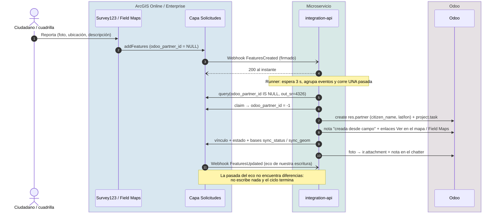
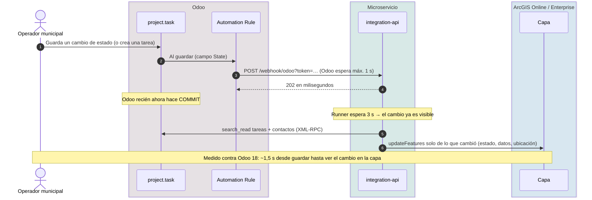
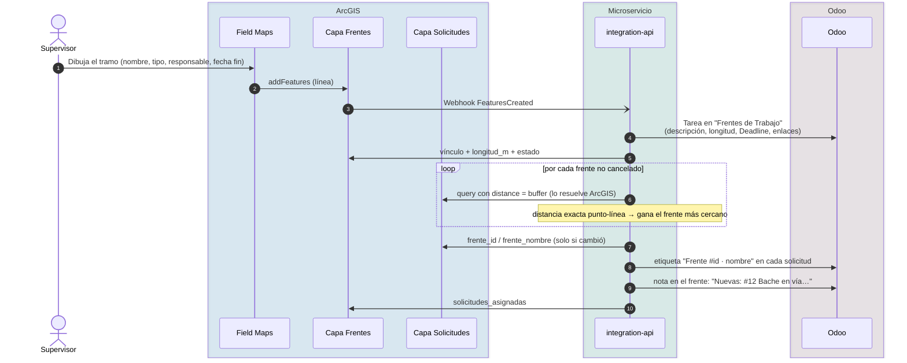
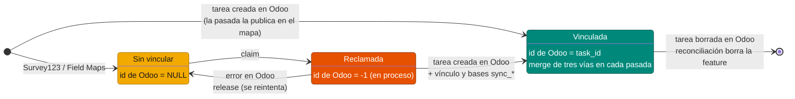

# Integración Odoo ↔ ArcGIS Online / Enterprise

Demo técnica de integración bidireccional entre **Odoo 18** (gestión de
solicitudes ciudadanas y frentes de trabajo) y **ArcGIS Online / Enterprise**
(mapa, **Survey123** para reportes ciudadanos y **ArcGIS Field Maps** para
edición en campo), mediante un microservicio propio en **FastAPI**.

Qué muestra la demo:

- Un ciudadano reporta en Survey123 → la solicitud aparece en Odoo con su
  contacto, ubicación, foto y un enlace para abrirla en Field Maps.
- Una cuadrilla actualiza en Field Maps el estado, corrige la ubicación,
  deja observaciones y fotos → todo llega a la tarea de Odoo, con autor.
- Un supervisor dibuja en Field Maps un **frente de trabajo** (línea) → se
  crea en Odoo y las solicitudes cercanas quedan asignadas a ese frente por
  análisis espacial.
- Un operador cambia el estado en Odoo → el mapa se actualiza en ~1,5 s.

## Arquitectura


```mermaid
flowchart RL
    subgraph ODOO["Odoo 18 · Docker"]
        direction TB
        operador(["Operador municipal"])
        sol["Proyecto Solicitudes<br/>project.task + res.partner"]
        fre["Proyecto Frentes de Trabajo<br/>project.task"]
        rule{{"Automation Rule<br/>Al guardar · campo State"}}
        operador --> sol
        operador --> fre
        sol -. "etiqueta<br/>Frente #id" .- fre
        sol --> rule
        fre --> rule
    end

    subgraph API["integration-api · FastAPI + Docker"]
        direction TB
        hooks["Webhooks<br/>/webhook/odoo<br/>/webhook/arcgis/solicitudes<br/>/webhook/arcgis/frentes"]
        runner(["Runner<br/>espera 3 s y agrupa"])
        sched(["APScheduler<br/>red de seguridad"])
        pipe["Pipeline idempotente<br/>reverse · merge 3 vías<br/>reconcile · asignación · fotos"]
        hooks --> runner --> pipe
        sched --> pipe
    end

    subgraph ESRI["ArcGIS Online / Enterprise"]
        direction TB
        ciudadano(["Ciudadano"])
        cuadrilla(["Cuadrilla / supervisor"])
        s123["Survey123"]
        fm["Field Maps"]
        pts[("Capa Solicitudes<br/>puntos")]
        lin[("Capa Frentes<br/>líneas")]
        ciudadano --> s123 --> pts
        cuadrilla --> fm
        fm --> pts
        fm --> lin
    end

    ODOO == "POST /webhook/odoo<br/>(push al guardar)" ==> API
    API -- "XML-RPC" --> ODOO
    ESRI == "webhook de capa, firmado<br/>(vía túnel HTTPS en ArcGIS Online)" ==> API
    API -- "ArcGIS API for Python<br/>query · edit_features" --> ESRI

    classDef odoo fill:#714B67,stroke:#4a2f43,color:#ffffff
    classDef api fill:#00897B,stroke:#00564d,color:#ffffff
    classDef esri fill:#0079C1,stroke:#004f7e,color:#ffffff
    classDef actor fill:#F2A900,stroke:#a87500,color:#1a1a1a
    class sol,fre,rule odoo
    class hooks,runner,sched,pipe api
    class s123,fm,pts,lin esri
    class operador,ciudadano,cuadrilla actor
    style ODOO fill:transparent,stroke:#714B67,stroke-width:2px
    style API fill:transparent,stroke:#00897B,stroke-width:2px
    style ESRI fill:transparent,stroke:#0079C1,stroke-width:2px
```

- **Flechas gruesas:** avisos en tiempo real (*push*). Odoo avisa con una
  Automation Rule; ArcGIS avisa con el webhook nativo de cada capa.
- **Flechas finas:** llamadas que **siempre inicia `integration-api`**
  (XML-RPC a Odoo; ArcGIS API for Python a las capas).
- **Survey123 y Field Maps escriben directo en las capas**; nunca pasan por
  el microservicio. El webhook de la capa es lo que dispara la sincronización.
- **Túnel HTTPS:** ArcGIS Online está en la nube y no puede llamar a
  `localhost`; el microservicio necesita una URL pública HTTPS (sección 9.1).

> Los diagramas están en **Mermaid**. GitHub y GitLab los muestran de forma
> nativa. En VS Code se necesita la extensión *Markdown Preview Mermaid
> Support* (`bierner.markdown-mermaid`).

---

## 1. Flujos

| Flujo | Qué lo dispara | Qué hace |
|---|---|---|
| Reporte nuevo desde campo → Odoo | Webhook de Survey123 al enviar (inmediato) y webhook de la capa (`FeaturesCreated`, por lotes) | Crea contacto + tarea, vincula la feature, publica observación y fotos |
| Odoo → ArcGIS | Automation Rule al guardar (campo *State*) | Actualiza la feature (solo lo que cambió); publica en el mapa las tareas nuevas con ubicación |
| Edición en campo → Odoo | Webhook de la capa (`FeaturesUpdated`, `Attachments*`) | Estado, ubicación, observaciones y fotos, con merge de tres vías |
| Frente de trabajo → Odoo | Webhook de la capa de frentes | Tarea en el proyecto *Frentes de Trabajo* + asignación de solicitudes por cercanía |
| Reconciliación | Cada pasada | Borra en ArcGIS las features cuya tarea ya no existe en Odoo |
| Red de seguridad | APScheduler cada `SYNC_INTERVAL_MINUTES` | Pasada completa por si se perdió algún webhook |

Todos los flujos ejecutan **la misma pasada idempotente** (`sync.run_pipeline`):
`reverse → merge → reconcile → assign → attachments`. Los webhooks funcionan
como un **timbre**: avisan que algo cambió, el microservicio responde al
instante, espera `WEBHOOK_DEBOUNCE_SECONDS` (3 s), agrupa todos los avisos
recibidos en ese lapso y corre **una** pasada. El contenido del webhook no se
usa para escribir datos, así que un aviso duplicado, perdido o fuera de orden
no puede corromper nada (sección 3.5).

### 1.1. Reporte nuevo desde campo (Survey123 / Field Maps) → Odoo


```mermaid
sequenceDiagram
    autonumber
    actor C as Ciudadano / cuadrilla
    box rgba(0,121,193,0.12) ArcGIS Online / Enterprise
        participant F as Survey123 / Field Maps
        participant L as Capa Solicitudes
    end
    box rgba(0,137,123,0.12) Microservicio
        participant API as integration-api
    end
    box rgba(113,75,103,0.12) Odoo
        participant O as Odoo
    end

    C->>F: Reporta (foto, ubicación, descripción)
    F->>L: addFeatures (odoo_partner_id = NULL)
    L-)API: Webhook FeaturesCreated (firmado)
    API--)L: 200 al instante
    Note over API: Runner: espera 3 s, agrupa eventos y corre UNA pasada
    API->>L: query(odoo_partner_id IS NULL, out_sr=4326)
    API->>L: claim → odoo_partner_id = -1
    API->>O: create res.partner (citizen_name, lat/lon) + project.task
    API->>O: nota "creada desde campo" + enlaces Ver en el mapa / Field Maps
    API->>L: vínculo + estado + bases sync_status / sync_geom
    API->>O: foto → ir.attachment + nota en el chatter
    L-)API: Webhook FeaturesUpdated (eco de nuestra escritura)
    Note over API,L: La pasada del eco no encuentra diferencias:<br/>no escribe nada y el ciclo termina
```

### 1.2. Odoo → ArcGIS (cambio de estado o tarea nueva)


```mermaid
sequenceDiagram
    autonumber
    actor Op as Operador municipal
    box rgba(113,75,103,0.12) Odoo
        participant O as project.task
        participant R as Automation Rule
    end
    box rgba(0,137,123,0.12) Microservicio
        participant API as integration-api
    end
    box rgba(0,121,193,0.12) ArcGIS Online / Enterprise
        participant L as Capa
    end

    Op->>O: Guarda un cambio de estado (o crea una tarea)
    O->>R: Al guardar (campo State)
    R->>API: POST /webhook/odoo?token=… (Odoo espera máx. 1 s)
    API-->>R: 202 en milisegundos
    Note over O: Odoo recién ahora hace COMMIT
    Note over API: Runner espera 3 s → el cambio ya es visible
    API->>O: search_read tareas + contactos (XML-RPC)
    API->>L: updateFeatures solo de lo que cambió (estado, datos, ubicación)
    Note over Op,L: Medido contra Odoo 18: ~1,5 s desde guardar hasta ver el cambio en la capa
```

Odoo ejecuta la acción *Enviar notificación webhook* **dentro de la
transacción, antes del commit**, con un timeout de 1 s
(`ir_actions.py`, `requests.post(..., timeout=1)`). Si el microservicio lee
Odoo en ese mismo instante, obtiene el estado **anterior**: se comprobó contra
Odoo 18 (el webhook leía `In Progress` con la tarea ya guardada como
`Approved`). Por eso `/webhook/odoo` responde `202` en milisegundos y la
pasada corre 3 s después, cuando el cambio ya está confirmado.

### 1.3. Edición en campo → Odoo (estado, ubicación, observaciones, fotos)


```mermaid
sequenceDiagram
    autonumber
    actor Q as Cuadrilla
    box rgba(0,121,193,0.12) ArcGIS
        participant FM as Field Maps
        participant L as Capa
    end
    box rgba(0,137,123,0.12) Microservicio
        participant API as integration-api
    end
    box rgba(113,75,103,0.12) Odoo
        participant O as Odoo
    end

    Q->>FM: Cambia estado a "Hecho", mueve el punto,<br/>escribe observación, toma foto
    FM->>L: applyEdits (EditDate, Editor)
    L-)API: Webhook FeaturesUpdated / AttachmentsCreated
    Note over API: Merge de tres vías por dato:<br/>valor en ArcGIS · valor en Odoo · base sync_*
    API->>O: state = 1_done + nota "Estado actualizado en campo (por jperez)"
    API->>O: res.partner lat/lon + nota "Ubicación corregida en campo"
    API->>O: nota "Observación de campo"
    API->>O: ir.attachment (foto) + nota con adjunto
    API->>L: bases al día (sync_status, sync_geom, sync_obs)
    O-)API: Automation Rule (cambió el estado) → pasada sin diferencias
```

### 1.4. Frentes de trabajo y asignación por cercanía


```mermaid
sequenceDiagram
    autonumber
    actor S as Supervisor
    box rgba(0,121,193,0.12) ArcGIS
        participant FM as Field Maps
        participant LN as Capa Frentes
        participant PT as Capa Solicitudes
    end
    box rgba(0,137,123,0.12) Microservicio
        participant API as integration-api
    end
    box rgba(113,75,103,0.12) Odoo
        participant O as Odoo
    end

    S->>FM: Dibuja el tramo (nombre, tipo, responsable, fecha fin)
    FM->>LN: addFeatures (línea)
    LN-)API: Webhook FeaturesCreated
    API->>O: Tarea en "Frentes de Trabajo"<br/>(descripción, longitud, Deadline, enlaces)
    API->>LN: vínculo + longitud_m + estado
    loop por cada frente no cancelado
        API->>PT: query con distance = buffer (lo resuelve ArcGIS)
        Note over API: distancia exacta punto-línea → gana el frente más cercano
    end
    API->>PT: frente_id / frente_nombre (solo si cambió)
    API->>O: etiqueta "Frente #35;id · nombre" en cada solicitud
    API->>O: nota en el frente: "Nuevas: #35;12 Bache en vía…"
    API->>LN: solicitudes_asignadas
```

Cada solicitud se asigna al frente **no cancelado** más cercano dentro de
`WORKFRONT_BUFFER_M` metros (50 por defecto). ArcGIS resuelve la consulta de
candidatos (parámetros `distance`/`units` de la query) y el microservicio
calcula la distancia exacta punto-línea para elegir el más cercano cuando hay
varios. Si un frente se redibuja, se renombra o se cancela, la asignación se
recalcula en la siguiente pasada.

---

## 2. Modelo de datos

La columna **Manda** indica qué lado es dueño de cada dato:
**Odoo**, **campo** (ArcGIS), **compartido** (merge de tres vías, sección 3.1),
**calculado** (lo escribe la integración) o **sistema** (oculto, uso interno).

### 2.1. Capa *Solicitudes* (puntos)

| Campo | Tipo | Manda | Uso |
|---|---|---|---|
| `odoo_partner_id` | Entero | sistema | id de la `project.task` (nombre histórico del campo) |
| `name` | Texto | Odoo | descripción del problema = título de la tarea |
| `citizen_name`, `address`, `city`, `phone`, `email` | Texto | Odoo | datos del ciudadano (`res.partner`) |
| `status` | Texto + lista | compartido | `project.task.state` (código = etiqueta de Odoo; se ve en español) |
| geometría | Punto | compartido | `res.partner.partner_latitude/longitude` |
| `latitude`, `longitude` | Doble | calculado | copia de la geometría |
| `observaciones` | Texto (1000) | campo | cada texto nuevo → nota en el chatter |
| adjuntos | Fotos / archivos | campo | → `ir.attachment` de la tarea + nota |
| `frente_id`, `frente_nombre` | Entero / Texto | calculado | frente de trabajo asignado |
| `sync_status`, `sync_geom`, `sync_obs` | Texto | sistema | base del merge de tres vías |

### 2.2. Capa *Frentes de Trabajo* (líneas)

| Campo | Tipo | Manda | Uso |
|---|---|---|---|
| `odoo_task_id` | Entero | sistema | id de la `project.task` en *Frentes de Trabajo* |
| `nombre` | Texto | campo | título de la tarea |
| `tipo_trabajo` | Texto + lista | campo | Bacheo, Alcantarillado, Agua potable, … |
| `responsable` | Texto | campo | cuadrilla / encargado |
| `fecha_inicio`, `fecha_fin` | Fecha | campo | `fecha_fin` → *Deadline* de la tarea |
| `status` | Texto + lista | compartido | `project.task.state` |
| geometría | Línea | campo | longitud en la descripción + asignación |
| `observaciones`, adjuntos | — | campo | notas y adjuntos de la tarea |
| `longitud_m`, `solicitudes_asignadas` | Doble / Entero | calculado | se muestran en el popup |
| `sync_status`, `sync_fp`, `sync_obs` | Texto | sistema | base del merge |

### 2.3. Del lado de Odoo

- **Solicitud** = `project.task` en *Solicitudes Ciudadanas*, con un
  `res.partner` (ciudadano + geolocalización, módulo `base_geolocalize`).
- **Frente** = `project.task` en *Frentes de Trabajo* (sin contacto; el
  trazado vive en ArcGIS). La descripción muestra tipo, responsable,
  longitud, fechas y enlaces **Ver en el mapa** / **Abrir en Field Maps**.
- **Asignación** = etiqueta `Frente #<id> · <nombre>` (`project.tags`) en la
  tarea de la solicitud. En el Kanban de solicitudes: *Agrupar por →
  Etiquetas*. Se usa una etiqueta y no una subtarea porque en Odoo 17/18
  asignar `parent_id` mueve la subtarea al proyecto del padre (la sacaría
  de *Solicitudes Ciudadanas*).
- **Chatter** (notas internas, con autor de campo cuando hay editor tracking):
  estado actualizado en campo, ubicación corregida, observación de campo,
  adjunto de campo, solicitudes asignadas por cercanía, valor rechazado.

### 2.4. `state` vs `stage_id`

`project.task` tiene dos conceptos de "estado":

- `stage_id`: la columna Kanban (`many2one` a `project.task.type`).
- `state`: `Selection` con código interno (`01_in_progress`,
  `02_changes_requested`, `03_approved`, `1_done`, `1_canceled`,
  `04_waiting_normal`).

La integración usa **`state`**. Las etiquetas se resuelven con
`fields_get(["state"], ["selection"])`, nunca con un mapeo fijo.
`04_waiting_normal` (*Waiting*) lo calcula Odoo a partir de dependencias, así
que la integración nunca lo escribe y la lista de valores de ArcGIS no lo
ofrece.

### 2.5. `citizen_name` vs `name`

En una feature de campo, `name` es la **descripción del problema** (título
de la tarea) y `citizen_name` es el **nombre del ciudadano** (nombre del
`res.partner`). Si el reporte no trae `citizen_name`, el contacto se crea
como *Ciudadano (reporte de campo)*.

---

## 3. Consistencia de datos

### 3.1. Merge de tres vías


```mermaid
flowchart TD
    A{"¿Valor en ArcGIS =<br/>valor en Odoo?"} -- sí --> N["Nada que sincronizar<br/>(solo se actualiza la base si hace falta)"]
    A -- no --> B{"¿Hay base sync_*?"}
    B -- no --> OD1["Manda Odoo<br/>(valor por defecto)"]
    B -- sí --> C{"¿Qué lado cambió<br/>respecto a la base?"}
    C -- solo ArcGIS --> AO["ArcGIS → Odoo"]
    C -- solo Odoo --> OA["Odoo → ArcGIS"]
    C -- ambos --> D{"¿Quién editó último?<br/>EditDate vs write_date"}
    D -- ArcGIS --> AO
    D -- "Odoo, o sin editor tracking" --> OA
    AO --> V{"¿Odoo acepta el valor?"}
    V -- sí --> OK["Se escribe en Odoo + nota en el chatter"]
    V -- "no (vacío, 'Waiting', texto libre)" --> REV["Se revierte en ArcGIS + nota explicando"]

    classDef odoo fill:#714B67,stroke:#4a2f43,color:#ffffff
    classDef esri fill:#0079C1,stroke:#004f7e,color:#ffffff
    classDef ok fill:#00897B,stroke:#00564d,color:#ffffff
    class OA,OD1,REV odoo
    class AO esri
    class OK,N ok
```

Para cada dato compartido (estado, ubicación) la integración compara tres
valores: el de ArcGIS, el de Odoo y la **base**, es decir el último valor
sincronizado, guardado en los campos ocultos `sync_*` de la propia feature.
Con la base se sabe **qué lado cambió** sin depender de relojes:

- Si solo cambió ArcGIS (edición en campo) → se escribe en Odoo.
- Si solo cambió Odoo → se escribe en ArcGIS.
- Si cambiaron ambos (conflicto real) → gana el que editó último
  (`EditDate` del editor tracking vs `write_date` de Odoo). Sin editor
  tracking, gana Odoo.
- Si ArcGIS trae un valor que Odoo no acepta (vacío, *Waiting*, texto
  libre) → se revierte en ArcGIS y queda una nota explicando el rechazo.

Comparar solo fechas de modificación ("gana el más reciente") daría falsos
conflictos: cualquier cambio en otra parte de la tarea en Odoo movería su
`write_date` y pisaría una edición de campo legítima. La base por dato lo
evita. Además, como la base vive en la feature, **el microservicio no guarda
estado**: se puede reiniciar o redesplegar sin perder nada.

### 3.2. Idempotencia de altas (claim / release)

Antes de crear la tarea de una feature nueva, esta se **reclama** escribiendo
`-1` en su campo de enlace. Una pasada solapada ya no la ve como "sin
vincular" y no crea una segunda tarea. Si Odoo falla antes de crear la tarea,
el claim se **libera** (vuelve a `NULL`) y se reintenta en la próxima pasada.
Si la tarea ya se creó y falla la escritura del vínculo, se reintenta el
vínculo solo; la feature nunca vuelve a `NULL` con una tarea ya creada,
porque eso duplicaría la solicitud.

### 3.3. Convergencia: los "ecos" se apagan solos

Toda escritura se hace **por diferencia**: si el valor ya es el correcto, no
se escribe. Cuando la integración escribe en ArcGIS, la capa dispara su
webhook (eco); cuando escribe el estado en Odoo, se dispara la Automation
Rule (eco). La pasada que provoca cada eco no encuentra diferencias, no
escribe nada y el ciclo termina. Esto se verificó en 18 escenarios contra
Odoo 18 (altas desde campo, conflictos en ambos sentidos, ubicación
corregida, coordenadas corruptas, observaciones, fotos, frentes creados,
redibujados y cancelados, reconciliación, fallos a mitad de camino): en todos
la segunda pasada terminó **sin escrituras** en ninguno de los dos sistemas.

### 3.4. Ciclo de vida de una feature


```mermaid
stateDiagram-v2
    direction LR
    state "Sin vincular" as SinVincular
    state "Reclamada" as Reclamada
    state "Vinculada" as Vinculada

    SinVincular : id de Odoo = NULL
    Reclamada : id de Odoo = -1 (en proceso)
    Vinculada : id de Odoo = task_id
    Vinculada : merge de tres vías en cada pasada

    [*] --> SinVincular : Survey123 / Field Maps
    [*] --> Vinculada : tarea creada en Odoo<br/>(la pasada la publica en el mapa)
    SinVincular --> Reclamada : claim
    Reclamada --> Vinculada : tarea creada en Odoo<br/>+ vínculo y bases sync_*
    Reclamada --> SinVincular : error en Odoo<br/>release (se reintenta)
    Vinculada --> [*] : tarea borrada en Odoo<br/>reconciliación borra la feature

    classDef nulo fill:#F2A900,stroke:#a87500,color:#1a1a1a
    classDef claim fill:#E65100,stroke:#8c3100,color:#ffffff
    classDef ok fill:#00897B,stroke:#00564d,color:#ffffff
    class SinVincular nulo
    class Reclamada claim
    class Vinculada ok
```

### 3.5. Webhooks como timbre

El payload del webhook de ArcGIS trae una `changesUrl` para consultar los
cambios con `extractChanges`. Esta integración **no la usa**: el webhook solo
indica que algo cambió y se ejecuta la pasada completa, que es idempotente.
Ventajas: no hay que guardar números de generación del servidor; un webhook
perdido lo recupera el scheduler; uno duplicado o falso solo provoca una
pasada sin cambios.

**Lotes.** Los webhooks de capa no se envían por cada edición: ArcGIS los
agrupa según la frecuencia del webhook (30 s, el mínimo, que es también el
valor con que se crean desde la interfaz de ArcGIS Online), y la entrega
puede tardar más: en las pruebas, el aviso llegó ~2 min después de la
edición. Por eso los reportes de Survey123 usan además el webhook propio de
Survey123, que es inmediato (sección 9.3).

**Re-chequeos.** ArcGIS Online puede enviar el webhook *antes* de que el
registro nuevo sea visible en las consultas (comportamiento reportado también
en la comunidad de Esri). Por eso, tras cada aviso de ArcGIS, además de la
pasada inmediata se programan pasadas extra a los `WEBHOOK_RECHECK_SECONDS`
(10, 30 y 60 s por defecto): el cambio se toma apenas ArcGIS lo muestra, sin
esperar al scheduler. Como la pasada es idempotente, un re-chequeo sin
cambios no escribe nada. Probado con un retardo de visibilidad de 4 s: el
registro llegó a Odoo a los 6,6 s con el scheduler apagado. La firma HMAC (`ARCGIS_WEBHOOK_SECRET`) evita abusos,
pero la integridad de los datos no depende de ella. Para capas con decenas de
miles de features, la optimización natural es usar `extractChanges` para
procesar solo los ObjectID cambiados.

### 3.6. Fuera de alcance, a propósito

La deduplicación de envíos **legítimos pero repetidos** (dos submits de
Survey123 casi iguales) no se implementó: sería una heurística de similitud
de contenido/ubicación/tiempo, con riesgo real de fusionar reportes distintos
de ciudadanos distintos. Si el municipio lo pide, es una función aparte.

---

## 4. Requisitos previos

- **Odoo 18** con los módulos `project`, `base_geolocalize` y
  `base_automation` (Automation Rules), y un usuario técnico con acceso a
  `project.task`, `res.partner`, `project.tags` e `ir.attachment`.
- **ArcGIS Online** o **ArcGIS Enterprise 11.x** con webhooks de feature
  layer. Las capas hosted necesitan *Mantener un registro de los cambios*
  (change tracking); el script de la sección 7 lo habilita.
- **ArcGIS Field Maps**: usuarios con un tipo de usuario que permita editar,
  y un mapa web con las dos capas (sección 8).
- **Survey123** (opcional) apuntando a la capa *Solicitudes*.
- **Docker** + Docker Compose.
- Con **ArcGIS Online**: una URL pública HTTPS para el microservicio
  (sección 9.1).

---

## 5. Variables de entorno (`integration-api/.env`)

```env
# --- Odoo ---
ODOO_URL=http://odoo:8069
ODOO_DB=odoo_demo
ODOO_USERNAME=admin
ODOO_PASSWORD=************
ODOO_PROJECT_NAME=Solicitudes Ciudadanas
ODOO_WORKFRONT_PROJECT_NAME=Frentes de Trabajo

# --- ArcGIS ---
ARCGIS_URL=https://www.arcgis.com          # o la URL del portal de Enterprise
ARCGIS_VERIFY_CERT=true
# Opción recomendada: App Authentication (no le afecta el MFA)
ARCGIS_CLIENT_ID=************
ARCGIS_CLIENT_SECRET=************
# Opción alternativa: usuario y contraseña
# ARCGIS_USERNAME=usuario
# ARCGIS_PASSWORD=************
ARCGIS_FEATURE_LAYER_ITEM_ID=<item de la capa Solicitudes>
ARCGIS_WORKFRONT_LAYER_ITEM_ID=<item de la capa Frentes de Trabajo>
ARCGIS_WEBMAP_ID=<item del mapa web de Field Maps>    # opcional: enlaces en Odoo

# --- Webhooks ---
ARCGIS_WEBHOOK_SECRET=<la misma clave secreta configurada en ArcGIS>
INTEGRATION_API_KEY=<clave larga aleatoria>
WEBHOOK_DEBOUNCE_SECONDS=3
WEBHOOK_RECHECK_SECONDS=10,30,60

# --- Frentes de trabajo ---
WORKFRONT_BUFFER_M=50

# --- Autoría en Odoo (opcional, sección 8.4) ---
# usuario de ArcGIS = login o correo de su usuario en Odoo
ARCGIS_ODOO_USERS=jperez_muni=jperez@muni.gob.ec, mlopez_muni=mlopez@muni.gob.ec

# --- Red de seguridad (pasada completa periódica) ---
SYNC_INTERVAL_MINUTES=5
```

- Clave aleatoria: `python -c "import secrets; print(secrets.token_urlsafe(32))"`.
- `ARCGIS_WORKFRONT_LAYER_ITEM_ID` vacío = frentes desactivados (solo solicitudes).
- `ARCGIS_WEBHOOK_SECRET` vacío = no se verifica la firma.
- `INTEGRATION_API_KEY` vacío = `/sync/*` y `/webhook/odoo` quedan abiertos
  (el log lo advierte al arrancar). Definirla es obligatorio si la API se
  expone con un túnel.

> **Seguridad:** nunca commitear `.env`. Las credenciales que se hayan
> compartido en texto plano durante las pruebas deben rotarse antes de
> mostrar la demo a un municipio.

---

## 6. Despliegue

```bash
docker compose up -d --build --force-recreate integration-api
docker compose logs -f integration-api
```

### Gotcha recurrente: `--force-recreate` sin `--build` no despliega el código

`docker compose up -d --force-recreate` recrea el **contenedor** con la
**imagen ya existente**. Como el `Dockerfile` copia el código al construir la
imagen, los `.py` editados no se aplican hasta reconstruirla. Síntomas típicos:
un endpoint nuevo responde `404` aunque `/health` funcione, o un "fix" que no
cambia nada. Siempre que cambie el código: `--build --force-recreate`.

El microservicio lee el esquema de las capas al arrancar: después de
ejecutar el script de la sección 7, se vuelve a desplegar con el mismo
comando.

---

## 7. Preparar las capas (`scripts/setup_field_maps.py`)

Se ejecuta **una sola vez** (no forma parte del contenedor). Es idempotente:
si se vuelve a correr, solo agrega lo que falte y reutiliza la capa
*Frentes de Trabajo* si ya existe. Hace lo siguiente:

1. **Capa Solicitudes** (la existente): agrega `frente_id`,
   `frente_nombre`, `observaciones`, `sync_status`, `sync_geom`, `sync_obs`;
   aplica la lista de valores de `status` (código = etiqueta de Odoo,
   nombre visible en español: *En progreso, Cambios solicitados, Aprobado,
   Hecho, Cancelado*); habilita adjuntos.
2. **Capa Frentes de Trabajo**: la crea (líneas, con listas de valores,
   adjuntos y plantilla de edición) o completa una existente.
3. **Ambos servicios**: habilita *Sync* + *ChangeTracking* (requisito de los
   webhooks y del trabajo offline en Field Maps) y editor tracking (quién y
   cuándo editó).

**Opción A — ArcGIS Notebook** (recomendada; la única que funciona con
cuentas de ArcGIS Online con MFA, porque el Notebook ya usa la sesión
iniciada en el navegador):

1. ArcGIS Online → pestaña **Notebook** → **Nuevo notebook → Estándar**
   (el Estándar no consume créditos).
2. En una celda nueva, pegar **todo** el contenido de
   `scripts/setup_field_maps.py` y ejecutarla. Solo carga las funciones e
   imprime qué ejecutar a continuación; todavía no cambia nada.
3. En otra celda, con el item id de la capa de solicitudes (el mismo
   `ARCGIS_FEATURE_LAYER_ITEM_ID` del `.env`; no el id del formulario de
   Survey123):

```python
from arcgis.gis import GIS
gis = GIS("home")
preparar(gis, solicitudes_item_id="<ITEM_ID_SOLICITUDES>", crear_frentes=True)
acelerar_webhooks(gis, "<ITEM_ID_SOLICITUDES>")   # sección 9.4
```

Si el id no corresponde a una capa de entidades (por ejemplo, el del
formulario de Survey123) o se cruzan los ids de puntos y líneas, el script
se detiene con un mensaje `ERROR: ...` sin modificar nada.

**Opción B — VS Code / PowerShell con ArcGIS Pro** (también funciona con
MFA). Con `--pro` el script usa la sesión que ya está iniciada en ArcGIS Pro,
así que se ejecuta con el Python de Pro (`arcgispro-py3`, que trae `arcpy`),
no con el Python normal. Desde la raíz del repo, con ArcGIS Pro abierto y con
la sesión iniciada en la cuenta de ArcGIS Online:

```powershell
& "C:\Program Files\ArcGIS\Pro\bin\Python\envs\arcgispro-py3\python.exe" scripts\setup_field_maps.py --pro --crear-frentes --acelerar-webhooks
```

Toma el id de la capa de solicitudes de `ARCGIS_FEATURE_LAYER_ITEM_ID` en
`integration-api/.env` (o se pasa con `--solicitudes`). La primera línea
de la salida muestra el portal y el usuario; debe ser la cuenta de ArcGIS
Online de la demo (Pro usa su portal activo).

**Opción C — usuario y contraseña** (ArcGIS Enterprise, o cuentas sin MFA),
con cualquier Python que tenga `arcgis`:

```bash
python scripts/setup_field_maps.py --user <usuario> --solicitudes <ITEM_ID_SOLICITUDES> --crear-frentes
```

Sin `--url`/`--user`/`--solicitudes`, toma los valores de
`integration-api/.env`. Para un Enterprise de laboratorio con certificado
autofirmado: `--no-verificar-certificado`.

Con MFA, el inicio de sesión con usuario y contraseña desde un script no
funciona, y las credenciales de App Authentication del contenedor tampoco
sirven aquí: identifican a una aplicación, que puede leer y editar
registros pero no cambiar la estructura de una capa ni crear capas nuevas.
Por eso las opciones A y B usan una sesión de usuario ya iniciada.

Al terminar, el script imprime los item id para el `.env`. Luego:

- Si `integration-api` usa **App Authentication**, la credencial solo llega
  a los items privados que tiene en su lista de acceso, así que hay que
  agregar el item nuevo de *Frentes de Trabajo*: en el item de las
  credenciales OAuth (el del `ARCGIS_CLIENT_ID`) → *Configuración* →
  *Aplicación* → *Credenciales* → **Editar** → *Acceso a elementos*
  (*Item access*) → *Conceder acceso a elementos específicos* → marcar
  *Frentes de Trabajo* → **Guardar**, y otra vez **Guardar** en
  *Aplicación*. Después, `docker compose restart integration-api` para que
  pida un token nuevo. Sin ese acceso, `/sync/run` devuelve errores `403`
  (*You do not have permissions to access this resource…*) en los pasos de
  frentes.
- En *Configuración* de cada item se puede verificar: *Habilitar edición*,
  *Mantener un registro de los cambios*, *Habilitar sincronización*,
  *Realizar un seguimiento de quién crea y actualiza entidades* y
  *Habilitar adjuntos*. Si algún paso del script aparece como `[FALLÓ]`,
  el mismo script indica cómo hacerlo a mano.
- Volver a desplegar `integration-api` (sección 6).

---

## 8. Field Maps

### 8.1. Mapa web

1. **Map Viewer** → agregar las capas *Solicitudes* y *Frentes de Trabajo*
   → guardar como, por ejemplo, *Operaciones de campo*.
2. Estilos sugeridos: *Solicitudes* por **tipos (símbolos únicos)** del campo
   `status`; *Frentes* con línea gruesa, también por `status`. Así el cambio
   de estado se ve en el mapa al instante.
3. Compartir el mapa y las dos capas con el grupo de las cuadrillas.
4. Copiar el id del mapa a `ARCGIS_WEBMAP_ID` para que Odoo muestre los
   enlaces **Ver en el mapa** / **Abrir en Field Maps**.

### 8.2. Formularios (Field Maps Designer → Formularios)

| Capa | Editables | Solo al crear (*) | Solo lectura | Fuera del formulario |
|---|---|---|---|---|
| Solicitudes | `status`, `observaciones`, fotos | `name`, `citizen_name`, `phone`, `email`, `address` | `frente_nombre` | `odoo_partner_id`, `frente_id`, `latitude`, `longitude`, `sync_*` |
| Frentes | `nombre`, `tipo_trabajo`, `responsable`, `status`, `fecha_inicio`, `fecha_fin`, `observaciones`, fotos | — | `longitud_m`, `solicitudes_asignadas` | `odoo_task_id`, `sync_*` |

(*) Los datos del ciudadano los manda Odoo. Para que la cuadrilla pueda
cargarlos en un reporte nuevo pero no pisarlos después, se usa como expresión
de edición (Arcade) `$editcontext.editType == "INSERT"`. Alternativa sin
Arcade: dejarlos como solo lectura y que los reportes nuevos entren por
Survey123.

### 8.3. Buenas prácticas de edición

- **Cerrar ≠ eliminar.** Una solicitud se cierra con el estado *Hecho* o
  *Cancelado*. Odoo manda en la existencia de las tareas: una feature
  eliminada en campo se vuelve a publicar en la siguiente pasada, y una tarea
  borrada en Odoo desaparece del mapa. Se recomienda deshabilitar
  *Eliminar* en las capas para los usuarios de campo.
- **Offline.** Field Maps puede trabajar sin conexión (las capas tienen
  *Sync* habilitado). Al sincronizar, la capa dispara el webhook y los
  cambios llegan a Odoo en esa pasada.
- **Frentes.** El trazado, el nombre, el tipo, el responsable y las fechas
  se editan en campo; en Odoo esos datos se sobrescriben cuando el frente
  vuelve a editarse en campo. El estado es compartido.

### 8.4. Quién aparece en Odoo (autoría)

Lo que se hace en campo queda firmado en el historial (chatter) de la tarea
por el usuario de ArcGIS que lo hizo, tomado de los campos *Creator* /
*Editor* de la capa: el "Tarea creada", los cambios de estado
(`In Progress → Done`), las observaciones, las fotos y los cambios de un
frente.

| Quién hizo el cambio | Cómo aparece en Odoo |
|---|---|
| Usuario de ArcGIS que también es usuario de Odoo (mismo login o correo, o enlazado en `ARCGIS_ODOO_USERS`) | Su usuario de Odoo |
| Usuario de ArcGIS sin usuario en Odoo | Un contacto con su nombre completo de ArcGIS o, si ArcGIS no lo entrega (lo normal con App Authentication), su nombre de usuario. Se crea una sola vez (referencia `arcgis:<usuario>`); si se renombra en Odoo, se respeta |
| Ciudadano en un reporte anónimo de Survey123 | El contacto del ciudadano (`citizen_name`) |
| La propia integración (asignación por cercanía, correcciones) | El contacto *Integración ArcGIS* |

Si un usuario de Field Maps crea una solicitud sin nombre de ciudadano, el
contacto de la tarea queda como "*<usuario>* (reporte de campo)", y la
descripción de cada frente incluye "Registrado en campo por".

El campo técnico *Creado por* (`create_uid`) sigue siendo el usuario de Odoo
con el que se conecta la integración, porque Odoo lo asigna a quien hace la
llamada a la API. Para que ahí tampoco diga *Administrator*, conviene que la
integración use un usuario propio de Odoo (por ejemplo *Integración ArcGIS*,
con permisos de administrador de Proyecto) en `ODOO_USERNAME` /
`ODOO_PASSWORD`.

---

## 9. Webhooks (tiempo real en ambos sentidos)

### 9.1. URL pública del microservicio (ArcGIS Online)

ArcGIS Online exige que el receptor sea **HTTPS** y accesible desde
internet, y la API corre en `localhost:8000`. Para la demo se usa un túnel
de Cloudflare (sin cuenta), que da una URL pública y la reenvía a la API. Se
agrega dentro de `services:` del `docker-compose.yml` raíz, con la misma
sangría que `integration-api:`:

```yaml
  tunnel:
    image: cloudflare/cloudflared:latest
    command: tunnel --no-autoupdate --url http://integration-api:8000
    depends_on:
      - integration-api
    networks:
      - backend
    restart: unless-stopped
```

```powershell
docker compose up -d tunnel
docker compose logs tunnel | Select-String trycloudflare   # URL https://<algo>.trycloudflare.com
```

Comprobación en el navegador: `https://<algo>.trycloudflare.com/health` debe
responder `{"status":"ok"}` (puede tardar unos 30 s en quedar accesible).

La URL de un túnel rápido **cambia cada vez que se reinicia**, y entonces hay
que editar la URL en los webhooks de ArcGIS. Para una URL fija: un túnel con
nombre de Cloudflare (requiere dominio propio), un dominio estático de ngrok,
o desplegar `integration-api` en un servidor con dominio.

Con **ArcGIS Enterprise** en la misma red, el webhook puede apuntar
directamente a la máquina donde corre Docker, sin túnel.

### 9.2. Webhook en cada capa (ArcGIS → integración)

En la página del item de **cada** capa: **Configuración → Webhooks → Crear
webhook** (*Settings → Webhooks → Create webhook*).

| Campo | Capa Solicitudes | Capa Frentes de Trabajo |
|---|---|---|
| Name | `integracion-odoo-solicitudes` | `integracion-odoo-frentes` |
| Events | *Features created*, *Features updated*, *Features deleted*, *Attachments created* | igual |
| Webhook receiver URL | `https://<túnel>/webhook/arcgis/solicitudes` | `https://<túnel>/webhook/arcgis/frentes` |
| Secret (optional) | vacío, o el valor de `ARCGIS_WEBHOOK_SECRET` si está definido | igual |

- Requisito: *Mantener un registro de los cambios* activado (lo hace el script).
- **Survey123 a través de una vista:** si la encuesta escribe en una *vista*
  de la capa (p. ej. la vista `_form` de una encuesta pública), el webhook de
  la capa original puede no dispararse con esos envíos. En ese caso se crea
  el mismo webhook (misma URL) también en el item de la vista, con *Mantener
  un registro de los cambios* activado en ella.
- ArcGIS prueba la URL al crear el webhook: el microservicio responde `200`.
- En Enterprise, según la versión, el webhook se crea desde la configuración
  del item o con el REST de administración del servicio
  (`.../FeatureServer/WebHooks/create` con `name`, `hookUrl`, `changeTypes`,
  `signatureKey`, `active=true`).

### 9.3. Webhook de Survey123 (reportes en tiempo real)

ArcGIS envía los webhooks de una capa **por lotes**: aunque el webhook esté
configurado cada 30 s (el mínimo), en las pruebas el aviso llegó ~2 min
después del cambio. Survey123 tiene además su
**webhook propio**, que envía la app en el momento del envío: es la vía para
que un reporte ciudadano aparezca en Odoo en segundos.

En **survey123.arcgis.com** → la encuesta → **Configuración → Webhooks →
Agregar webhook** (*Settings → Webhooks → Add webhook*):

| Campo | Valor |
|---|---|
| Nombre | `integracion-odoo` |
| URL de carga (*Payload URL*) | `https://<túnel>/webhook/survey123` (con `?token=<INTEGRATION_API_KEY>` si está definida) |
| Eventos | *Nuevo registro enviado* (y *Registro existente editado*, si la encuesta permite editar) |
| Datos del evento | cualquiera: el contenido no se usa |

El webhook de la capa se mantiene: cubre las ediciones hechas fuera de
Survey123 (Field Maps, Map Viewer). El payload de Survey123 incluye el token
del usuario que envió la encuesta; la integración no lo usa ni lo registra.

### 9.4. Frecuencia del webhook de la capa (mínimo 30 s)

Los webhooks creados desde la interfaz de ArcGIS Online ya vienen con la
frecuencia mínima, **30 s**. `acelerar_webhooks()` de
`scripts/setup_field_maps.py` lo verifica y solo lo cambia si el intervalo
es mayor (por ejemplo, un webhook creado por REST con otro `scheduleInfo`).
La demora de entrega de ArcGIS Online (~2 min en las pruebas) no se reduce
desde el webhook: para las ediciones de Field Maps, el tope de espera lo da
el scheduler (`SYNC_INTERVAL_MINUTES`; con `1`, un minuto como máximo).

Desde VS Code con ArcGIS Pro se hace con `--acelerar-webhooks` (sección 7,
opción B). En un ArcGIS Notebook, después de crear el webhook:

```python
from arcgis.gis import GIS
gis = GIS("home")
acelerar_webhooks(gis, "<ITEM_ID_SOLICITUDES>")
acelerar_webhooks(gis, "<ITEM_ID_FRENTES>")
```

Por cada webhook imprime si ya estaba en 30 s o la frecuencia anterior y la
nueva. Si al crear el webhook se le puso un secreto (*Secret*) y hay que
cambiar la frecuencia, se pasa de nuevo para que se conserve:
`acelerar_webhooks(gis, "<ITEM_ID>", secreto="...")`.

### 9.5. Automation Rule de Odoo (Odoo → integración)

*Ajustes → Técnico → Automatizaciones* (*Settings → Technical → Automation
Rules*; requiere modo desarrollador) → **Nuevo**:

1. **Modelo:** *Tarea* (`project.task`).
2. **Disparador:** *Al guardar* (*On save*).
3. **Al actualizar / campos disparadores:** *Estado* (`state`). Se dispara
   al crear una tarea y cada vez que cambia su estado, no con cualquier
   edición.
4. **Aplicar en** (opcional): `[("project_id.name", "in", ["Solicitudes Ciudadanas", "Frentes de Trabajo"])]`.
5. **Acción:** *Enviar notificación webhook* (*Send Webhook Notification*),
   URL `http://integration-api:8000/webhook/odoo?token=<INTEGRATION_API_KEY>`.
   Odoo e `integration-api` comparten la red `backend` de Docker Compose,
   así que no hace falta túnel.
6. Guardar.

Como el disparador incluye la creación, una tarea nueva creada en Odoo con
un contacto geolocalizado aparece en el mapa en segundos. Si las coordenadas
del contacto se cargan después, llegan en la siguiente pasada del scheduler.

### 9.6. Verificación

- `GET /status`: si hay una pasada en curso, avisos pendientes y el resumen
  de la última pasada.
- Log: `docker compose logs -f integration-api` muestra cada aviso y cada pasada:
  `Webhook de ArcGIS recibido (solicitudes): FeaturesCreated`, luego
  `Pasada 'webhook: arcgis:solicitudes:FeaturesCreated' ...` y, si ArcGIS
  todavía no mostraba el registro, `Pasada 're-chequeo tras webhook de ArcGIS' ... created_in_odoo: 1`.
- Prueba rápida del sentido Odoo → ArcGIS: cambiar el estado de una tarea y
  mirar el log; debe aparecer `Pasada 'webhook: odoo'` en ~3 s.

---

## 10. Guion de demo (10 minutos)

1. Pantalla dividida: Odoo (Kanban de *Solicitudes Ciudadanas* agrupado por
   *Etiquetas*) y el mapa web.
2. **Ciudadano:** reporte en Survey123 con foto. Con el webhook de Survey123
   aparece en Odoo en segundos, con contacto, ubicación, foto y el enlace
   *Abrir en Field Maps*.
3. **Despacho:** desde la tarea en Odoo, *Abrir en Field Maps* lleva a la
   cuadrilla al punto exacto.
4. **Supervisor:** dibuja en Field Maps el frente *Bacheo Av. X*. Aparece en
   el proyecto *Frentes de Trabajo* con longitud y fecha; las solicitudes
   cercanas reciben la etiqueta del frente y el frente registra en su
   chatter cuáles se le asignaron.
5. **Cuadrilla:** marca *Hecho*, ajusta la ubicación, escribe una
   observación y toma una foto. La tarea de Odoo cambia de estado y el
   chatter muestra cada acción con el usuario de campo.
6. **Operador:** cambia un estado en Odoo; el símbolo cambia en el mapa en
   ~1,5 s.
7. **Limpieza:** se borra en Odoo una tarea duplicada; desaparece del mapa.

---

## 11. Endpoints

| Método | Ruta | Uso |
|---|---|---|
| `GET` | `/health` | healthcheck |
| `GET` | `/status` | runner (en curso / pendientes) + última pasada |
| `POST` | `/sync/run` | pasada completa, devuelve el resumen (`X-API-Key`) |
| `GET` | `/sync/last` | resumen de la última pasada |
| `POST` | `/sync/reverse` | solo altas desde campo (`X-API-Key`) |
| `POST` | `/sync/reconcile` | solo reconciliación (`X-API-Key`) |
| `POST` | `/sync/assign` | solo asignación a frentes (`X-API-Key`) |
| `POST` | `/webhook/odoo?token=…` | Automation Rule de Odoo; responde `202` |
| `GET`/`POST` | `/webhook/arcgis/solicitudes` | webhook de la capa de puntos (firma HMAC) |
| `GET`/`POST` | `/webhook/arcgis/frentes` | webhook de la capa de líneas (firma HMAC) |
| `GET`/`POST` | `/webhook/survey123?token=…` | webhook propio de Survey123 (inmediato al enviar) |
| `POST` | `/webhook/arcgis` | simulación manual de un cambio de estado desde ArcGIS (`X-API-Key`) |

```bash
curl -X POST http://localhost:8000/sync/run -H "X-API-Key: <INTEGRATION_API_KEY>"
```

Resumen de una pasada (abreviado):

```json
{
  "ok": true,
  "reason": "webhook: arcgis:frentes:FeaturesCreated",
  "duration_s": 1.4,
  "solicitudes": {"updated_in_arcgis": 2, "photos_synced": 1},
  "frentes": {"created_in_odoo": 1, "updated_in_arcgis": 1},
  "assignment_changes": 2,
  "errors": []
}
```

---

## 12. Survey123 / XLSForm

El archivo `Survey_Odoo.xlsx` es el XLSForm para Survey123 Connect,
apuntando a la capa *Solicitudes*.

- Los campos `sync_*`, `frente_id` y `frente_nombre` **no** deben estar en el
  formulario. Si el XLSForm se regenera desde la capa después de correr el
  script, Survey123 Connect los agrega: hay que borrar esas filas.
- Al combinar un XLSForm propio con la plantilla que genera Survey123 Connect
  desde una capa existente, se copia **por nombre de columna, nunca por
  posición**: la plantilla tiene más columnas (`guidance_hint`,
  `required_message`, `bind::esri:fieldType`, …) y en otro orden. Copiar por
  posición produce el error *Duplicate column header: instance_name* o,
  peor, valores en la columna equivocada sin ningún error.
- Validación local:

```bash
pip install pyxform
python -m pyxform.xls2xform Survey_Odoo.xlsx salida.xml
```

---

## 13. Troubleshooting

| Síntoma | Causa | Solución |
|---|---|---|
| Las mismas features se actualizan en **cada** pasada (`updated_in_arcgis` nunca llega a 0) | Un campo de la capa tiene otro tipo que el dato de Odoo (p. ej. `phone` entero con un teléfono "0999…"): ArcGIS guarda otro valor y parecía distinto siempre. Con webhooks, esto sería un bucle | La integración compara el valor convertido al tipo real del campo. El log muestra qué se escribe: `solicitudes: N actualización(es) -> oid=…: campo`. Un campo entero pierde el 0 inicial del teléfono; lo correcto es un campo de texto |
| El aviso de la capa llega ~2 min después del cambio (el scheduler crea el registro antes que el webhook) | ArcGIS envía los webhooks de capa por lotes y la entrega puede tardar más que su frecuencia (30 s) | Para Survey123, su webhook propio (sección 9.3); para Field Maps, verificar los 30 s (sección 9.4) y, si hace falta menos espera, `SYNC_INTERVAL_MINUTES=1` |
| Llega el webhook (`Webhook de ArcGIS recibido`) pero el registro aparece recién con el scheduler | ArcGIS avisó antes de que el registro fuera visible en las consultas | Re-chequeos a los 10/30/60 s (`WEBHOOK_RECHECK_SECONDS`); si ArcGIS tarda más, agregar un valor mayor (p. ej. `10,30,60,120`) |
| Al enviar desde Survey123 no aparece `Webhook de ArcGIS recibido` | La encuesta escribe en una vista de la capa | Crear el webhook también en el item de la vista (sección 9.2) |
| Los cambios de ArcGIS no llegan a Odoo hasta la pasada periódica | El webhook no llega: túnel caído, URL del túnel cambiada, URL sin `https` | `docker compose logs tunnel`, actualizar la URL en *Configuración → Webhooks* de cada capa |
| Log: `firma inválida o ausente` | La clave secreta de ArcGIS no coincide con `ARCGIS_WEBHOOK_SECRET` | Igualarlas; para descartar la causa, dejar la variable vacía temporalmente |
| Los cambios de estado de Odoo tardan hasta la pasada periódica | Falta la Automation Rule, token incorrecto, o disparador mal configurado | Sección 9.5; el log debe mostrar `Pasada 'webhook: odoo'` |
| Log: `La capa '…' no tiene los campos [...]` | No se ejecutó el script de capas, o no se redesplegó después | Sección 7 y redesplegar (sección 6) |
| `/sync/run`: `403 You do not have permissions…` (o `No se encontró el item …`) en los pasos de frentes | La credencial de App Authentication no tiene el item nuevo en su lista de acceso | Agregarlo en *Acceso a elementos* de las credenciales OAuth (sección 7) y `docker compose restart integration-api` |
| Las solicitudes no se asignan a un frente | Frente en estado *Cancelado*, a más de `WORKFRONT_BUFFER_M` m, o `ARCGIS_WORKFRONT_LAYER_ITEM_ID` vacío | Revisar estado, distancia y `.env`; `POST /sync/assign` fuerza el recálculo |
| Field Maps muestra `status` como texto libre | La lista de valores no se aplicó | Script de la sección 7, o *Datos → Campos → status → Lista* |
| Estado de campo revertido y nota "no es válido en Odoo" | Valor que Odoo no acepta (vacío, *Waiting*, texto libre) | Usar la lista de valores; es el comportamiento esperado |
| Log de Odoo: `Posting HTML message using body_is_html=True` | Aviso de Odoo 17/18 al publicar notas con formato vía XML-RPC | Esperado, inofensivo |
| Coordenadas absurdas (`lat ≈ -20000`) | Geometría leída en Web Mercator | Todas las consultas usan `out_sr=4326`; la pasada corrige en Odoo las coordenadas fuera de rango con la ubicación del mapa |
| Contacto con el nombre de la descripción ("Robo") | Se usaba `name` para el contacto | El contacto sale de `citizen_name` (sección 2.5) |
| Tareas duplicadas por una misma feature | Pasadas solapadas | Claim/release (sección 3.2) |
| Features con `odoo_partner_id` de tareas borradas | Referencias huérfanas | Reconciliación en cada pasada |
| "El fix no funciona" / endpoint nuevo da `404` | Contenedor recreado con la imagen vieja | `--build --force-recreate` (sección 6) |
| *Duplicate column header: instance_name* | XLSForm combinado por posición | Copiar por nombre de columna (sección 12) |
| Conteos distintos entre Odoo y ArcGIS | Filtro *Open Tasks* activo en el Kanban (oculta tareas *Hecho* / *Cancelado*) | Quitar el filtro |

---

## 14. Seguridad

- Nunca commitear `.env`; rotar toda credencial compartida en texto plano.
- Con la API expuesta por un túnel: definir `INTEGRATION_API_KEY` (protege
  `/sync/*` y `/webhook/odoo`) y `ARCGIS_WEBHOOK_SECRET` (firma HMAC-SHA256
  de los webhooks de ArcGIS).
- Preferir **App Authentication** en ArcGIS; darle acceso solo a los items
  de la integración.
- Usuario técnico de Odoo con los permisos mínimos sobre los modelos
  listados en la sección 4.
- El contenido de los webhooks nunca se usa para escribir datos (sección
  3.5): un webhook falso solo puede provocar una pasada sin cambios.