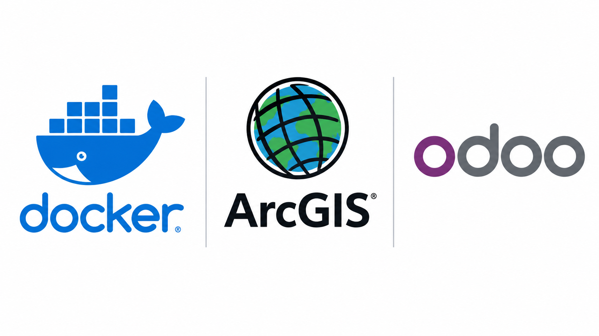
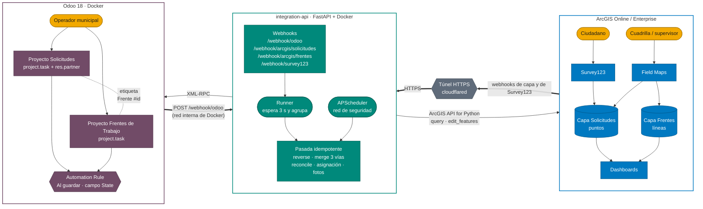
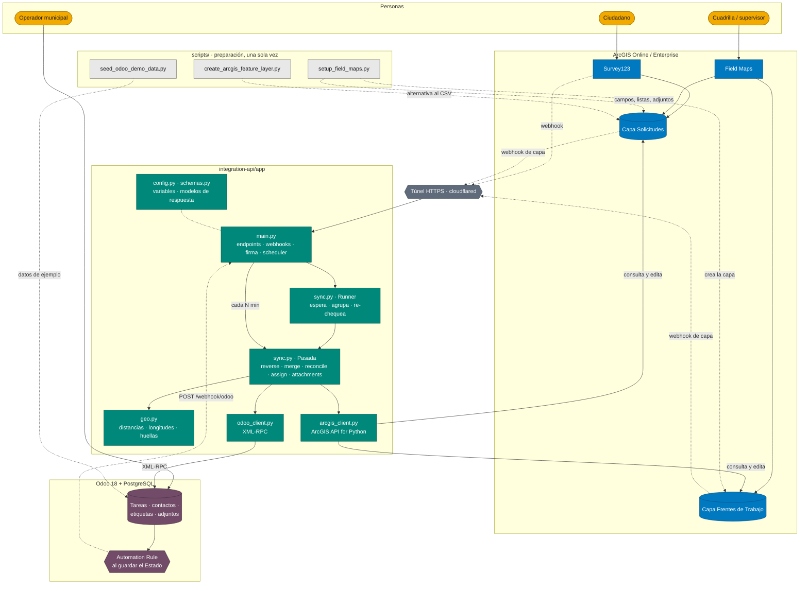
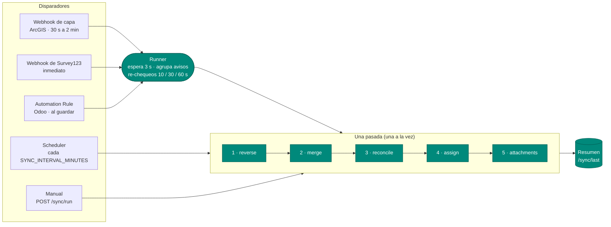
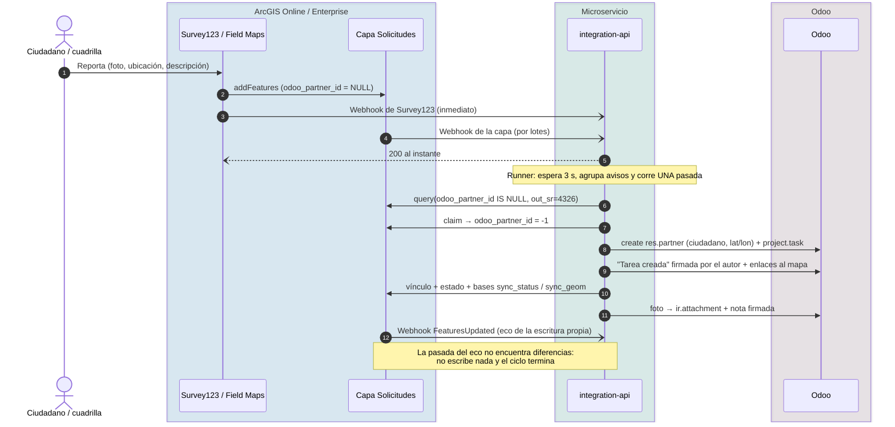
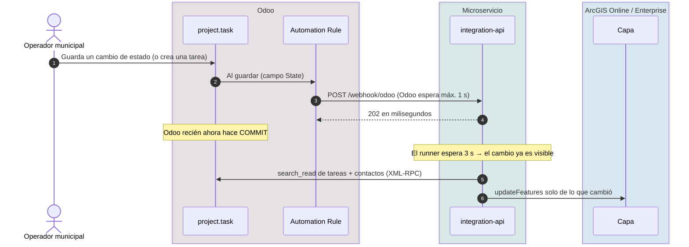
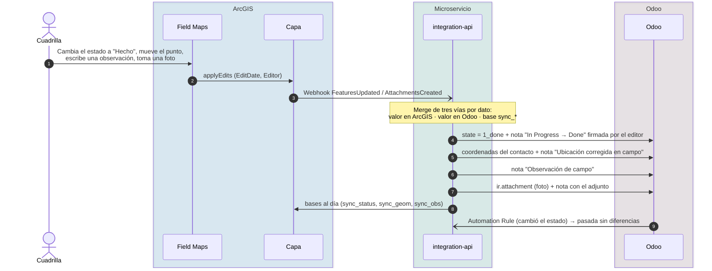
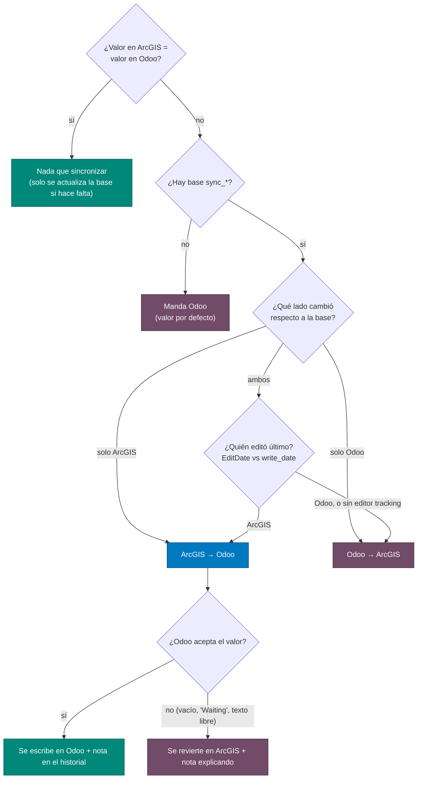
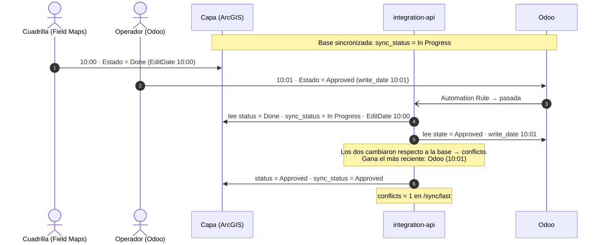

<p align="center">
  
</p>

# Integración Odoo ↔ ArcGIS Online / Enterprise

Demo técnica de integración bidireccional entre **Odoo 18** (gestión de solicitudes ciudadanas y frentes de trabajo) y **ArcGIS Online / Enterprise** (mapa, **Survey123** para reportes ciudadanos, **ArcGIS Field Maps** para trabajo en campo y **ArcGIS Dashboards** para monitoreo), mediante un microservicio propio en **FastAPI**.

> **Montaje desde cero:** [sección 3](#3-montaje-desde-cero-paso-a-paso). **Qué hace cada archivo:** [sección 4](#4-qué-hace-cada-archivo). **Ediciones simultáneas:** [sección 8](#8-ediciones-simultáneas-y-conflictos). **Limitaciones y prueba de carga:** [secciones 10 y 11](#10-pruebas-realizadas).

## Contenido

1. [Qué resuelve la solución](#1-qué-resuelve-la-solución)
2. [Arquitectura](#2-arquitectura)
3. [Montaje desde cero (paso a paso)](#3-montaje-desde-cero-paso-a-paso)
4. [Qué hace cada archivo](#4-qué-hace-cada-archivo)
5. [Cómo funciona la sincronización](#5-cómo-funciona-la-sincronización)
6. [Flujos](#6-flujos)
7. [Modelo de datos](#7-modelo-de-datos)
8. [Ediciones simultáneas y conflictos](#8-ediciones-simultáneas-y-conflictos)
9. [Autoría en Odoo](#9-autoría-en-odoo)
10. [Pruebas realizadas](#10-pruebas-realizadas)
11. [Limitaciones conocidas](#11-limitaciones-conocidas)
12. [Variables de entorno](#12-variables-de-entorno)
13. [Endpoints](#13-endpoints)
14. [Troubleshooting](#14-troubleshooting)
15. [Seguridad](#15-seguridad)
16. [Evolución recomendada para producción](#16-evolución-recomendada-para-producción)

> Los diagramas están en **Mermaid**. GitHub y GitLab los muestran de forma nativa. En VS Code se necesita la extensión *Markdown Preview Mermaid Support* (`bierner.markdown-mermaid`).

---

## 1. Qué resuelve la solución

Muchos gobiernos locales administran trámites y atención ciudadana en Odoo, sin componente geográfico. La solución conecta Odoo con ArcGIS sin cambiar la forma de trabajo de cada equipo:

- la oficina sigue en Odoo;
- el campo trabaja en Field Maps;
- la ciudadanía reporta en Survey123;
- la dirección monitorea en Dashboards.

Un microservicio mantiene ambos lados sincronizados.

| Quién | Dónde | Qué hace | Qué ocurre en el otro sistema |
|---|---|---|---|
| Ciudadano | Survey123 | Reporta un problema con foto y ubicación | Se crea una tarea en Odoo con el ciudadano como contacto, la foto y enlaces al mapa |
| Cuadrilla | Field Maps | Cambia el estado, corrige la ubicación, agrega observaciones y fotos | La tarea de Odoo se actualiza; cada cambio queda firmado por el usuario de ArcGIS |
| Supervisor | Field Maps | Dibuja un frente de trabajo (línea) | Se crea una tarea en el proyecto *Frentes de Trabajo* y las solicitudes cercanas se asignan solas |
| Operador municipal | Odoo | Cambia el estado de una tarea o crea una con ubicación | El punto se actualiza o aparece en el mapa |
| Dirección | Dashboards | Consulta indicadores | Los indicadores se actualizan con cada cambio |

| Componente | Tecnología | Rol |
|---|---|---|
| Odoo 18 + PostgreSQL 15 | Docker | ERP: proyectos, tareas, contactos, historial (chatter) |
| ArcGIS Online / Enterprise | SaaS / on-premise | Capas alojadas, mapa web, Survey123, Field Maps, Dashboards |
| `integration-api` | Python 3.11, FastAPI, ArcGIS API for Python 2.4.3, XML-RPC | Recibe avisos (webhooks) y ejecuta la sincronización |
| Túnel HTTPS | Cloudflare `cloudflared` | Publica la API en internet para que ArcGIS Online le envíe webhooks |
| Scripts de preparación | Python | Crean y configuran las capas; cargan datos de ejemplo en Odoo |

---

## 2. Arquitectura

### 2.1. Vista general


```mermaid
flowchart RL
    subgraph ODOO["Odoo 18 · Docker"]
        direction TB
        operador(["Operador municipal"])
        sol["Proyecto Solicitudes<br/>project.task + res.partner"]
        fre["Proyecto Frentes de Trabajo<br/>project.task"]
        rule{{"Automation Rule<br/>Al guardar · campo State"}}
        operador --> sol
        operador --> fre
        sol -. "etiqueta<br/>Frente #id" .- fre
        sol --> rule
        fre --> rule
    end

    subgraph API["integration-api · FastAPI + Docker"]
        direction TB
        hooks["Webhooks<br/>/webhook/odoo<br/>/webhook/arcgis/solicitudes<br/>/webhook/arcgis/frentes<br/>/webhook/survey123"]
        runner(["Runner<br/>espera 3 s y agrupa"])
        sched(["APScheduler<br/>red de seguridad"])
        pipe["Pasada idempotente<br/>reverse · merge 3 vías<br/>reconcile · asignación · fotos"]
        hooks --> runner --> pipe
        sched --> pipe
    end

    TUN{{"Túnel HTTPS<br/>cloudflared"}}

    subgraph ESRI["ArcGIS Online / Enterprise"]
        direction TB
        ciudadano(["Ciudadano"])
        cuadrilla(["Cuadrilla / supervisor"])
        s123["Survey123"]
        fm["Field Maps"]
        pts[("Capa Solicitudes<br/>puntos")]
        lin[("Capa Frentes<br/>líneas")]
        dash["Dashboards"]
        ciudadano --> s123 --> pts
        cuadrilla --> fm
        fm --> pts
        fm --> lin
        pts --> dash
        lin --> dash
    end

    ODOO == "POST /webhook/odoo<br/>(red interna de Docker)" ==> API
    API -- "XML-RPC" --> ODOO
    ESRI == "webhooks de capa y de Survey123" ==> TUN
    TUN == "HTTPS" ==> API
    API -- "ArcGIS API for Python<br/>query · edit_features" --> ESRI

    classDef odoo fill:#714B67,stroke:#4a2f43,color:#ffffff
    classDef api fill:#00897B,stroke:#00564d,color:#ffffff
    classDef esri fill:#0079C1,stroke:#004f7e,color:#ffffff
    classDef actor fill:#F2A900,stroke:#a87500,color:#1a1a1a
    classDef net fill:#5f6b7a,stroke:#3c4550,color:#ffffff
    class sol,fre,rule odoo
    class hooks,runner,sched,pipe api
    class s123,fm,pts,lin,dash esri
    class operador,ciudadano,cuadrilla actor
    class TUN net
    style ODOO fill:transparent,stroke:#714B67,stroke-width:2px
    style API fill:transparent,stroke:#00897B,stroke-width:2px
    style ESRI fill:transparent,stroke:#0079C1,stroke-width:2px
```

- **Flechas gruesas:** avisos en tiempo real (*push*). Odoo avisa con una Automation Rule; ArcGIS avisa con el webhook nativo de cada capa y con el webhook propio de Survey123.
- **Flechas finas:** llamadas que **siempre inicia `integration-api`**: XML-RPC hacia Odoo y ArcGIS API for Python hacia las capas.
- **Survey123 y Field Maps escriben directo en las capas** y nunca pasan por el microservicio. El webhook es lo que dispara la sincronización.
- **Túnel HTTPS:** ArcGIS Online está en la nube y no puede llamar a `localhost`; el microservicio necesita una URL pública HTTPS. Odoo, en cambio, llega a la API por la red interna de Docker.

### 2.2. Componentes del código


```mermaid
flowchart TB
    subgraph PER["Personas"]
        direction LR
        ciu(["Ciudadano"])
        cua(["Cuadrilla / supervisor"])
        ope(["Operador municipal"])
    end

    subgraph AG["ArcGIS Online / Enterprise"]
        direction LR
        s123["Survey123"]
        fm["Field Maps"]
        req[("Capa Solicitudes")]
        fre[("Capa Frentes de Trabajo")]
    end

    subgraph SC["scripts/ · preparación, una sola vez"]
        direction LR
        setup["setup_field_maps.py"]
        create["create_arcgis_feature_layer.py"]
        seed["seed_odoo_demo_data.py"]
    end

    tun{{"Túnel HTTPS · cloudflared"}}

    subgraph API["integration-api/app"]
        direction TB
        main["main.py<br/>endpoints · webhooks · firma · scheduler"]
        runner["sync.py · Runner<br/>espera · agrupa · re-chequea"]
        pipe["sync.py · Pasada<br/>reverse · merge · reconcile · assign · attachments"]
        geo["geo.py<br/>distancias · longitudes · huellas"]
        cfg["config.py · schemas.py<br/>variables · modelos de respuesta"]
        ac["arcgis_client.py<br/>ArcGIS API for Python"]
        oc["odoo_client.py<br/>XML-RPC"]
    end

    subgraph OD["Odoo 18 + PostgreSQL"]
        direction LR
        tasks[("Tareas · contactos ·<br/>etiquetas · adjuntos")]
        rule{{"Automation Rule<br/>al guardar el Estado"}}
    end

    ciu --> s123
    cua --> fm
    ope --> tasks
    s123 --> req
    fm --> req
    fm --> fre
    s123 -. "webhook" .-> tun
    req -. "webhook de capa" .-> tun
    fre -. "webhook de capa" .-> tun
    tun --> main
    tasks --> rule
    rule -. "POST /webhook/odoo" .-> main
    main --> runner --> pipe
    main -- "cada N min" --> pipe
    cfg -.- main
    pipe --> geo
    pipe --> ac
    pipe --> oc
    ac -- "consulta y edita" --> req
    ac -- "consulta y edita" --> fre
    oc -- "XML-RPC" --> tasks
    setup -. "campos, listas, adjuntos" .-> req
    setup -. "crea la capa" .-> fre
    create -. "alternativa al CSV" .-> req
    seed -. "datos de ejemplo" .-> tasks

    classDef odoo fill:#714B67,stroke:#4a2f43,color:#ffffff
    classDef api fill:#00897B,stroke:#00564d,color:#ffffff
    classDef esri fill:#0079C1,stroke:#004f7e,color:#ffffff
    classDef actor fill:#F2A900,stroke:#a87500,color:#1a1a1a
    classDef tool fill:#e8e8e8,stroke:#7a7a7a,color:#1a1a1a
    classDef net fill:#5f6b7a,stroke:#3c4550,color:#ffffff
    class tasks,rule odoo
    class main,runner,pipe,geo,cfg,ac,oc api
    class s123,fm,req,fre esri
    class ciu,cua,ope actor
    class setup,create,seed tool
    class tun net
```

### 2.3. Sobre el diagrama generado con GitDiagram

El diagrama que genera [gitdiagram.com](https://gitdiagram.com/osbonilla/integracionodooarcgis) a partir de este repositorio coincide con el código en lo esencial:
- los cuatro orígenes de avisos (Survey123, las dos capas y la Automation Rule);
- la división en `main.py`, `sync.py`, `config.py`, `schemas.py`, `geo.py`, `arcgis_client.py` y `odoo_client.py`;
- el runner y el scheduler;
- la asignación espacial apoyada en `geo.py`.

El diagrama 2.2 corrige y completa estos puntos:

| En GitDiagram | Corrección |
|---|---|
| La *Odoo automation rule* aparece suelta, fuera de Odoo | La dispara Odoo al guardar el estado de una tarea; pertenece a Odoo |
| El grupo se llama *Reconciliation* | La pasada tiene cinco pasos; *reconcile* es solo uno de ellos (sección 5.2) |
| Los webhooks llegan directo a FastAPI | Con ArcGIS Online pasan por el túnel HTTPS |
| No aparecen los scripts de `scripts/` | Preparan las capas y cargan datos de ejemplo (sección 4.3) |
| *Odoo tasks & contacts* dentro de *System clients* | Es la base de datos de Odoo, no un cliente del microservicio |

---

## 3. Montaje desde cero (paso a paso)

Ruta completa y en orden para recrear la demo en otra máquina y otra organización de ArcGIS. **Tiempo estimado:** 1,5 a 2 horas la primera vez.

### Paso 0 — Requisitos

- [ ] PC con **Windows 10/11**, Linux o macOS, con **Docker Desktop** (o Docker Engine + Compose) en ejecución.
- [ ] **Git**.
- [ ] Una **organización de ArcGIS Online** (o un portal de ArcGIS Enterprise 11.x) con un usuario *Creator* que pueda crear contenido, webhooks y credenciales de desarrollador (rol *Administrador*, o *Publicador* con esos privilegios). Incluye **Survey123**, **Field Maps** y **Dashboards**.
- [ ] **ArcGIS Pro 3.x** o acceso a **ArcGIS Notebooks**, para ejecutar el script de preparación de capas.
- [ ] **ArcGIS Survey123 Connect**, para publicar la encuesta desde el XLSForm.
- [ ] Un celular con la app **ArcGIS Field Maps**.

### Paso 1 — Clonar el repositorio

```powershell
git clone https://github.com/osbonilla/integracionodooarcgis.git C:\Github\IntegracionOdooArcGIS
cd C:\Github\IntegracionOdooArcGIS
```

La estructura del repositorio está en la [sección 4.1](#41-estructura-del-repositorio).

### Paso 2 — Levantar Odoo

1. Copiar `.env.example` (raíz) como `.env`, y cambiar `ODOO_DB_PASSWORD`. Es la contraseña del usuario de PostgreSQL que usa Odoo.
2. Editar `odoo/config/odoo.conf` y cambiar `admin_passwd`. Es la *contraseña maestra* que pide Odoo para crear o borrar bases de datos.
   - `dbfilter = ^odoo_demo$` obliga a que la base se llame **`odoo_demo`**.
3. Levantar la base de datos y Odoo:
   ```powershell
   docker compose up -d db odoo
   ```
4. Abrir **http://localhost:8069**. Odoo muestra el administrador de bases de datos. Completar:
   - **Master Password:** el `admin_passwd` del paso 2.
   - **Database Name:** `odoo_demo`.
   - **Email** y **Password:** el usuario administrador. Son los valores que después van en `ODOO_USERNAME` y `ODOO_PASSWORD`.
   - **Language:** *Español*.
   - **Demo data:** sin marcar.
5. Instalar la aplicación **Proyecto**: *Apps → Proyecto → Activar*.
6. Activar el **modo de desarrollador**: *Ajustes → Activar el modo de desarrollador*, al final de la página.
7. Instalar **Automation Rules** (`base_automation`): en *Apps*, quitar el filtro *Aplicaciones* y buscarlo por nombre.

`base_geolocalize` es opcional: en Odoo 18 los campos de coordenadas (`partner_latitude` / `partner_longitude`) ya existen en el módulo base, y ese módulo solo agrega la geocodificación por dirección. No hace falta crear proyectos: la integración crea *Solicitudes Ciudadanas* y *Frentes de Trabajo* la primera vez que los necesita.

> Un PostgreSQL instalado en Windows en el puerto 5432 no genera conflicto: el contenedor `db` no publica puertos.

### Paso 3 — (Opcional) Datos de ejemplo en Odoo

`scripts/seed_odoo_demo_data.py` crea ocho solicitudes en Quito, con contacto y coordenadas. La integración las publica después en el mapa: es el flujo Odoo → ArcGIS.

1. Crear `scripts/.env` (está excluido de git) con:
   ```env
   ODOO_URL=http://localhost:8069
   ODOO_DB=odoo_demo
   ODOO_USERNAME=<usuario administrador>
   ODOO_PASSWORD=<contraseña>
   ODOO_PROJECT_NAME=Solicitudes Ciudadanas
   ```
2. Ejecutar:
   ```powershell
   cd scripts
   pip install python-dotenv
   python seed_odoo_demo_data.py
   ```

### Paso 4 — Capa de solicitudes en ArcGIS

**Opción A — Publicar el CSV (recomendada; funciona con MFA):**

1. ArcGIS Online → **Contenido → Nuevo elemento**, y cargar `scripts/plantilla_capa_arcgis.csv`.
2. Elegir *Crear una capa de entidades alojada*, con la ubicación tomada de las columnas `latitude` / `longitude`.
3. En el paso de campos, verificar los tipos:
   - `phone` como **Cadena**, para conservar el 0 inicial;
   - `odoo_partner_id` como **Entero**;
   - `latitude` / `longitude` como **Doble**.
4. Asignar un título y guardar.
5. En la pestaña **Datos** de la capa, **borrar la fila de ejemplo**.
6. Copiar el id de la capa desde la URL `...item.html?id=<ID>`. Es el valor de **`ARCGIS_FEATURE_LAYER_ITEM_ID`**.

**Opción B — Por script (ArcGIS Enterprise o cuentas sin MFA):** `scripts/create_arcgis_feature_layer.py`, con `ARCGIS_USERNAME` / `ARCGIS_PASSWORD` en `scripts/.env`. Crea la misma capa vacía (sección 4.3).

### Paso 5 — Preparar las capas para Field Maps

`scripts/setup_field_maps.py` hace lo siguiente (detalle en la [sección 4.3](#43-scripts)):
- agrega a la capa de solicitudes los campos de sincronización (`sync_*`), `observaciones` y `frente_*`;
- configura la lista de estados y habilita adjuntos, Sync, ChangeTracking y editor tracking;
- **crea la capa Frentes de Trabajo** (líneas).

Este paso va antes de la encuesta porque habilita los adjuntos, donde Survey123 guarda las fotos.

Con ArcGIS Pro abierto y la sesión iniciada en la organización, desde la raíz del repositorio:

```powershell
& "C:\Program Files\ArcGIS\Pro\bin\Python\envs\arcgispro-py3\python.exe" scripts\setup_field_maps.py --pro --solicitudes <ITEM_ID_SOLICITUDES> --crear-frentes
```

- La primera línea de la salida muestra el portal y el usuario; deben ser los de la demo.
- Cada acción sale con `[OK]`. `[--]` es informativo. `[FALLÓ]` indica un ajuste que debe hacerse a mano, y el mensaje dice dónde.
- Al final imprime `ARCGIS_WORKFRONT_LAYER_ITEM_ID=<id>`; ese valor se guarda para el `.env`.
- El script es idempotente: volver a ejecutarlo solo agrega lo que falta y reutiliza la capa de frentes existente.
- Sin ArcGIS Pro, se usa un ArcGIS Notebook: se pega el archivo completo en una celda y en otra se ejecuta `preparar(GIS("home"), solicitudes_item_id="<ID>", crear_frentes=True)`.

### Paso 6 — Encuesta de Survey123

El formulario de referencia es `survey/Survey_Odoo.xlsx`.

| Pregunta | Dónde se guarda |
|---|---|
| Ubicación (mapa) | geometría del punto |
| Nombre completo | `citizen_name` |
| Problema (texto largo) | `name` |
| Fotos del problema (opcional, hasta 3) | adjuntos del punto |
| Dirección de referencia | `address` |
| Ciudad | `city` |
| Teléfono | `phone` |
| Correo | `email` |
| Campos de sistema ocultos | `odoo_partner_id`, `status`, `latitude`, `longitude` |

**Fotos:** no ocupan un campo de la capa. Survey123 las guarda como adjuntos del punto, y la integración las copia a la tarea de Odoo con una nota firmada por quien envió el reporte (sección 5.2). Por eso la capa necesita los adjuntos que habilita el paso 5. La pregunta se define así en la hoja **survey**:

| type | name | label | appearance | constraint | parameters |
|---|---|---|---|---|---|
| `image` | `foto` | Fotos del problema | `multiline` | `count-selected(${foto}) <= 3` | `max-pixels=1280` |

- `multiline` permite varias fotos en una sola pregunta y `count-selected` las limita a tres.
- `max-pixels=1280` reduce cada foto a 1.280 px en su lado mayor: el envío es más rápido desde el celular y las fotos quedan muy por debajo del límite de 25 MB que copia la integración.

Publicación:

1. Abrir `survey/Survey_Odoo.xlsx`. En la hoja **settings**, poner en `submission_url` la URL del item de la capa del paso 4: `https://www.arcgis.com/sharing/rest/content/items/<ITEM_ID>`. En Enterprise, la URL equivalente del portal.
2. En **Survey123 Connect**: *Nueva encuesta → Archivo*, y elegir el XLSForm. Luego **Publicar**. La encuesta queda conectada a la capa existente y no crea otra.
3. Compartir la encuesta:
   - pública (*Todos*) si la ciudadanía reporta sin iniciar sesión;
   - con la organización, para pruebas internas.

> **Encuesta ya publicada sin fotos:** se abre la encuesta en Survey123 Connect, se agrega la fila `foto` de la tabla anterior al XLSForm de la encuesta (debajo de la pregunta del problema), se guarda y se vuelve a **Publicar**. La capa no cambia de esquema y los envíos anteriores se conservan.

> Si se combina este XLSForm con otro generado por Survey123 Connect, las filas se copian **por nombre de columna, nunca por posición**. Copiar por posición produce el error *Duplicate column header: instance_name*.

### Paso 7 — Credenciales de App Authentication

La integración entra a ArcGIS con credenciales de aplicación, sin usuario ni contraseña, así que el MFA no la afecta.

1. ArcGIS Online → **Contenido → Nuevo elemento → Credenciales de desarrollador → OAuth 2.0**.
2. Copiar el **Client ID** y el **Client Secret**.
3. En el item de las credenciales: **Configuración → Aplicación → Credenciales → Editar → Acceso a elementos → Conceder acceso a elementos específicos**. Marcar **las dos capas**.
4. **Guardar**, y luego **Guardar** otra vez en la sección *Aplicación*.

> Cada capa nueva debe agregarse a esta lista. Sin ese acceso, `/sync/run` devuelve errores `403`.

### Paso 8 — Mapa web y Field Maps

1. **Map Viewer**: agregar la capa de solicitudes y *Frentes de Trabajo*.
   - Renombrarlas, por ejemplo *Solicitudes ciudadanas*.
   - Simbolizar ambas por `status` con *Tipos (símbolos únicos)*.
   - **Guardar** el mapa, por ejemplo como *Operaciones de Campo*. Su id es **`ARCGIS_WEBMAP_ID`**.
2. **Ventanas emergentes** de cada capa:
   - título `{name}` (solicitudes) o `{nombre}` (frentes);
   - en la lista de campos, dejar solo los campos útiles y quitar `odoo_*`, `frente_id`, `latitude`, `longitude` y `sync_*`;
   - en **Campos**, asignar nombres para mostrar en español.
3. **Field Maps Designer → Formularios**:
   - **Solicitudes:**
     - editables: *Estado* (sin la opción *Include "no value"*) y *Observaciones de campo*;
     - solo lectura (*Logic → Editable* desmarcado): problema, dirección, ciudadano, teléfono y frente asignado.
   - **Frentes de Trabajo:**
     - editables: nombre (*Required*), tipo, responsable, estado, fechas y observaciones;
     - solo lectura: longitud y solicitudes asignadas.
   - Nunca se incluyen en los formularios `odoo_partner_id`, `odoo_task_id` ni `sync_*`.
4. Pestaña **Templates**:
   - la plantilla *New Feature* de la capa de solicitudes se renombra (por ejemplo *Reporte de campo*) o se elimina si los reportes solo entran por Survey123;
   - la plantilla *Frente de trabajo* ya viene creada.

### Paso 9 — Configurar `integration-api/.env`

```powershell
copy integration-api\.env.example integration-api\.env
```

Valores mínimos (la lista completa está en la [sección 12](#12-variables-de-entorno)):

```env
ODOO_URL=http://odoo:8069
ODOO_DB=odoo_demo
ODOO_USERNAME=<usuario administrador de Odoo>
ODOO_PASSWORD=<contraseña>
ODOO_PROJECT_NAME=Solicitudes Ciudadanas
ODOO_WORKFRONT_PROJECT_NAME=Frentes de Trabajo

ARCGIS_URL=https://www.arcgis.com
ARCGIS_CLIENT_ID=<paso 7>
ARCGIS_CLIENT_SECRET=<paso 7>
ARCGIS_FEATURE_LAYER_ITEM_ID=<paso 4>
ARCGIS_WORKFRONT_LAYER_ITEM_ID=<paso 5>
ARCGIS_WEBMAP_ID=<paso 8>

SYNC_INTERVAL_MINUTES=1
```

### Paso 10 — Levantar la integración y el túnel

```powershell
docker compose up -d --build integration-api tunnel
docker compose logs integration-api --tail 30
curl -X POST http://localhost:8000/sync/run
```

- `/sync/run` debe devolver `"ok": true` y `"errors": []`.
- Si se cargaron los datos de ejemplo, aparecen `created_in_arcgis: 8`.
- Con `INTEGRATION_API_KEY` definida, la llamada lleva la clave: `curl -X POST -H "X-API-Key: <clave>" http://localhost:8000/sync/run`.
- En Windows PowerShell 5.1, `curl` es un alias de `Invoke-WebRequest` y no acepta `-X`; en ese caso se escribe `curl.exe`.
- URL pública del túnel:
  ```powershell
  docker compose logs tunnel | Select-String trycloudflare
  ```
  En el navegador, `https://<algo>.trycloudflare.com/health` debe responder `{"status":"ok"}`.

> La URL del túnel **cambia cada vez que se reinicia el contenedor `tunnel`**. En ese caso se actualiza en los webhooks del paso 11.

### Paso 11 — Webhooks (tiempo real)

| Dónde | Configuración |
|---|---|
| Item de la capa de solicitudes → **Configuración → Webhooks → Crear webhook** | Nombre `integracion-odoo-solicitudes`. URL `https://<túnel>/webhook/arcgis/solicitudes`. Eventos: entidades creadas, actualizadas y eliminadas, y adjuntos creados |
| Item *Frentes de Trabajo* → igual | Nombre `integracion-odoo-frentes`. URL `https://<túnel>/webhook/arcgis/frentes` |
| **survey123.arcgis.com** → encuesta → **Configuración → Webhooks → Agregar** | URL `https://<túnel>/webhook/survey123`. Evento *Nuevo registro enviado*. Sin *Portal info* ni *User info* (incluyen el token del usuario) |
| Odoo → **Ajustes → Técnico → Automatizaciones → Nuevo** | Modelo *Tarea*. Disparador *Al guardar*, campo *Estado*. Acción *Enviar notificación webhook* a `http://integration-api:8000/webhook/odoo` |

Con `INTEGRATION_API_KEY` definida, las URLs de Survey123 y de Odoo llevan además `?token=<clave>`. Con `ARCGIS_WEBHOOK_SECRET`, el mismo valor va en el campo *Secret* de los webhooks de capa (sección 15).

Los webhooks de capa creados desde la interfaz ya se envían cada 30 s, el mínimo de ArcGIS Online. Para comprobarlo, se repite el comando del paso 5 con `--acelerar-webhooks` al final: informa el intervalo de cada webhook y solo lo cambia si es mayor.

### Paso 12 — (Opcional) Panel en ArcGIS Dashboards

- Crear un panel sobre el mapa *Operaciones de Campo* con:
  - indicadores (total de solicitudes; abiertas, con `status` distinto de *Done* y *Cancelled*);
  - un gráfico por `status`;
  - un gráfico por `frente_nombre`;
  - una lista de solicitudes;
  - el mapa.
- Para que el panel se actualice solo, configurar un **intervalo de actualización** en las capas del mapa (*Map Viewer → Propiedades de la capa*).

### Paso 13 — Prueba de punta a punta

Dejar el log abierto en una terminal: `docker compose logs -f integration-api`.

1. **Survey123 → Odoo:** se envía un reporte con foto. En segundos (hasta ~1 min si ArcGIS tarda en mostrar el registro) aparece en *Proyecto → Solicitudes Ciudadanas*, con el ciudadano como contacto y la foto en el historial.
2. **Field Maps → Odoo:** en el celular se abre el mapa, se toca la solicitud → **Editar** → estado *Hecho*, una observación y una foto → **Enviar**. Entre 30 s y 2 min después, la tarea pasa a *Done*, con las notas firmadas por el usuario de ArcGIS.
3. **Odoo → ArcGIS:** se cambia el estado de una tarea en Odoo. En segundos el punto cambia de símbolo en el mapa.
4. **Frente de trabajo:** en Field Maps, **+** → *Frente de trabajo* → se traza una línea a menos de 50 m de alguna solicitud → **Enviar**. Se crea la tarea en *Frentes de Trabajo*. Las solicitudes cercanas reciben la etiqueta *Frente #… · nombre* en Odoo y el campo *Frente de trabajo* en el mapa.

### Checklist antes de presentar

- [ ] `docker compose ps` muestra `db`, `odoo`, `integration-api` y `tunnel` en ejecución.
- [ ] La URL actual del túnel está en los dos webhooks de capa y en el de Survey123.
- [ ] `curl -X POST http://localhost:8000/sync/run` devuelve `"errors": []`.
- [ ] Field Maps abre el mapa en el celular con la sesión de ArcGIS iniciada.

---

## 4. Qué hace cada archivo

### 4.1. Estructura del repositorio

```
IntegracionOdooArcGIS/
├── docker-compose.yml            # db (PostgreSQL 15) · odoo (18.0) · integration-api · tunnel
├── .env.example                  # usuario y contraseña de PostgreSQL para docker compose
├── odoo/
│   ├── config/odoo.conf          # contraseña maestra, filtro de base (^odoo_demo$)
│   └── addons/                   # módulos propios de Odoo (vacío en esta demo)
├── integration-api/              # microservicio de integración
│   ├── Dockerfile                # python:3.11-slim + uvicorn; healthcheck en /health
│   ├── requirements.txt          # fastapi, uvicorn, pydantic, apscheduler, arcgis 2.4.3
│   ├── .env.example              # plantilla de variables (sección 12)
│   └── app/
│       ├── main.py               # API: endpoints, webhooks, firma, scheduler
│       ├── sync.py               # motor de sincronización y runner
│       ├── arcgis_client.py      # acceso a las capas (ArcGIS API for Python)
│       ├── odoo_client.py        # acceso a Odoo (XML-RPC)
│       ├── geo.py                # geometría y huellas
│       ├── config.py             # lectura de variables de entorno
│       └── schemas.py            # modelos de respuesta de la API
├── scripts/
│   ├── setup_field_maps.py       # prepara las capas y crea la de frentes
│   ├── create_arcgis_feature_layer.py   # crea la capa de solicitudes (sin MFA)
│   ├── seed_odoo_demo_data.py    # carga solicitudes de ejemplo en Odoo
│   ├── plantilla_capa_arcgis.csv # plantilla para publicar la capa de solicitudes
│   └── requirements.txt          # dependencias de los scripts locales
└── survey/
    └── Survey_Odoo.xlsx          # XLSForm de la encuesta ciudadana
```

### 4.2. `integration-api/app/`

#### `main.py` — API y recepción de avisos

- Crea la aplicación FastAPI, con CORS abierto (lo requiere el webhook de Survey123 cuando lo envía el navegador).
- **Recibe los avisos y no escribe datos**: cada webhook se valida y se convierte en una solicitud de pasada (`runner.request(...)`). La respuesta es inmediata (`200` / `202`).
- **Seguridad:**
  - `X-API-Key` o `?api_key=` para `/sync/*`;
  - `?token=` para `/webhook/odoo` y `/webhook/survey123`;
  - verificación HMAC-SHA256 de la firma `x-esriHook-Signature` de ArcGIS con `ARCGIS_WEBHOOK_SECRET`.
- **Lectura tolerante del payload de ArcGIS:** acepta JSON directo, un objeto `{"payload": "<json>"}` o un formulario `payload=`. Responde `pong` a las pruebas de conectividad que hace ArcGIS al crear el webhook.
- **Arranque:** si `SYNC_INTERVAL_MINUTES > 0`, programa la pasada periódica con APScheduler (la primera a los 15 s). Si `INTEGRATION_API_KEY` está vacía, lo advierte en el log.

#### `sync.py` — motor de sincronización

| Pieza | Función |
|---|---|
| `run_pipeline` / `_run` | Ejecuta una pasada con candado (nunca dos a la vez), arma el resumen (`PipelineSummary`) y lo deja en `/sync/last` |
| `_reverse_requests` / `_reverse_fronts` | Features nuevas de campo → tareas en Odoo (sección 5.2) |
| `_merge_requests` / `_merge_fronts` | Merge de tres vías de estado y ubicación, datos que manda cada lado, observaciones y publicación de tareas de Odoo en el mapa |
| `_three_way`, `_merge_status`, `_merge_request_location`, `_merge_observations` | Reglas de decisión por dato (sección 8) |
| `_claim`, `_release`, `_link` | Idempotencia de altas: marca con `-1` antes de crear en Odoo; si Odoo falla, libera; si falla el vínculo, reintenta solo el vínculo |
| `_reconcile` | Borra en ArcGIS las features cuya tarea ya no existe en Odoo |
| `_assign` | Asigna cada solicitud al frente no cancelado más cercano (≤ `WORKFRONT_BUFFER_M`) |
| `_sync_attachments` | Copia a Odoo las fotos nuevas de campo |
| `_author`, `_system_author` | Quién firma cada mensaje en Odoo (sección 9) |
| `_set` | Escribe un campo solo si el valor, convertido al tipo real de la capa, es distinto |
| `_map_links` | Enlaces *Ver en el mapa* y *Abrir en Field Maps* (si `ARCGIS_WEBMAP_ID` está definido) |
| `_Runner` | Espera, agrupa avisos y programa re-chequeos (sección 5.1) |
| `handle_manual_status` | Simulación de un cambio desde ArcGIS vía `/webhook/arcgis` (para demos sin mapa) |

#### `arcgis_client.py` — acceso a las capas

- `get_gis()`: conexión única a ArcGIS, por App Authentication (client id / secret, con prioridad) o por usuario y contraseña.
- `ArcGISLayer`: una capa identificada por item id.
  - Lee el esquema real de la capa (`field_info`) y los campos de editor tracking (`edit_fields`: *Creator*, *Editor*, *EditDate*).
  - Consulta siempre en WGS84 (`out_sr=4326`), con paginación automática.
  - `query_near`: consulta espacial por distancia en metros.
  - Altas y actualizaciones en **lotes de 200**; bajas en una sola petición. Descarta los campos que la capa no tiene, así el esquema es tolerante.
  - Claim y release.
  - Adjuntos: `queryAttachments` en una sola consulta, con respaldo de una consulta por feature; descarga de archivos.
- `coerce_value`: convierte cada valor al tipo del campo antes de comparar. Evita escrituras eternas cuando el tipo difiere; por ejemplo, un teléfono de texto en un campo entero.
- `user_profile`: nombre completo y correo de un usuario de ArcGIS, si el portal los entrega.

#### `odoo_client.py` — acceso a Odoo por XML-RPC

- **Conexión:** autenticación y `execute_kw` (XML-RPC es la API externa estándar de Odoo; no requiere módulos adicionales).
- **Proyectos:** se crean al primer uso.
- **Estados:** `project.task.state` con etiquetas leídas por `fields_get`. Nunca escribe `04_waiting_normal` (*Waiting*), que Odoo calcula por dependencias.
- **Solicitudes:** lectura de tareas más contactos; creación de contacto y tarea; actualización de coordenadas.
- **Frentes:** lectura, creación y actualización de tareas en *Frentes de Trabajo*.
- **Etiquetas** `Frente #<id> · <nombre>`.
- **Adjuntos:** en `ir.attachment`, con clave `arcgis:<capa>:<GlobalID>` para no duplicarlos.
- **Notas y autoría:**
  - `message_post` con autor;
  - creación sin el mensaje automático firmado por el usuario técnico (`mail_create_nolog`);
  - escrituras de estado y de datos del frente sin seguimiento automático (`mail_notrack`), acompañadas de una nota firmada por quien hizo el cambio.
- **Autores:** usuario interno de Odoo, contacto `arcgis:<usuario>`, o el contacto *Integración ArcGIS*.

#### `geo.py` — geometría y huellas

- **Validación de coordenadas:** descarta `0,0` y valores fuera de rango, como coordenadas en Web Mercator.
- **Comparación de puntos:** `same_point`, con tolerancia de ~0,2 m. La huella de ubicación es `"lat,lon"` con 6 decimales.
- **Distancias:**
  - `haversine_m` y `polyline_length_m` (longitud de un frente);
  - `point_to_polyline_m`: distancia punto–línea con proyección equirectangular local, adecuada para decenas o cientos de metros;
  - `polyline_midpoint`, para el enlace al mapa.
- **Huellas:** `content_fp` (SHA-1 del contenido de campo de un frente) y `text_fp` (observaciones). Permiten saber si algo cambió sin guardar estado.

#### `config.py` y `schemas.py`

- `config.py` lee las variables de entorno (sección 12). Ignora las variables que no declara (`extra="ignore"`) e interpreta `ARCGIS_ODOO_USERS`.
- `schemas.py` define los modelos de respuesta:
  - `LayerCounts` (contadores por capa);
  - `PipelineSummary` (resumen de una pasada);
  - `RunnerStatus` (`/status`);
  - `ArcGISWebhookPayload` (simulación manual).

### 4.3. `scripts/`

#### `setup_field_maps.py` — preparación de capas (una sola vez, idempotente)

| Sobre | Qué hace |
|---|---|
| Capa de solicitudes | Agrega `frente_id`, `frente_nombre`, `observaciones`, `sync_status`, `sync_geom` y `sync_obs`. Crea la lista de valores de `status` (código = etiqueta de Odoo en inglés; nombre visible en español: *En progreso, Cambios solicitados, Aprobado, Hecho, Cancelado*). Habilita adjuntos |
| Capa de frentes | La crea (`--crear-frentes`) con sus campos, listas de `status` y `tipo_trabajo`, adjuntos y la plantilla *Frente de trabajo* (estado inicial *En progreso*). Si ya existe una capa propia con ese nombre, la reutiliza |
| Ambos servicios | Habilita *Sync* + *ChangeTracking* (requisito de los webhooks y del trabajo offline) y editor tracking |
| Webhooks | `--acelerar-webhooks` / `acelerar_webhooks()` verifica que se envíen cada 30 s (el mínimo de ArcGIS Online) y solo los cambia si tienen un intervalo mayor. Al cambiarlos conserva la firma si `ARCGIS_WEBHOOK_SECRET` está en el `.env`. Se usa una vez creados los webhooks (paso 11) |

- **Validaciones:** se detiene con un mensaje claro si el id corresponde a un formulario de Survey123 en lugar de una capa, si se cruzan los ids de puntos y líneas, o si no hay sesión de ArcGIS Pro.
- **Modos de ejecución:**
  - `--pro`: usa la sesión de ArcGIS Pro; funciona con MFA.
  - Pegado en un ArcGIS Notebook: funciona con MFA.
  - `--user`: usuario y contraseña; para Enterprise o cuentas sin MFA.

#### `create_arcgis_feature_layer.py` — capa de solicitudes por código

- Alternativa a publicar el CSV.
- Crea el servicio, le agrega la capa de puntos con los campos base y la comparte con la organización.
- Usa usuario y contraseña, por lo que no funciona con MFA ni SSO.
- Si ya existe una capa con el mismo título, no la duplica.

#### `seed_odoo_demo_data.py` — datos de ejemplo en Odoo

- Crea el proyecto *Solicitudes Ciudadanas* y ocho solicitudes en Quito, cada una con contacto, teléfono y coordenadas.
- Es idempotente: no repite tareas con el mismo nombre.
- Lee `scripts/.env` y se conecta por XML-RPC.

#### `plantilla_capa_arcgis.csv` y `requirements.txt`

- `plantilla_capa_arcgis.csv`: columnas de la capa de solicitudes con una fila de ejemplo. El teléfono va con guiones para que ArcGIS lo publique como texto. La fila de ejemplo se borra después de publicar.
- `requirements.txt`: dependencias de los scripts locales (`python-dotenv`, `arcgis`). `setup_field_maps.py --pro` usa el Python de ArcGIS Pro y no las necesita.

### 4.4. `survey/Survey_Odoo.xlsx`

XLSForm de la encuesta ciudadana (paso 6).

- Las preguntas visibles corresponden a los datos del ciudadano y del problema, más hasta tres fotos (pregunta `foto`, tipo `image`), que se guardan como adjuntos del punto.
- `odoo_partner_id`, `status`, `latitude` y `longitude` son campos ocultos que llena la integración.
- `submission_url` conecta la encuesta con la capa existente.

### 4.5. Infraestructura

| Archivo | Contenido |
|---|---|
| `docker-compose.yml` | **`db`**: PostgreSQL 15 con volumen persistente y healthcheck. **`odoo`**: Odoo 18, puerto 8069, monta `odoo/config` y `odoo/addons`. **`integration-api`**: build de `integration-api/`, puerto 8000, lee `integration-api/.env`. **`tunnel`**: `cloudflared` hacia `http://integration-api:8000`. Todos en la red `backend` |
| `odoo/config/odoo.conf` | `admin_passwd` (contraseña maestra), `dbfilter = ^odoo_demo$`, `list_db = True`. Configuración de demo, no de producción |
| `integration-api/Dockerfile` | Imagen `python:3.11-slim`, instala dependencias, copia `app/`, healthcheck en `/health`, arranca `uvicorn` |
| `.env.example` (raíz) | `ODOO_DB_USER` / `ODOO_DB_PASSWORD` para PostgreSQL |

> **Cambios de código:** `docker compose up -d --force-recreate` sin `--build` reutiliza la imagen anterior, que tiene copiado el código viejo. Siempre que cambia un `.py`: `docker compose up -d --build --force-recreate integration-api`. Cuando solo cambia el `.env`: `docker compose up -d --force-recreate integration-api`.

---

## 5. Cómo funciona la sincronización

### 5.1. Disparadores y runner


```mermaid
flowchart LR
    subgraph DIS["Disparadores"]
        direction TB
        w1["Webhook de capa<br/>ArcGIS · 30 s a 2 min"]
        w2["Webhook de Survey123<br/>inmediato"]
        w3["Automation Rule<br/>Odoo · al guardar"]
        w4["Scheduler<br/>cada SYNC_INTERVAL_MINUTES"]
        w5["Manual<br/>POST /sync/run"]
    end
    R(["Runner<br/>espera 3 s · agrupa avisos<br/>re-chequeos 10 / 30 / 60 s"])
    subgraph PASADA["Una pasada (una a la vez)"]
        direction LR
        p1["1 · reverse"] --> p2["2 · merge"] --> p3["3 · reconcile"] --> p4["4 · assign"] --> p5["5 · attachments"]
    end
    S[("Resumen<br/>/sync/last")]
    w1 --> R
    w2 --> R
    w3 --> R
    R --> PASADA
    w4 --> PASADA
    w5 --> PASADA
    PASADA --> S

    classDef api fill:#00897B,stroke:#00564d,color:#ffffff
    class R,p1,p2,p3,p4,p5,S api
```

- **Los webhooks son un timbre:** solo avisan que algo cambió. El contenido del aviso nunca se usa para escribir datos, así que un aviso duplicado, falso o fuera de orden solo provoca una pasada que no encuentra diferencias.
- **Espera y agrupamiento:** el runner espera `WEBHOOK_DEBOUNCE_SECONDS` (3 s) y ejecuta **una** pasada con todos los avisos acumulados. Una ráfaga de 50 webhooks produjo una sola pasada (sección 10.2). La espera también deja que Odoo confirme su transacción: la Automation Rule llama al webhook *antes* del commit.
- **Re-chequeos:** ArcGIS Online puede avisar antes de que el registro nuevo sea visible en las consultas. Tras cada aviso de ArcGIS se programan pasadas extra a los 10, 30 y 60 s (`WEBHOOK_RECHECK_SECONDS`).
- **Una pasada a la vez:** un candado evita pasadas simultáneas. Si llega un aviso durante una pasada, se ejecuta una más al terminar. El scheduler no espera: si hay una pasada en curso, omite su turno.
- **Red de seguridad:** el scheduler ejecuta una pasada completa cada `SYNC_INTERVAL_MINUTES`. Recupera cualquier aviso perdido; por ejemplo, si la API estaba caída o la URL del túnel cambió.

### 5.2. Qué hace cada paso de la pasada

| Paso | Lee | Decide y escribe |
|---|---|---|
| **1 · reverse** | Features sin vínculo (`odoo_partner_id` / `odoo_task_id` nulos) | Por cada una: *claim* (`-1`), crea en Odoo el contacto y la tarea (solicitud) o la tarea (frente), respeta el estado elegido en campo si es válido, publica el *Tarea creada* firmado por quien la creó y la observación inicial, y escribe en la feature el vínculo, el estado y las bases `sync_*`. Si Odoo falla, libera el claim para reintentar |
| **2 · merge** | Features vinculadas y tareas de Odoo | **Solicitudes:** datos del ciudadano (manda Odoo), estado y ubicación (merge de tres vías), observaciones nuevas → nota. Las tareas de Odoo con coordenadas y sin feature se publican en el mapa. **Frentes:** estado (tres vías). Si cambió la huella del contenido de campo (nombre, tipo, responsable, fechas, trazado), actualiza la tarea y la longitud |
| **3 · reconcile** | Ids vinculados en ArcGIS y tareas existentes | Borra las features cuya tarea ya no existe en Odoo (Odoo manda en la existencia) |
| **4 · assign** | Frentes no cancelados y solicitudes cercanas | ArcGIS resuelve los candidatos con una consulta por distancia; `geo.py` calcula la distancia exacta punto–línea; gana el frente más cercano dentro de `WORKFRONT_BUFFER_M`. Escribe la etiqueta en Odoo, `frente_id` / `frente_nombre` en la solicitud y `solicitudes_asignadas` en el frente. Publica una nota en el frente con las solicitudes nuevas y retiradas |
| **5 · attachments** | Adjuntos de las features vinculadas | Copia a la tarea los adjuntos que aún no tienen clave `arcgis:<capa>:<GlobalID>` (máx. 25 MB por archivo), con una nota firmada |

Principios comunes a todos los pasos:

- **Escritura por diferencia:** solo se escribe lo que cambió, comparando con el valor ya convertido al tipo del campo. Por eso los *ecos* convergen: la escritura propia dispara un webhook, la pasada siguiente no encuentra diferencias y no escribe nada.
- **Microservicio sin estado:** la *base* del merge vive en campos ocultos de cada feature (`sync_status`, `sync_geom`, `sync_fp`, `sync_obs`). El contenedor se puede reiniciar o redesplegar sin perder contexto.
- **Errores aislados:** cada paso se ejecuta protegido. Un error en una feature o en un paso queda en `errors` del resumen y no detiene el resto.

---

## 6. Flujos

| Flujo | Qué lo dispara | Qué hace |
|---|---|---|
| Reporte nuevo (Survey123 / Field Maps) → Odoo | Webhook de Survey123 (inmediato) y webhook de la capa | Crea contacto y tarea, vincula la feature, publica observación y fotos |
| Odoo → ArcGIS | Automation Rule al guardar el estado | Actualiza la feature (solo lo que cambió); publica en el mapa las tareas nuevas con ubicación |
| Edición en campo → Odoo | Webhook de la capa | Estado, ubicación, observaciones y fotos, con merge de tres vías |
| Frente de trabajo → Odoo | Webhook de la capa de frentes | Tarea en *Frentes de Trabajo* y asignación de solicitudes por cercanía |
| Reconciliación | Cada pasada | Borra en ArcGIS las features cuya tarea ya no existe en Odoo |
| Red de seguridad | Scheduler | Pasada completa por si se perdió algún aviso |

### 6.1. Reporte nuevo desde campo (Survey123 / Field Maps) → Odoo


```mermaid
sequenceDiagram
    autonumber
    actor C as Ciudadano / cuadrilla
    box rgba(0,121,193,0.12) ArcGIS Online / Enterprise
        participant F as Survey123 / Field Maps
        participant L as Capa Solicitudes
    end
    box rgba(0,137,123,0.12) Microservicio
        participant API as integration-api
    end
    box rgba(113,75,103,0.12) Odoo
        participant O as Odoo
    end

    C->>F: Reporta (foto, ubicación, descripción)
    F->>L: addFeatures (odoo_partner_id = NULL)
    F-)API: Webhook de Survey123 (inmediato)
    L-)API: Webhook de la capa (por lotes)
    API--)F: 200 al instante
    Note over API: Runner: espera 3 s, agrupa avisos y corre UNA pasada
    API->>L: query(odoo_partner_id IS NULL, out_sr=4326)
    API->>L: claim → odoo_partner_id = -1
    API->>O: create res.partner (ciudadano, lat/lon) + project.task
    API->>O: "Tarea creada" firmada por el autor + enlaces al mapa
    API->>L: vínculo + estado + bases sync_status / sync_geom
    API->>O: foto → ir.attachment + nota firmada
    L-)API: Webhook FeaturesUpdated (eco de la escritura propia)
    Note over API,L: La pasada del eco no encuentra diferencias:<br/>no escribe nada y el ciclo termina
```

Si el registro todavía no es visible cuando llega el aviso, lo toma uno de los re-chequeos (10, 30 o 60 s).

### 6.2. Odoo → ArcGIS (cambio de estado o tarea nueva)


```mermaid
sequenceDiagram
    autonumber
    actor Op as Operador municipal
    box rgba(113,75,103,0.12) Odoo
        participant O as project.task
        participant R as Automation Rule
    end
    box rgba(0,137,123,0.12) Microservicio
        participant API as integration-api
    end
    box rgba(0,121,193,0.12) ArcGIS Online / Enterprise
        participant L as Capa
    end

    Op->>O: Guarda un cambio de estado (o crea una tarea)
    O->>R: Al guardar (campo State)
    R->>API: POST /webhook/odoo (Odoo espera máx. 1 s)
    API-->>R: 202 en milisegundos
    Note over O: Odoo recién ahora hace COMMIT
    Note over API: El runner espera 3 s → el cambio ya es visible
    API->>O: search_read de tareas + contactos (XML-RPC)
    API->>L: updateFeatures solo de lo que cambió
```

Odoo ejecuta la acción *Enviar notificación webhook* **dentro de la transacción, antes del commit**, con un timeout de 1 s. Si el microservicio leyera Odoo en ese instante, obtendría el estado **anterior**. Por eso `/webhook/odoo` responde `202` de inmediato y la pasada corre 3 s después.

### 6.3. Edición en campo → Odoo (estado, ubicación, observaciones, fotos)


```mermaid
sequenceDiagram
    autonumber
    actor Q as Cuadrilla
    box rgba(0,121,193,0.12) ArcGIS
        participant FM as Field Maps
        participant L as Capa
    end
    box rgba(0,137,123,0.12) Microservicio
        participant API as integration-api
    end
    box rgba(113,75,103,0.12) Odoo
        participant O as Odoo
    end

    Q->>FM: Cambia el estado a "Hecho", mueve el punto,<br/>escribe una observación, toma una foto
    FM->>L: applyEdits (EditDate, Editor)
    L-)API: Webhook FeaturesUpdated / AttachmentsCreated
    Note over API: Merge de tres vías por dato:<br/>valor en ArcGIS · valor en Odoo · base sync_*
    API->>O: state = 1_done + nota "In Progress → Done" firmada por el editor
    API->>O: coordenadas del contacto + nota "Ubicación corregida en campo"
    API->>O: nota "Observación de campo"
    API->>O: ir.attachment (foto) + nota con el adjunto
    API->>L: bases al día (sync_status, sync_geom, sync_obs)
    O-)API: Automation Rule (cambió el estado) → pasada sin diferencias
```

### 6.4. Frentes de trabajo y asignación por cercanía


```mermaid
sequenceDiagram
    autonumber
    actor S as Supervisor
    box rgba(0,121,193,0.12) ArcGIS
        participant FM as Field Maps
        participant LN as Capa Frentes
        participant PT as Capa Solicitudes
    end
    box rgba(0,137,123,0.12) Microservicio
        participant API as integration-api
    end
    box rgba(113,75,103,0.12) Odoo
        participant O as Odoo
    end

    S->>FM: Dibuja el tramo (nombre, tipo, responsable, fecha fin)
    FM->>LN: addFeatures (línea)
    LN-)API: Webhook FeaturesCreated
    API->>O: Tarea en "Frentes de Trabajo"<br/>(descripción, longitud, fecha límite, enlaces)
    API->>LN: vínculo + longitud_m + estado
    loop por cada frente no cancelado
        API->>PT: query con distance = buffer (lo resuelve ArcGIS)
        Note over API: distancia exacta punto-línea → gana el frente más cercano
    end
    API->>PT: frente_id / frente_nombre (solo si cambió)
    API->>O: etiqueta "Frente #35;id · nombre" en cada solicitud
    API->>O: nota en el frente: "Nuevas: #35;12 Bache en vía…"
    API->>LN: solicitudes_asignadas
```

---

## 7. Modelo de datos

La columna **Manda** indica qué lado es dueño de cada dato:
- **Odoo** o **campo** (ArcGIS);
- **compartido**: se resuelve con el merge de tres vías;
- **calculado**: lo escribe la integración;
- **sistema**: oculto, de uso interno.

### 7.1. Capa *Solicitudes* (puntos)

| Campo | Tipo | Manda | Uso |
|---|---|---|---|
| `odoo_partner_id` | Entero | sistema | id de la `project.task` (nombre histórico del campo) |
| `name` | Texto | Odoo | descripción del problema = título de la tarea |
| `citizen_name`, `address`, `city`, `phone`, `email` | Texto | Odoo | datos del ciudadano (`res.partner`) |
| `status` | Texto + lista | compartido | `project.task.state` (código = etiqueta de Odoo; se ve en español) |
| geometría | Punto | compartido | `res.partner.partner_latitude/longitude` |
| `latitude`, `longitude` | Doble | calculado | copia de la geometría |
| `observaciones` | Texto (1000) | campo | cada texto nuevo → nota en el historial |
| adjuntos | Fotos / archivos | campo | fotos de Survey123 (pregunta `foto`) y de Field Maps → `ir.attachment` de la tarea + nota |
| `frente_id`, `frente_nombre` | Entero / Texto | calculado | frente de trabajo asignado |
| `sync_status`, `sync_geom`, `sync_obs` | Texto | sistema | base del merge de tres vías |

### 7.2. Capa *Frentes de Trabajo* (líneas)

| Campo | Tipo | Manda | Uso |
|---|---|---|---|
| `odoo_task_id` | Entero | sistema | id de la `project.task` en *Frentes de Trabajo* |
| `nombre` | Texto | campo | título de la tarea |
| `tipo_trabajo` | Texto + lista | campo | Bacheo, Alcantarillado, Agua potable, … |
| `responsable` | Texto | campo | cuadrilla o encargado |
| `fecha_inicio`, `fecha_fin` | Fecha | campo | `fecha_fin` → fecha límite de la tarea |
| `status` | Texto + lista | compartido | `project.task.state` |
| geometría | Línea | campo | longitud en la descripción y asignación de solicitudes |
| `observaciones`, adjuntos | — | campo | notas y adjuntos de la tarea |
| `longitud_m`, `solicitudes_asignadas` | Doble / Entero | calculado | se muestran en el formulario y la ventana emergente |
| `sync_status`, `sync_fp`, `sync_obs` | Texto | sistema | base del merge |

### 7.3. Del lado de Odoo

- **Solicitud** = `project.task` en *Solicitudes Ciudadanas*, con un `res.partner` propio que guarda el ciudadano y la ubicación del reporte.
- **Frente** = `project.task` en *Frentes de Trabajo*, sin contacto. El trazado vive solo en ArcGIS.
- **Asignación** = etiqueta `Frente #<id> · <nombre>` (`project.tags`) en la tarea de la solicitud. En el Kanban: *Agrupar por → Etiquetas*.
- **Historial (chatter):** *Tarea creada*, cambios de estado, ubicación corregida, observaciones, adjuntos, solicitudes asignadas y valores rechazados. Cada entrada va firmada por su autor (sección 9).

### 7.4. `state` vs `stage_id`

- La integración usa **`state`**, el estado de la tarea (Selection), no la columna del Kanban (`stage_id`).
- Las etiquetas se resuelven con `fields_get(["state"], ["selection"])`.
- `04_waiting_normal` (*Waiting*) lo calcula Odoo por dependencias. La integración nunca lo escribe y la lista de ArcGIS no lo ofrece.

---

## 8. Ediciones simultáneas y conflictos

### 8.1. ¿Pueden dos personas editar el mismo dato a la vez?

Sí. Ni Odoo ni ArcGIS bloquean registros, así que un operador puede cambiar el estado de una solicitud en Odoo mientras una cuadrilla lo cambia en Field Maps. La integración no lo impide; lo **resuelve de forma determinista** en la pasada siguiente:

1. **Se compara dato por dato, no registro por registro.** Si cada persona cambió un dato distinto (por ejemplo, el operador el estado y la cuadrilla la ubicación), **se conservan los dos cambios**.
2. **Para cada dato compartido se comparan tres valores:**
   - el de ArcGIS;
   - el de Odoo;
   - la **base**, que es el último valor sincronizado y está guardado en los campos `sync_*`.

   Así se sabe qué lado cambió sin depender de relojes.
3. **Solo hay conflicto si los dos lados cambiaron el mismo dato** desde la última sincronización. En ese caso **gana la edición más reciente**: `EditDate` de la feature contra `write_date` de la tarea (o del contacto, para la ubicación).

### 8.2. Reglas por tipo de dato

| Dato | Si cambia solo en Odoo | Si cambia solo en campo | Si cambia en ambos lados |
|---|---|---|---|
| Estado (solicitud y frente) | Pasa a ArcGIS | Pasa a Odoo + nota firmada | Gana el más reciente. Si gana campo, nota en Odoo; si gana Odoo, se corrige la capa |
| Ubicación de la solicitud | Pasa a ArcGIS | Pasa a Odoo + nota | Gana el más reciente (mismo criterio) |
| Datos del ciudadano y descripción | Pasan a ArcGIS | **Se revierten** en la pasada siguiente (manda Odoo) | Gana Odoo |
| Datos del frente (nombre, tipo, responsable, fechas, trazado) | Quedan solo en Odoo y se sobrescriben en la próxima edición del frente en campo | Pasan a Odoo + nota | Gana campo |
| Observaciones | — | Cada texto nuevo es una nota (no se reemplaza nada) | No hay conflicto: se agregan |
| Fotos | — | Se agregan como adjuntos | No hay conflicto: se agregan |
| Estado inválido en campo (vacío, *Waiting*, texto libre) | — | Se revierte al valor de Odoo + nota explicando | Igual |
| Existencia de la solicitud | Tarea borrada → se borra la feature | Feature borrada → se vuelve a publicar desde Odoo | Manda Odoo |

### 8.3. Merge de tres vías


```mermaid
flowchart TD
    A{"¿Valor en ArcGIS =<br/>valor en Odoo?"} -- sí --> N["Nada que sincronizar<br/>(solo se actualiza la base si hace falta)"]
    A -- no --> B{"¿Hay base sync_*?"}
    B -- no --> OD1["Manda Odoo<br/>(valor por defecto)"]
    B -- sí --> C{"¿Qué lado cambió<br/>respecto a la base?"}
    C -- solo ArcGIS --> AO["ArcGIS → Odoo"]
    C -- solo Odoo --> OA["Odoo → ArcGIS"]
    C -- ambos --> D{"¿Quién editó último?<br/>EditDate vs write_date"}
    D -- ArcGIS --> AO
    D -- "Odoo, o sin editor tracking" --> OA
    AO --> V{"¿Odoo acepta el valor?"}
    V -- sí --> OK["Se escribe en Odoo + nota en el historial"]
    V -- "no (vacío, 'Waiting', texto libre)" --> REV["Se revierte en ArcGIS + nota explicando"]

    classDef odoo fill:#714B67,stroke:#4a2f43,color:#ffffff
    classDef esri fill:#0079C1,stroke:#004f7e,color:#ffffff
    classDef ok fill:#00897B,stroke:#00564d,color:#ffffff
    class OA,OD1,REV odoo
    class AO esri
    class OK,N ok
```

### 8.4. Ejemplo: operador y cuadrilla cambian el mismo estado


```mermaid
sequenceDiagram
    autonumber
    actor Q as Cuadrilla (Field Maps)
    actor Op as Operador (Odoo)
    participant L as Capa (ArcGIS)
    participant API as integration-api
    participant O as Odoo
    Note over L,O: Base sincronizada: sync_status = In Progress
    Q->>L: 10:00 · Estado = Done (EditDate 10:00)
    Op->>O: 10:01 · Estado = Approved (write_date 10:01)
    O-)API: Automation Rule → pasada
    API->>L: lee status = Done · sync_status = In Progress · EditDate 10:00
    API->>O: lee state = Approved · write_date 10:01
    Note over API: Los dos cambiaron respecto a la base → conflicto.<br/>Gana el más reciente: Odoo (10:01)
    API->>L: status = Approved · sync_status = Approved
    Note over API: conflicts = 1 en /sync/last
```

Con los tiempos invertidos (Odoo 10:00, campo 10:01), gana el campo: Odoo pasa a *Done* y la nota "In Progress → Done" queda firmada por la cuadrilla. Las pruebas automatizadas cubren los dos casos (sección 10.1).

### 8.5. Ventana de conflicto y matices

- **La ventana real es corta.** Un conflicto solo ocurre si los dos cambios caen entre dos pasadas. Los cambios en Odoo llegan en segundos, y los de Field Maps tardan lo que ArcGIS en enviar el webhook de la capa (30 s a 2 min). En la práctica, la ventana es de uno o dos minutos.
- **"Más reciente" es por registro, no por campo.**
  - `write_date` cambia con cualquier modificación de la tarea, incluida una etiqueta que agrega la propia integración.
  - `EditDate` cambia con cualquier edición de la feature.
  - En un conflicto, una edición posterior de *otro* dato del mismo registro puede inclinar la decisión.
- **Relojes.** `EditDate` usa la hora del servidor de ArcGIS y `write_date` la del servidor de Odoo, ambas en UTC. El equipo que aloja Odoo debe tener la hora sincronizada (NTP).
- **Edición offline.** En Field Maps sin conexión, `EditDate` es la hora en que el cambio llega al servidor, no la hora en que se hizo en el dispositivo. Un cambio offline sincronizado tarde puede ganarle a uno hecho en Odoo durante ese intervalo.
- **El cambio perdedor no deja rastro cuando gana Odoo.** La capa se corrige sin nota; el conflicto solo queda en el contador `conflicts` del resumen.
- **Sin editor tracking, gana Odoo.** Por eso el script de preparación lo habilita.

---

## 9. Autoría en Odoo

Lo que se hace en campo queda firmado en el historial de la tarea por el usuario de ArcGIS que lo hizo, tomado de *Creator* / *Editor*: el *Tarea creada*, los cambios de estado, las observaciones, las fotos y los cambios de un frente.

| Quién hizo el cambio | Cómo aparece en Odoo |
|---|---|
| Usuario de ArcGIS que también es usuario de Odoo (mismo login o correo, o enlazado en `ARCGIS_ODOO_USERS`) | Su usuario de Odoo |
| Usuario de ArcGIS sin usuario en Odoo | Un contacto con su nombre completo o, si ArcGIS no lo entrega (lo normal con App Authentication), su nombre de usuario. Se crea una sola vez (referencia `arcgis:<usuario>`); si se renombra en Odoo, se respeta |
| Ciudadano en un reporte anónimo de Survey123 | El contacto del ciudadano (`citizen_name`) |
| La propia integración (asignación por cercanía, correcciones) | El contacto *Integración ArcGIS* |

- Si un usuario de Field Maps crea una solicitud sin nombre de ciudadano, el contacto queda como "*<usuario>* (reporte de campo)". La descripción de cada frente incluye "Registrado en campo por".
- Las tareas se crean sin el *Tarea creada* automático de Odoo (que firmaría el usuario técnico). Los estados se escriben sin el seguimiento automático, y en su lugar se publica una nota firmada por quien hizo el cambio.
- El campo técnico *Creado por* (`create_uid`) sigue siendo el usuario de Odoo con el que se conecta la integración: Odoo lo asigna a quien hace la llamada a la API.

---

## 10. Pruebas realizadas

### 10.1. Pruebas funcionales automatizadas

Se ejecutaron contra **Odoo 18 real**, con capas de ArcGIS **simuladas** (un doble de pruebas que reproduce el comportamiento de las capas: tipos de campo, editor tracking, adjuntos y consultas por distancia). Las pruebas viven en el entorno de desarrollo y no forman parte del repositorio.

| Suite | Cubre | Resultado |
|---|---|---|
| Escenarios de extremo a extremo | 18 escenarios: altas desde campo, estados en ambos sentidos, **conflicto con Odoo más reciente** y **con campo más reciente**, valor inválido, ubicación, coordenadas corruptas, observaciones, fotos, frentes, asignación y reasignación, cancelación, reconciliación, fallo de Odoo (claim liberado), claim rechazado y features previas sin base. Tras cada escenario se exige **convergencia**: una segunda pasada no escribe nada | 67/67 |
| Autoría | Firma de la creación, el estado, las observaciones y las fotos; usuario de Odoo enlazado; contacto renombrado; ningún mensaje de *Administrator*; sin duplicados | 33/33 |
| API | Endpoints, firma HMAC, API key, formatos de payload, pruebas de conectividad | 14/14 |
| Re-chequeos | Webhook que llega antes de que el registro sea visible | 11/11 |
| Survey123 | Webhook propio de Survey123 | 8/8 |
| Regresión de tipos | Teléfono en campo entero: 0 escrituras en pasadas sin cambios | OK |

Además se probó de punta a punta en una organización real de ArcGIS Online: Survey123 web, Field Maps en Android, webhooks de capa y de Survey123, Automation Rule de Odoo y ArcGIS Dashboards.

### 10.2. Prueba de carga básica

**Método:**
- Odoo 18 real, en un equipo de 2 vCPU y 8 GB.
- Capas de ArcGIS simuladas, sin latencia de red, para medir la integración y Odoo por separado.
- Se contaron las llamadas XML-RPC a Odoo (reales) y las peticiones HTTP que haría el cliente de ArcGIS: 1 por consulta o página de 2.000 registros, 1 por lote de 200 ediciones, 1 por claim o vínculo y 1 por adjunto.

| Escenario | N = 100 | N = 500 | N = 1.000 | XML-RPC (N = 1.000) | Peticiones ArcGIS (N = 1.000) |
|---|---|---|---|---|---|
| Publicación inicial Odoo → ArcGIS (N tareas) | 0,62 s | 0,34 s | 0,59 s | 9 | 15 |
| Pasada sin cambios | 0,12 s | 0,37 s | 0,64 s | 9 | 10 |
| 10 % de las solicitudes editadas en campo (estado + observación) | 0,88 s | 3,65 s | 7,45 s | 312 | 11 |
| Reportes nuevos simultáneos (10 % de N) | 1,14 s | 4,56 s | 9,50 s | 509 | 211 |
| 5 frentes nuevos + asignación | 0,62 s | 0,91 s | 1,31 s | 45 | 27 |
| Pasada sin cambios con frentes | 0,17 s | 0,42 s | 0,76 s | 11 | 15 |

La primera medición (publicación inicial con N = 100) incluye el arranque en frío de Odoo; por eso tarda más que la de N = 500. Ninguna pasada registró errores.

| Prueba adicional | Resultado |
|---|---|
| Ráfaga de 50 webhooks en 0,12 s | **1 pasada** (agrupamiento) |
| Memoria máxima del proceso de integración (N = 1.000) | 55 MB |

**Lectura de los resultados:**

- En una pasada **sin cambios**, las llamadas a Odoo y ArcGIS son **constantes** (≈10 y ≈10–15) aunque crezca el volumen. El tiempo local crece de forma lineal y es bajo: ~0,6 s por cada 1.000 solicitudes.
- El costo es **proporcional a los cambios**:
  - ~3 llamadas XML-RPC por cada solicitud editada en campo (estado + nota de estado + nota de observación);
  - ~5 llamadas XML-RPC y **2 peticiones a ArcGIS por cada reporte nuevo** (claim y vínculo, que se hacen uno por uno para garantizar la idempotencia).
- Los avisos en ráfaga se agrupan: la cantidad de webhooks no multiplica las pasadas.

### 10.3. Estimación con ArcGIS Online

Con las capas reales, el tiempo de una pasada está dominado por la red. En la demo con ArcGIS Online, una pasada sin cambios (~25 solicitudes, ~15 peticiones) tomó **18 a 21 s**, es decir ~1,3 s por petición, incluyendo autenticación y procesamiento del lado de ArcGIS. Con ese valor:

| Situación | Estimación con ArcGIS Online |
|---|---|
| Pasada sin cambios, hasta ~2.000 solicitudes | 15–25 s |
| 100 solicitudes editadas en campo en una misma pasada | 20–30 s |
| **100 reportes nuevos llegando a la vez** | **4–6 min** (≈211 peticiones) |
| Cambio de estado en Odoo hasta verse en el mapa | segundos: 3 s de espera + la parte de la pasada previa a la escritura |

Los números de esta tabla son **estimaciones**: provienen de multiplicar las peticiones contadas por la latencia observada. Con ArcGIS Online no se realizó una prueba de carga formal. **Escala recomendada para esta arquitectura:** cientos a pocos miles de solicitudes, con decenas de cambios por minuto. Para volúmenes mayores, ver la [sección 16](#16-evolución-recomendada-para-producción).

### 10.4. Cómo realizar una prueba de carga real

1. Usar capas y una base de Odoo **de prueba**, nunca las de la demo, porque la prueba crea y borra datos.
2. Generar N tareas en Odoo con coordenadas, como hace `seed_odoo_demo_data.py` pero con N mayor, y medir la publicación con `curl -X POST /sync/run`, que devuelve `duration_s`.
3. Generar ediciones en la capa con la ArcGIS API for Python (`edit_features` en lotes) para simular cuadrillas, y altas para simular reportes ciudadanos. Medir `duration_s` y `errors` de cada pasada en `/sync/last`.
4. Repetir con N = 1.000, 5.000 y 10.000 y vigilar los límites de uso de ArcGIS Online (las peticiones excesivas pueden ser limitadas) y la memoria del contenedor (`docker stats`).

---

## 11. Limitaciones conocidas

| Área | Limitación | Impacto | Mitigación |
|---|---|---|---|
| Latencia | ArcGIS Online envía los webhooks de capa por lotes: 30 s como mínimo y ~2 min observados | Las ediciones de Field Maps llegan a Odoo en 30 s a 2 min | Survey123 usa su webhook inmediato; `SYNC_INTERVAL_MINUTES=1` acota la espera |
| Latencia | Una pasada completa con ArcGIS Online toma ~20 s | Un cambio puede esperar a que termine la pasada en curso | Avisos agrupados; una sola pasada pendiente |
| Escala | Cada pasada lee todas las features vinculadas y todas las tareas de los dos proyectos | El tiempo crece con el volumen | Adecuado hasta pocos miles de solicitudes; sincronización incremental como evolución |
| Escala | Los reportes nuevos se procesan uno por uno (claim + vínculo) | 100 reportes simultáneos ≈ 4–6 min con ArcGIS Online | Agrupar claims y vínculos en lotes (sección 16) |
| Concurrencia | El candado es en memoria: una sola instancia | Dos instancias en paralelo podrían duplicar notas (las altas sí están protegidas por el claim) | Ejecutar una sola réplica de `integration-api` |
| Conflictos | "Más reciente" se decide por registro (`EditDate` / `write_date`), no por campo | En conflictos reales, otra edición del mismo registro puede inclinar la decisión | Ventana de conflicto corta; reglas claras de propiedad (sección 8) |
| Conflictos | La edición offline usa la hora de sincronización | Un cambio offline tardío puede ganar a uno de Odoo | Sincronizar Field Maps al recuperar conexión |
| Conflictos | Cuando gana Odoo, el valor perdedor de campo no deja nota | Se pierde el rastro del cambio perdedor | Contador `conflicts` en `/sync/last` |
| Propiedad | Los datos del ciudadano los manda Odoo | Las ediciones de esos campos en campo se revierten | Campos en solo lectura en el formulario |
| Propiedad | Los datos del frente los manda campo | Un cambio en Odoo del nombre o la fecha límite de un frente no viaja al mapa y se sobrescribe en la próxima edición en campo | Editar los frentes en Field Maps |
| Existencia | Un frente borrado en campo deja su tarea en Odoo | Queda una tarea sin trazado | Cancelar en lugar de borrar; deshabilitar *Eliminar* para usuarios de campo |
| Existencia | Un frente creado en Odoo no se publica en el mapa (el trazado solo existe en ArcGIS) | Los frentes se crean solo desde Field Maps | — |
| Datos | Las tareas de Odoo sin coordenadas no se publican (`skipped_no_coordinates`) | No aparecen en el mapa | Cargar latitud y longitud en el contacto |
| Datos | Fotos y observaciones viajan solo de ArcGIS a Odoo | Lo adjuntado o comentado en Odoo no aparece en el mapa | — |
| Datos | Adjuntos de más de 25 MB no se copian | Se registra un aviso en el log | Survey123 ya reduce las fotos (`max-pixels=1280`); en Field Maps, usar un tamaño de foto reducido |
| Datos | Tipos distintos entre Odoo y la capa (por ejemplo, teléfono entero) | Se pierde el 0 inicial; la conversión evita bucles de escritura | Usar texto para teléfonos (plantilla CSV y XLSForm) |
| Estados | `Waiting` no se puede escribir; la lista de ArcGIS usa las etiquetas de Odoo en inglés como código | Las notas muestran los estados en inglés | Nombre visible en español en la lista de valores |
| Despliegue | El túnel rápido de Cloudflare cambia de URL en cada reinicio y no tiene garantías de servicio | Hay que actualizar los webhooks; no es apto para producción | Túnel con nombre, dominio propio o proxy inverso con TLS |
| Despliegue | La Automation Rule de Odoo no reintenta si la API está caída | Se pierde el aviso | El scheduler lo recupera en la siguiente pasada |
| Autenticación | App Authentication solo llega a los items de su lista de acceso | Error `403` con capas nuevas | Agregar cada capa a la credencial (paso 7) |
| Autoría | `create_uid` queda como el usuario técnico. Una foto agregada sin otra edición se atribuye al último editor del punto | Atribución aproximada en ese caso | Usuario de Odoo propio para la integración |
| Geometría | Las solicitudes son puntos y los frentes polilíneas. La distancia usa una proyección local | Adecuado para buffers de decenas o cientos de metros | — |
| Plataforma | La integración usa XML-RPC, que Odoo declaró obsoleto desde la versión 19 y retirará en una versión posterior | En Odoo 18 funciona sin cambios; una migración futura de Odoo exigirá adaptar `odoo_client.py` | Migrar `odoo_client.py` a la API JSON-2 (sección 16) |

---

## 12. Variables de entorno

### `integration-api/.env`

| Variable | Por defecto | Uso |
|---|---|---|
| `ODOO_URL` | `http://odoo:8069` | URL de Odoo vista desde el contenedor |
| `ODOO_DB` | `odoo_demo` | Base de datos |
| `ODOO_USERNAME` / `ODOO_PASSWORD` | `admin` / — | Usuario técnico de la integración |
| `ODOO_PROJECT_NAME` | `Solicitudes Ciudadanas` | Proyecto de las solicitudes |
| `ODOO_WORKFRONT_PROJECT_NAME` | `Frentes de Trabajo` | Proyecto de los frentes |
| `ARCGIS_URL` | `https://www.arcgis.com` | Portal (ArcGIS Online o Enterprise) |
| `ARCGIS_VERIFY_CERT` | `true` | `false` solo para Enterprise de laboratorio con certificado autofirmado |
| `ARCGIS_CLIENT_ID` / `ARCGIS_CLIENT_SECRET` | — | App Authentication (recomendada; tiene prioridad) |
| `ARCGIS_USERNAME` / `ARCGIS_PASSWORD` | — | Alternativa para cuentas sin MFA |
| `ARCGIS_FEATURE_LAYER_ITEM_ID` | — | Capa de solicitudes (puntos) |
| `ARCGIS_WORKFRONT_LAYER_ITEM_ID` | — | Capa de frentes (líneas); vacío = sin frentes |
| `ARCGIS_WEBMAP_ID` | — | Mapa de Field Maps; activa los enlaces en Odoo |
| `ARCGIS_WEBHOOK_SECRET` | — | Clave de firma de los webhooks de capa; vacío = sin verificación |
| `INTEGRATION_API_KEY` | — | Protege `/sync/*`, `/webhook/odoo` y `/webhook/survey123`; vacío = abiertos |
| `WEBHOOK_DEBOUNCE_SECONDS` | `3` | Espera antes de procesar avisos |
| `WEBHOOK_RECHECK_SECONDS` | `10,30,60` | Re-chequeos tras un aviso de ArcGIS |
| `WORKFRONT_BUFFER_M` | `50` | Distancia máxima solicitud–frente para asignar |
| `ARCGIS_ODOO_USERS` | — | Enlaza usuarios de ArcGIS con usuarios de Odoo: `usuario_arcgis=correo_odoo, ...` |
| `SYNC_INTERVAL_MINUTES` | `5` | Pasada periódica de respaldo; `0` = desactivada |

Para generar claves: `python -c "import secrets; print(secrets.token_urlsafe(32))"`. Se ejecuta una vez por cada clave.

### `.env` (raíz, para docker compose)

| Variable | Uso |
|---|---|
| `ODOO_DB_USER` / `ODOO_DB_PASSWORD` | Usuario y contraseña de PostgreSQL para Odoo |

---

## 13. Endpoints

| Método | Ruta | Uso |
|---|---|---|
| `GET` | `/health` | Healthcheck |
| `GET` | `/status` | Runner (en curso, avisos pendientes, re-chequeos) y última pasada |
| `POST` | `/sync/run` | Pasada completa; devuelve el resumen (`X-API-Key` si está definida) |
| `GET` | `/sync/last` | Resumen de la última pasada |
| `POST` | `/sync/reverse` · `/sync/reconcile` · `/sync/assign` | Ejecuta solo ese paso |
| `POST` | `/webhook/odoo?token=…` | Automation Rule de Odoo; responde `202` |
| `GET` / `POST` | `/webhook/arcgis/solicitudes` | Webhook de la capa de puntos (firma HMAC) |
| `GET` / `POST` | `/webhook/arcgis/frentes` | Webhook de la capa de líneas (firma HMAC) |
| `GET` / `POST` | `/webhook/survey123?token=…` | Webhook propio de Survey123 |
| `POST` | `/webhook/arcgis` | Simulación manual `{odoo_task_id, new_status, note}` (`X-API-Key`) |

Resumen de una pasada (`/sync/run`, `/sync/last`):
- `solicitudes` y `frentes`, cada uno con `created_in_odoo`, `created_in_arcgis`, `updated_in_odoo`, `updated_in_arcgis`, `conflicts`, `rejected_field_values`, `notes_posted`, `photos_synced`, `orphaned_deleted` y `skipped_no_coordinates`;
- `assignment_changes`;
- `duration_s`;
- `errors`.

---

## 14. Troubleshooting

| Síntoma | Causa | Solución |
|---|---|---|
| `/sync/run`: `403 You do not have permissions…` en los pasos de frentes | La credencial de App Authentication no tiene el item en su lista de acceso | Agregarlo en *Acceso a elementos* (paso 7) y ejecutar `docker compose restart integration-api` |
| Los webhooks dejaron de llegar | Cambió la URL del túnel | `docker compose logs tunnel \| Select-String trycloudflare` y actualizar los tres webhooks |
| Un endpoint nuevo responde `404` o un cambio de código "no hace nada" | Se recreó el contenedor sin reconstruir la imagen | `docker compose up -d --build --force-recreate integration-api` |
| Log: `La capa '…' no tiene los campos […]` | Falta ejecutar el script de preparación | Paso 5 y luego reiniciar la integración |
| Las mismas features se actualizan en **cada** pasada | Un campo tiene otro tipo de dato en la capa que en Odoo | La conversión por tipo lo evita; si persiste, el log `actualización(es) -> oid=…` indica el campo |
| El reporte aparece recién con el scheduler | ArcGIS avisó antes de que el registro fuera visible | Los re-chequeos (`WEBHOOK_RECHECK_SECONDS`) lo toman; si tarda más, se amplía la lista |
| Las encuestas enviadas a una *vista* de la capa no disparan el webhook | El webhook está en la capa original | Crear el mismo webhook también en el item de la vista |
| Odoo no muestra la base `odoo_demo` | `dbfilter = ^odoo_demo$` en `odoo.conf` | Crear la base con ese nombre exacto o ajustar el filtro |
| El estado escrito en campo vuelve al anterior, con una nota | Valor no válido en Odoo (vacío, *Waiting*, texto libre) | Usar la lista de valores; desmarcar *Include "no value"* en el formulario |
| Field Maps muestra nombres técnicos (`name`, `address`…) | Ventana emergente sin configurar | Paso 8, punto 2 |
| La plantilla de Field Maps se llama *New Feature* | Nombre por defecto de la capa | Pestaña *Templates* en Field Maps Designer |
| ArcGIS Enterprise no resuelve su nombre de host desde Docker | El nombre solo resuelve con el DNS local de Windows | Descomentar `extra_hosts` en `docker-compose.yml` |
| Log de Odoo: `Posting HTML message using body_is_html=True` | Aviso inofensivo de Odoo 17/18 al publicar notas por XML-RPC | Ignorar |
| Coordenadas absurdas en Odoo (`lat ≈ -20000`) | Geometría leída en Web Mercator | La integración consulta siempre en WGS84 y corrige esas coordenadas en Odoo |
| *Duplicate column header: instance_name* | XLSForm combinado por posición | Copiar filas por nombre de columna (paso 6) |
| Survey123 Connect no publica la encuesta por la pregunta `foto` | La capa no tiene adjuntos habilitados | Ejecutar el paso 5 y publicar de nuevo |
| La encuesta no muestra la opción de fotos | Encuesta publicada con una versión anterior del XLSForm | Agregar la fila `foto` y volver a publicar (paso 6) |

---

## 15. Seguridad

- **Nunca se suben archivos `.env` al repositorio:** `.gitignore` los excluye. Las credenciales compartidas en texto plano durante las pruebas deben rotarse antes de una demostración externa.
- **API expuesta por el túnel:**
  - `INTEGRATION_API_KEY` protege los endpoints manuales y los webhooks de Odoo y Survey123.
  - `ARCGIS_WEBHOOK_SECRET` (firma HMAC-SHA256) autentica los webhooks de capa. Va en el campo *Secret* de cada webhook.
- **ArcGIS:** se prefiere App Authentication, que no depende de una persona ni del MFA y solo llega a los items autorizados.
- **Webhooks:** su contenido nunca se usa para escribir datos. Un aviso falso solo provoca una pasada de lectura. El payload de Survey123 incluye el token del usuario: la integración no lo usa ni lo registra, y conviene no activar *Portal info* / *User info*.
- **Odoo:**
  - cambiar `admin_passwd` en `odoo.conf`;
  - usar para la integración un usuario propio con permisos de Proyecto, no el administrador;
  - en producción, `list_db = False`.

---

## 16. Evolución recomendada para producción

| Necesidad | Propuesta |
|---|---|
| Volumen alto | Sincronización **incremental**: cambios de ArcGIS con `extractChanges` (ChangeTracking ya está habilitado) y tareas de Odoo filtradas por `write_date`, en lugar de leer todo en cada pasada |
| Muchos reportes simultáneos | Claims y vínculos **en lotes** (una petición `applyEdits` por grupo) |
| Alta disponibilidad | Cola persistente (por ejemplo Redis) y candado distribuido para correr más de una instancia |
| Publicación estable | Túnel con nombre o dominio propio con TLS; con ArcGIS Enterprise en la misma red, sin túnel |
| Trazabilidad de conflictos | Nota también cuando gana Odoo; ArcGIS Enterprise con *branch versioning* para conservar el historial de ediciones |
| Integración nativa | Módulo de Odoo (campos de ubicación, acciones, vistas de mapa), o la API JSON-2 de Odoo 19+ en lugar de XML-RPC |
| Operación | Métricas (duración de pasadas, errores, cola), logs estructurados y pruebas automatizadas en CI |