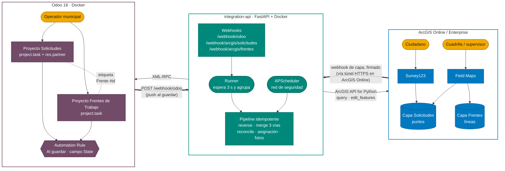
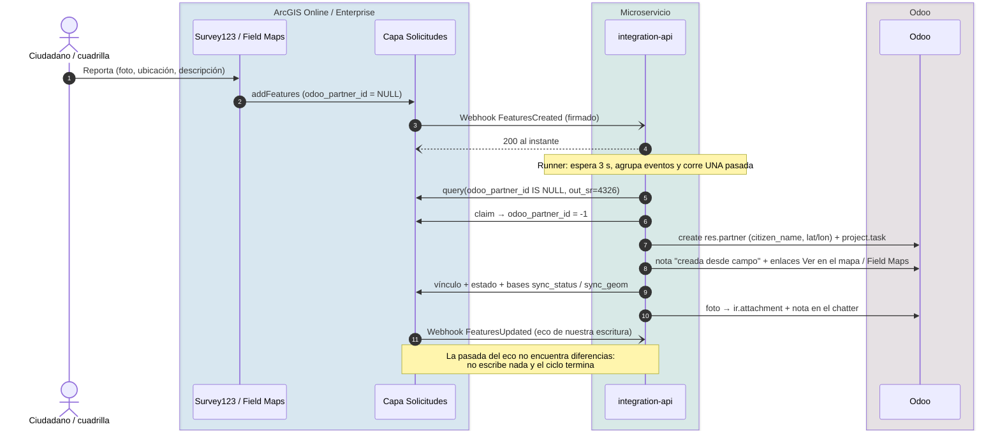
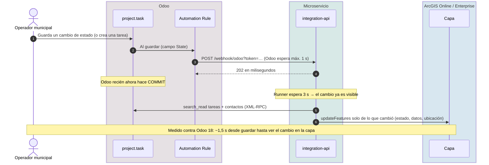
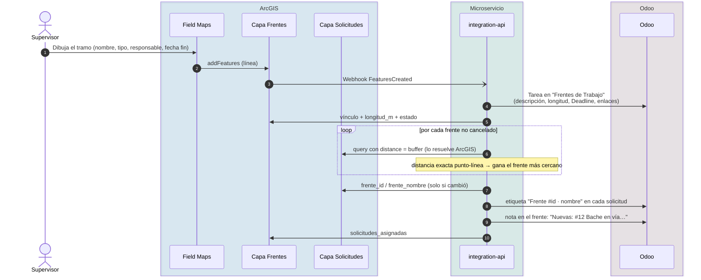

# Integración Odoo ↔ ArcGIS Online / Enterprise

Demo técnica de integración bidireccional entre **Odoo 18** (gestión de solicitudes ciudadanas y frentes de trabajo) y **ArcGIS Online / Enterprise** (mapa, **Survey123** para reportes ciudadanos y **ArcGIS Field Maps** para edición en campo), mediante un microservicio propio en **FastAPI**.

> **¿Quieres montarla desde cero?** Sigue la [sección 0 — paso a paso](#0-recrear-la-demo-desde-cero-paso-a-paso).

Qué muestra la demo:

- Un ciudadano reporta en Survey123 → la solicitud aparece en Odoo con su contacto, ubicación, foto y un enlace para abrirla en Field Maps.
- Una cuadrilla actualiza en Field Maps el estado, corrige la ubicación, deja observaciones y fotos → todo llega a la tarea de Odoo, con autor.
- Un supervisor dibuja en Field Maps un **frente de trabajo** (línea) → se crea en Odoo y las solicitudes cercanas quedan asignadas a ese frente por análisis espacial.
- Un operador cambia el estado en Odoo → el mapa se actualiza en ~1,5 s.

---

## Arquitectura


```mermaid
flowchart RL
    subgraph ODOO["Odoo 18 · Docker"]
        direction TB
        operador(["Operador municipal"])
        sol["Proyecto Solicitudes<br/>project.task + res.partner"]
        fre["Proyecto Frentes de Trabajo<br/>project.task"]
        rule{{"Automation Rule<br/>Al guardar · campo State"}}
        operador --> sol
        operador --> fre
        sol -. "etiqueta<br/>Frente #id" .- fre
        sol --> rule
        fre --> rule
    end

    subgraph API["integration-api · FastAPI + Docker"]
        direction TB
        hooks["Webhooks<br/>/webhook/odoo<br/>/webhook/arcgis/solicitudes<br/>/webhook/arcgis/frentes"]
        runner(["Runner<br/>espera 3 s y agrupa"])
        sched(["APScheduler<br/>red de seguridad"])
        pipe["Pipeline idempotente<br/>reverse · merge 3 vías<br/>reconcile · asignación · fotos"]
        hooks --> runner --> pipe
        sched --> pipe
    end

    subgraph ESRI["ArcGIS Online / Enterprise"]
        direction TB
        ciudadano(["Ciudadano"])
        cuadrilla(["Cuadrilla / supervisor"])
        s123["Survey123"]
        fm["Field Maps"]
        pts[("Capa Solicitudes<br/>puntos")]
        lin[("Capa Frentes<br/>líneas")]
        ciudadano --> s123 --> pts
        cuadrilla --> fm
        fm --> pts
        fm --> lin
    end

    ODOO == "POST /webhook/odoo<br/>(push al guardar)" ==> API
    API -- "XML-RPC" --> ODOO
    ESRI == "webhook de capa, firmado<br/>(vía túnel HTTPS en ArcGIS Online)" ==> API
    API -- "ArcGIS API for Python<br/>query · edit_features" --> ESRI

    classDef odoo fill:#714B67,stroke:#4a2f43,color:#ffffff
    classDef api fill:#00897B,stroke:#00564d,color:#ffffff
    classDef esri fill:#0079C1,stroke:#004f7e,color:#ffffff
    classDef actor fill:#F2A900,stroke:#a87500,color:#1a1a1a
    class sol,fre,rule odoo
    class hooks,runner,sched,pipe api
    class s123,fm,pts,lin esri
    class operador,ciudadano,cuadrilla actor
    style ODOO fill:transparent,stroke:#714B67,stroke-width:2px
    style API fill:transparent,stroke:#00897B,stroke-width:2px
    style ESRI fill:transparent,stroke:#0079C1,stroke-width:2px
```

- **Flechas gruesas:** avisos en tiempo real (*push*). Odoo avisa con una Automation Rule; ArcGIS avisa con el webhook nativo de cada capa.
- **Flechas finas:** llamadas que **siempre inicia `integration-api`** (XML-RPC a Odoo; ArcGIS API for Python a las capas).
- **Survey123 y Field Maps escriben directo en las capas**; nunca pasan por el microservicio. El webhook de la capa es lo que dispara la sincronización.
- **Túnel HTTPS:** ArcGIS Online está en la nube y no puede llamar a `localhost`; el microservicio necesita una URL pública HTTPS (sección 8.1).

> Los diagramas están en **Mermaid**. GitHub y GitLab los muestran de forma nativa. En VS Code se necesita la extensión *Markdown Preview Mermaid Support* (`bierner.markdown-mermaid`).

---

## 0. Recrear la demo desde cero (paso a paso)

Esta sección es la ruta completa, en orden. Las secciones 1 a 13 son la referencia detallada de cada paso.

**Tiempo estimado:** 1,5 a 2 horas la primera vez.

### Paso 0 — Qué necesitas antes de empezar

- [ ] PC con **Windows 10/11** (o Linux/macOS) con **Docker Desktop** instalado y corriendo.
- [ ] **Git** y **VS Code** (opcional, para editar el `.env`).
- [ ] Una **organización de ArcGIS Online** con un usuario que pueda crear contenido, webhooks y credenciales de desarrollador (rol *Administrador* o *Publicador* con esos privilegios), y licencias de **Survey123**, **Field Maps** y **Dashboards** (vienen con el tipo de usuario *Creator*).
- [ ] **ArcGIS Pro 3.x** (o un ArcGIS Notebook) para ejecutar el script de preparación de capas.
- [ ] Un celular con la app **ArcGIS Field Maps**.

### Paso 1 — Clonar el repositorio

```powershell
git clone <URL_DE_ESTE_REPO> C:\Github\IntegracionOdooArcGIS
cd C:\Github\IntegracionOdooArcGIS
```

Estructura esperada:

```
IntegracionOdooArcGIS/
├── docker-compose.yml          # Postgres + Odoo + integration-api + túnel
├── integration-api/            # microservicio FastAPI
│   ├── app/
│   ├── Dockerfile
│   ├── requirements.txt
│   └── .env.example            # plantilla de variables
├── scripts/setup_field_maps.py # prepara las capas en ArcGIS
└── Survey_Odoo.xlsx            # XLSForm de la encuesta ciudadana
```

### Paso 2 — Levantar Odoo

Si el repositorio no trae `docker-compose.yml`, créalo en la raíz con este contenido:

```yaml
services:
  db:
    image: postgres:15
    environment:
      POSTGRES_DB: postgres
      POSTGRES_USER: odoo
      POSTGRES_PASSWORD: odoo
    volumes:
      - odoo-db-data:/var/lib/postgresql/data
    networks: [backend]

  odoo:
    image: odoo:18.0
    depends_on: [db]
    environment:
      HOST: db
      USER: odoo
      PASSWORD: odoo
    ports:
      - "8069:8069"
    volumes:
      - odoo-web-data:/var/lib/odoo
    networks: [backend]

  integration-api:
    build: ./integration-api
    container_name: integration-api
    restart: unless-stopped
    env_file: ./integration-api/.env
    depends_on: [odoo]
    ports:
      - "8000:8000"
    networks: [backend]

  tunnel:
    image: cloudflare/cloudflared:latest
    command: tunnel --no-autoupdate --url http://integration-api:8000
    depends_on: [integration-api]
    networks: [backend]
    restart: unless-stopped

volumes:
  odoo-db-data:
  odoo-web-data:

networks:
  backend:
    driver: bridge
```

> Si en Windows ya tienes un PostgreSQL instalado en el puerto 5432, no hay conflicto: el contenedor `db` no publica puertos.

Levanta solo la base y Odoo:

```powershell
docker compose up -d db odoo
```

1. Abre **http://localhost:8069**.
2. Crea la base de datos:
   - Nombre: **`odoo_demo`**
   - Usuario y contraseña de administrador: los que pondrás en `ODOO_USERNAME` / `ODOO_PASSWORD`
   - Idioma: *Español*
   - *Datos de demostración*: **sin marcar**
3. Instala la aplicación **Proyecto** (*Apps → Proyecto → Activar*).
4. Activa el **modo desarrollador**: *Ajustes → Herramientas de desarrollador → Activar el modo desarrollador*.
5. En *Apps*, quita el filtro *Aplicaciones* e instala también:
   - **Automation Rules** (`base_automation`)
   - **Partners Geolocation** (`base_geolocalize`)

No hace falta crear proyectos: la integración crea *Solicitudes Ciudadanas* y *Frentes de Trabajo* la primera vez que los necesita.

### Paso 3 — Crear la encuesta y la capa de solicitudes (Survey123)

1. Instala **ArcGIS Survey123 Connect** o usa el sitio **survey123.arcgis.com** → *Crear una encuesta* → *Usar un XLSForm*.
2. Carga **`Survey_Odoo.xlsx`** y publica la encuesta. Survey123 crea la **capa de entidades alojada** de solicitudes, con los campos `name`, `citizen_name`, `address`, `city`, `phone`, `email`, `status`, `odoo_partner_id`, `latitude` y `longitude`.
3. En ArcGIS Online abre el item de esa **capa** (no el del formulario) y copia su id desde la URL `...item.html?id=<ID>`. Ese id es **`ARCGIS_FEATURE_LAYER_ITEM_ID`**.
4. Comparte la encuesta según el escenario: público para reportes ciudadanos, u organización.

### Paso 4 — Preparar las capas para Field Maps (script)

El script agrega a la capa de solicitudes:

- los campos `sync_*`, `observaciones` y `frente_*`;
- la lista de estados y los adjuntos;
- Sync, ChangeTracking y editor tracking.

Además crea la capa **Frentes de Trabajo** (líneas). Detalle en la sección 7.

Con ArcGIS Pro abierto y la sesión iniciada en tu organización, desde la raíz del repo:

```powershell
& "C:\Program Files\ArcGIS\Pro\bin\Python\envs\arcgispro-py3\python.exe" scripts\setup_field_maps.py --pro --solicitudes <ITEM_ID_SOLICITUDES> --crear-frentes --acelerar-webhooks
```

Al terminar imprime:

```
ARCGIS_FEATURE_LAYER_ITEM_ID=...
ARCGIS_WORKFRONT_LAYER_ITEM_ID=...   ← guárdalo
```

Todas las líneas deben salir `[OK]`. Sin ArcGIS Pro, usa la opción A de la sección 7 (ArcGIS Notebook).

### Paso 5 — Credenciales de App Authentication

La integración entra a ArcGIS con credenciales de aplicación, sin usuario ni contraseña, así que no le afecta el MFA.

1. ArcGIS Online → **Contenido → Nuevo elemento → Credenciales de desarrollador → OAuth 2.0 credentials**.
2. Copia el **Client ID** y el **Client Secret**.
3. En el item de las credenciales: **Configuración → Aplicación → Credenciales → Editar → Acceso a elementos → Conceder acceso a elementos específicos**. Marca **las dos capas** (solicitudes y Frentes de Trabajo).
4. Pulsa **Guardar**, y luego **Guardar** otra vez en la sección *Aplicación*.

> Si más adelante creas otra capa, también hay que agregarla aquí; si no, `/sync/run` devuelve errores `403`.

### Paso 6 — Mapa web y formularios de Field Maps

1. **Map Viewer** → agrega la capa de solicitudes y **Frentes de Trabajo**.
   - Renómbralas (por ejemplo *Solicitudes ciudadanas*).
   - Estilo de cada capa: **Tipos (símbolos únicos)** por `status`.
   - **Guarda** el mapa (por ejemplo *Operaciones de Campo*) y copia su id. Ese id es **`ARCGIS_WEBMAP_ID`**.
2. **Ventanas emergentes** de cada capa:
   - título `{name}` / `{nombre}`;
   - solo los campos útiles: quita `odoo_*`, `frente_id`, `latitude`, `longitude` y `sync_*`.
3. **Field Maps Designer → Formularios** (sección 9.2):
   - **Solicitudes**:
     - editables: *Estado* (desmarca *Include "no value" option*) y *Observaciones de campo*;
     - solo lectura (desmarca *Editable* en *Logic*): problema, dirección, ciudadano, teléfono, frente asignado.
   - **Frentes de Trabajo**:
     - editables: nombre (*Required*), tipo, responsable, estado, fechas, observaciones;
     - solo lectura: longitud y solicitudes asignadas.
   - Nunca pongas en el formulario `odoo_partner_id`, `odoo_task_id` ni `sync_*`.
4. Pestaña **Templates**:
   - Renombra *New Feature* de la capa de solicitudes (por ejemplo *Reporte de campo*), o bórrala si los reportes solo entran por Survey123.
   - La plantilla *Frente de trabajo* ya viene creada.

### Paso 7 — Configurar `integration-api/.env`

```powershell
copy integration-api\.env.example integration-api\.env
```

Completa como mínimo:

```env
ODOO_URL=http://odoo:8069
ODOO_DB=odoo_demo
ODOO_USERNAME=<usuario admin de Odoo>
ODOO_PASSWORD=<contraseña>
ODOO_PROJECT_NAME=Solicitudes Ciudadanas
ODOO_WORKFRONT_PROJECT_NAME=Frentes de Trabajo

ARCGIS_URL=https://www.arcgis.com
ARCGIS_CLIENT_ID=<paso 5>
ARCGIS_CLIENT_SECRET=<paso 5>
ARCGIS_FEATURE_LAYER_ITEM_ID=<paso 3>
ARCGIS_WORKFRONT_LAYER_ITEM_ID=<paso 4>
ARCGIS_WEBMAP_ID=<paso 6>

SYNC_INTERVAL_MINUTES=1
```

Las demás variables (claves de webhooks, `ARCGIS_ODOO_USERS`) son opcionales; ver sección 2.

### Paso 8 — Levantar la integración y el túnel

```powershell
docker compose up -d --build integration-api tunnel
docker compose logs integration-api --tail 30
curl -X POST http://localhost:8000/sync/run
```

`/sync/run` debe devolver `"ok": true` y `"errors": []`.

Obtén la URL pública del túnel:

```powershell
docker compose logs tunnel | Select-String trycloudflare
```

Pruébala en el navegador: `https://<algo>.trycloudflare.com/health` debe responder `{"status":"ok"}`.

> La URL del túnel **cambia cada vez que el contenedor `tunnel` se reinicia**. Si eso pasa, actualízala en los webhooks del paso 9.

### Paso 9 — Webhooks (tiempo real)

| Dónde | Configuración |
|---|---|
| Item de la capa de solicitudes → **Configuración → Webhooks → Crear webhook** | Nombre `integracion-odoo-solicitudes`. URL `https://<túnel>/webhook/arcgis/solicitudes`. Eventos: features creadas, actualizadas, eliminadas y adjuntos creados |
| Item **Frentes de Trabajo** → igual | Nombre `integracion-odoo-frentes`. URL `https://<túnel>/webhook/arcgis/frentes` |
| **survey123.arcgis.com** → encuesta → **Configuración → Webhooks → Agregar** | URL `https://<túnel>/webhook/survey123`. Evento *Nuevo registro enviado*. Sin *Portal info* ni *User info* |
| Odoo → **Ajustes → Técnico → Automatizaciones → Nuevo** | Modelo *Tarea*. Disparador *Al guardar*, campo *Estado*. Acción *Enviar notificación webhook* a `http://integration-api:8000/webhook/odoo` |

Si definiste `INTEGRATION_API_KEY`, agrega `?token=<clave>` a las URLs de Survey123 y de Odoo (sección 8).

### Paso 10 — Probar de punta a punta

Deja abierto el log en una terminal: `docker compose logs -f integration-api`.

1. **Survey123 → Odoo**
   - Envía un reporte con foto desde la encuesta.
   - En segundos aparece en **Proyecto → Solicitudes Ciudadanas**, con el ciudadano como contacto y la foto en el historial.
2. **Field Maps → Odoo**
   - En el celular abre el mapa, toca la solicitud → **Editar**.
   - Pon *Hecho*, agrega una observación y una foto → **Enviar**.
   - En 30 s a 2 min la tarea pasa a *Done* en Odoo, con las notas firmadas por tu usuario de ArcGIS.
3. **Odoo → ArcGIS**
   - Cambia el estado de una tarea en Odoo.
   - En pocos segundos el punto cambia de símbolo en el mapa.
4. **Frente de trabajo**
   - En Field Maps: **+** → *Frente de trabajo* → traza una línea a menos de 50 m de alguna solicitud → **Enviar**.
   - Aparece la tarea en *Frentes de Trabajo*.
   - Las solicitudes cercanas reciben la etiqueta *Frente #… · nombre* en Odoo y el campo *Frente de trabajo* en el mapa.
5. **(Opcional) ArcGIS Dashboards**
   - Crea un tablero sobre las dos capas: indicadores por estado, lista de solicitudes, mapa.
   - Se actualiza solo con cada cambio.

Si algo no llega, revisa la sección 12 (*Troubleshooting*).

### Checklist antes de presentar

- [ ] `docker compose ps` muestra `db`, `odoo`, `integration-api` y `tunnel` en *running*.
- [ ] La URL actual del túnel está en los dos webhooks de capa y en el de Survey123.
- [ ] `curl -X POST http://localhost:8000/sync/run` → `"errors": []`.
- [ ] Field Maps abre el mapa en el celular y la sesión de ArcGIS está iniciada.

---

## 1. Requisitos previos

- **Odoo 18** con los módulos `project`, `base_geolocalize` y `base_automation` (Automation Rules), y un usuario técnico con acceso a `project.task`, `res.partner`, `project.tags` e `ir.attachment`.
- **ArcGIS Online** o **ArcGIS Enterprise 11.x** con webhooks de feature layer. Las capas hosted necesitan *Mantener un registro de los cambios* (change tracking); el script de la sección 7 lo habilita.
- **ArcGIS Field Maps**: usuarios con un tipo de usuario que permita editar, y un mapa web con las dos capas (sección 9).
- **Guía completa en orden:** sección 0.
- **Survey123** (opcional) apuntando a la capa *Solicitudes*.
- **Docker** + Docker Compose.
- **Conectividad:** Con ArcGIS Online, se requiere una URL pública HTTPS para el microservicio (sección 8.1).
- **Compatibilidad Probada:** API desarrollada para FastAPI (0.100+), ArcGIS API for Python (2.x), y cliente Odoo XML-RPC estándar.

**Nota sobre persistencia local:** Si despliegas Odoo localmente mediante Docker para esta integración, asegúrate de mapear los volúmenes de PostgreSQL (`/var/lib/postgresql/data`) y Odoo (`/var/lib/odoo`) en tu `docker-compose.yml`. Esto evitará que pierdas la configuración de las Automation Rules y las credenciales al detener los contenedores.

---

## 2. Variables de entorno (`integration-api/.env`)

```env
# --- Odoo ---
ODOO_URL=http://odoo:8069
ODOO_DB=odoo_demo
ODOO_USERNAME=admin
ODOO_PASSWORD=************
ODOO_PROJECT_NAME=Solicitudes Ciudadanas
ODOO_WORKFRONT_PROJECT_NAME=Frentes de Trabajo

# --- ArcGIS ---
ARCGIS_URL=https://www.arcgis.com           # o la URL del portal de Enterprise
ARCGIS_VERIFY_CERT=true
# Opción recomendada: App Authentication (no le afecta el MFA)
ARCGIS_CLIENT_ID=************
ARCGIS_CLIENT_SECRET=************
# Opción alternativa: usuario y contraseña
# ARCGIS_USERNAME=usuario
# ARCGIS_PASSWORD=************
ARCGIS_FEATURE_LAYER_ITEM_ID=<item de la capa Solicitudes>
ARCGIS_WORKFRONT_LAYER_ITEM_ID=<item de la capa Frentes de Trabajo>
ARCGIS_WEBMAP_ID=<item del mapa web de Field Maps>    # opcional: enlaces en Odoo

# --- Webhooks ---
ARCGIS_WEBHOOK_SECRET=<la misma clave secreta configurada en ArcGIS>
INTEGRATION_API_KEY=<clave larga aleatoria>
WEBHOOK_DEBOUNCE_SECONDS=3
WEBHOOK_RECHECK_SECONDS=10,30,60

# --- Frentes de trabajo ---
WORKFRONT_BUFFER_M=50

# --- Autoría en Odoo (opcional, sección 9.3) ---
# usuario de ArcGIS = login o correo de su usuario en Odoo
ARCGIS_ODOO_USERS=jperez_muni=jperez@muni.gob.ec, mlopez_muni=mlopez@muni.gob.ec

# --- Red de seguridad (pasada completa periódica) ---
SYNC_INTERVAL_MINUTES=5
```

- Clave aleatoria: `python -c "import secrets; print(secrets.token_urlsafe(32))"`.
- `ARCGIS_WORKFRONT_LAYER_ITEM_ID` vacío = frentes desactivados (solo solicitudes).
- `ARCGIS_WEBHOOK_SECRET` vacío = no se verifica la firma.
- `INTEGRATION_API_KEY` vacío = `/sync/*` y `/webhook/odoo` quedan abiertos (el log lo advierte al arrancar). Definirla es obligatorio si la API se expone con un túnel.

> **Seguridad:** nunca commitear `.env`. Las credenciales que se hayan compartido en texto plano durante las pruebas deben rotarse antes de un despliegue en producción.

---

## 3. Despliegue Local

Para que la Automation Rule de Odoo pueda alcanzar a la API (`http://integration-api:8000/webhook/odoo`), ambos servicios deben compartir una red en Docker. 

Ejemplo de estructura en `docker-compose.yml`:

```yaml
services:
  odoo:
    image: odoo:18.0
    networks:
      - backend
    # ... (volúmenes y dependencias de db)

  integration-api:
    build: ./integration-api
    container_name: integration-api
    restart: unless-stopped
    env_file: ./integration-api/.env
    networks:
      - backend
    ports:
      - "8000:8000"

networks:
  backend:
    driver: bridge
```

Para levantar la integración:

```bash
docker compose up -d --build --force-recreate integration-api
docker compose logs -f integration-api
```

### Gotcha recurrente: `--force-recreate` sin `--build` no despliega el código

`docker compose up -d --force-recreate` recrea el **contenedor** con la **imagen ya existente**. Como el `Dockerfile` copia el código al construir la imagen, los `.py` editados no se aplican hasta reconstruirla. Síntomas típicos: un endpoint nuevo responde `404` aunque `/health` funcione, o un "fix" que no cambia nada. Siempre que cambie el código: `--build --force-recreate`.

El microservicio lee el esquema de las capas al arrancar: después de ejecutar el script de la sección 7, se vuelve a desplegar con el mismo comando.

---

## 4. Flujos

| Flujo | Qué lo dispara | Qué hace |
|---|---|---|
| Reporte nuevo desde campo → Odoo | Webhook de Survey123 al enviar (inmediato) y webhook de la capa (`FeaturesCreated`, por lotes) | Crea contacto + tarea, vincula la feature, publica observación y fotos |
| Odoo → ArcGIS | Automation Rule al guardar (campo *State*) | Actualiza la feature (solo lo que cambió); publica en el mapa las tareas nuevas con ubicación |
| Edición en campo → Odoo | Webhook de la capa (`FeaturesUpdated`, `Attachments*`) | Estado, ubicación, observaciones y fotos, con merge de tres vías |
| Frente de trabajo → Odoo | Webhook de la capa de frentes | Tarea en el proyecto *Frentes de Trabajo* + asignación de solicitudes por cercanía |
| Reconciliación | Cada pasada | Borra en ArcGIS las features cuya tarea ya no existe en Odoo |
| Red de seguridad | APScheduler cada `SYNC_INTERVAL_MINUTES` | Pasada completa por si se perdió algún webhook |

Todos los flujos ejecutan **la misma pasada idempotente** (`sync.run_pipeline`): `reverse → merge → reconcile → assign → attachments`. Los webhooks funcionan como un **timbre**: avisan que algo cambió, el microservicio responde al instante, espera `WEBHOOK_DEBOUNCE_SECONDS` (3 s), agrupa todos los avisos recibidos en ese lapso y corre **una** pasada. El contenido del webhook no se usa para escribir datos, así que un aviso duplicado, perdido o fuera de orden no puede corromper nada.

### 4.1. Reporte nuevo desde campo (Survey123 / Field Maps) → Odoo


```mermaid
sequenceDiagram
    autonumber
    actor C as Ciudadano / cuadrilla
    box rgba(0,121,193,0.12) ArcGIS Online / Enterprise
        participant F as Survey123 / Field Maps
        participant L as Capa Solicitudes
    end
    box rgba(0,137,123,0.12) Microservicio
        participant API as integration-api
    end
    box rgba(113,75,103,0.12) Odoo
        participant O as Odoo
    end

    C->>F: Reporta (foto, ubicación, descripción)
    F->>L: addFeatures (odoo_partner_id = NULL)
    L-)API: Webhook FeaturesCreated (firmado)
    API--)L: 200 al instante
    Note over API: Runner: espera 3 s, agrupa eventos y corre UNA pasada
    API->>L: query(odoo_partner_id IS NULL, out_sr=4326)
    API->>L: claim → odoo_partner_id = -1
    API->>O: create res.partner (citizen_name, lat/lon) + project.task
    API->>O: nota "creada desde campo" + enlaces Ver en el mapa / Field Maps
    API->>L: vínculo + estado + bases sync_status / sync_geom
    API->>O: foto → ir.attachment + nota en el chatter
    L-)API: Webhook FeaturesUpdated (eco de nuestra escritura)
    Note over API,L: La pasada del eco no encuentra diferencias:<br/>no escribe nada y el ciclo termina
```

### 4.2. Odoo → ArcGIS (cambio de estado o tarea nueva)


```mermaid
sequenceDiagram
    autonumber
    actor Op as Operador municipal
    box rgba(113,75,103,0.12) Odoo
        participant O as project.task
        participant R as Automation Rule
    end
    box rgba(0,137,123,0.12) Microservicio
        participant API as integration-api
    end
    box rgba(0,121,193,0.12) ArcGIS Online / Enterprise
        participant L as Capa
    end

    Op->>O: Guarda un cambio de estado (o crea una tarea)
    O->>R: Al guardar (campo State)
    R->>API: POST /webhook/odoo?token=… (Odoo espera máx. 1 s)
    API-->>R: 202 en milisegundos
    Note over O: Odoo recién ahora hace COMMIT
    Note over API: Runner espera 3 s → el cambio ya es visible
    API->>O: search_read tareas + contactos (XML-RPC)
    API->>L: updateFeatures solo de lo que cambió (estado, datos, ubicación)
    Note over Op,L: Medido contra Odoo 18: ~1,5 s desde guardar hasta ver el cambio en la capa
```

Odoo ejecuta la acción *Enviar notificación webhook* **dentro de la transacción, antes del commit**, con un timeout de 1 s. Si el microservicio lee Odoo en ese mismo instante, obtiene el estado **anterior**. Por eso `/webhook/odoo` responde `202` en milisegundos y la pasada corre 3 s después, cuando el cambio ya está confirmado.

### 4.3. Edición en campo → Odoo (estado, ubicación, observaciones, fotos)


```mermaid
sequenceDiagram
    autonumber
    actor Q as Cuadrilla
    box rgba(0,121,193,0.12) ArcGIS
        participant FM as Field Maps
        participant L as Capa
    end
    box rgba(0,137,123,0.12) Microservicio
        participant API as integration-api
    end
    box rgba(113,75,103,0.12) Odoo
        participant O as Odoo
    end

    Q->>FM: Cambia estado a "Hecho", mueve el punto,<br/>escribe observación, toma foto
    FM->>L: applyEdits (EditDate, Editor)
    L-)API: Webhook FeaturesUpdated / AttachmentsCreated
    Note over API: Merge de tres vías por dato:<br/>valor en ArcGIS · valor en Odoo · base sync_*
    API->>O: state = 1_done + nota "Estado actualizado en campo (por jperez)"
    API->>O: res.partner lat/lon + nota "Ubicación corregida en campo"
    API->>O: nota "Observación de campo"
    API->>O: ir.attachment (foto) + nota con adjunto
    API->>L: bases al día (sync_status, sync_geom, sync_obs)
    O-)API: Automation Rule (cambió el estado) → pasada sin diferencias
```

### 4.4. Frentes de trabajo y asignación por cercanía


```mermaid
sequenceDiagram
    autonumber
    actor S as Supervisor
    box rgba(0,121,193,0.12) ArcGIS
        participant FM as Field Maps
        participant LN as Capa Frentes
        participant PT as Capa Solicitudes
    end
    box rgba(0,137,123,0.12) Microservicio
        participant API as integration-api
    end
    box rgba(113,75,103,0.12) Odoo
        participant O as Odoo
    end

    S->>FM: Dibuja el tramo (nombre, tipo, responsable, fecha fin)
    FM->>LN: addFeatures (línea)
    LN-)API: Webhook FeaturesCreated
    API->>O: Tarea en "Frentes de Trabajo"<br/>(descripción, longitud, Deadline, enlaces)
    API->>LN: vínculo + longitud_m + estado
    loop por cada frente no cancelado
        API->>PT: query con distance = buffer (lo resuelve ArcGIS)
        Note over API: distancia exacta punto-línea → gana el frente más cercano
    end
    API->>PT: frente_id / frente_nombre (solo si cambió)
    API->>O: etiqueta "Frente #35;id · nombre" en cada solicitud
    API->>O: nota en el frente: "Nuevas: #35;12 Bache en vía…"
    API->>LN: solicitudes_asignadas
```

Cada solicitud se asigna al frente **no cancelado** más cercano dentro de `WORKFRONT_BUFFER_M` metros (50 por defecto). ArcGIS resuelve la consulta de candidatos (parámetros `distance`/`units` de la query) y el microservicio calcula la distancia exacta punto-línea para elegir el más cercano.

---

## 5. Modelo de datos

La columna **Manda** indica qué lado es dueño de cada dato: **Odoo**, **campo** (ArcGIS), **compartido** (merge de tres vías), **calculado** (lo escribe la integración) o **sistema** (oculto, uso interno).

### 5.1. Capa *Solicitudes* (puntos)

| Campo | Tipo | Manda | Uso |
|---|---|---|---|
| `odoo_partner_id` | Entero | sistema | id de la `project.task` (nombre histórico del campo) |
| `name` | Texto | Odoo | descripción del problema = título de la tarea |
| `citizen_name`, `address`, `city`, `phone`, `email` | Texto | Odoo | datos del ciudadano (`res.partner`) |
| `status` | Texto + lista | compartido | `project.task.state` (código = etiqueta de Odoo; se ve en español) |
| geometría | Punto | compartido | `res.partner.partner_latitude/longitude` |
| `latitude`, `longitude` | Doble | calculado | copia de la geometría |
| `observaciones` | Texto (1000) | campo | cada texto nuevo → nota en el chatter |
| adjuntos | Fotos / archivos | campo | → `ir.attachment` de la tarea + nota |
| `frente_id`, `frente_nombre` | Entero / Texto | calculado | frente de trabajo asignado |
| `sync_status`, `sync_geom`, `sync_obs` | Texto | sistema | base del merge de tres vías |

### 5.2. Capa *Frentes de Trabajo* (líneas)

| Campo | Tipo | Manda | Uso |
|---|---|---|---|
| `odoo_task_id` | Entero | sistema | id de la `project.task` en *Frentes de Trabajo* |
| `nombre` | Texto | campo | título de la tarea |
| `tipo_trabajo` | Texto + lista | campo | Bacheo, Alcantarillado, Agua potable, … |
| `responsable` | Texto | campo | cuadrilla / encargado |
| `fecha_inicio`, `fecha_fin` | Fecha | campo | `fecha_fin` → *Deadline* de la tarea |
| `status` | Texto + lista | compartido | `project.task.state` |
| geometría | Línea | campo | longitud en la descripción + asignación |
| `observaciones`, adjuntos | — | campo | notas y adjuntos de la tarea |
| `longitud_m`, `solicitudes_asignadas` | Doble / Entero | calculado | se muestran en el popup |
| `sync_status`, `sync_fp`, `sync_obs` | Texto | sistema | base del merge |

### 5.3. Del lado de Odoo

- **Solicitud** = `project.task` en *Solicitudes Ciudadanas*, con un `res.partner` (ciudadano + geolocalización, módulo `base_geolocalize`).
- **Frente** = `project.task` en *Frentes de Trabajo* (sin contacto; el trazado vive en ArcGIS).
- **Asignación** = etiqueta `Frente #<id> · <nombre>` (`project.tags`) en la tarea de la solicitud. En el Kanban de solicitudes: *Agrupar por → Etiquetas*.
- **Chatter** (notas internas, con autor de campo cuando hay editor tracking): estado actualizado en campo, ubicación corregida, observación de campo, adjunto de campo, solicitudes asignadas por cercanía, valor rechazado.

### 5.4. `state` vs `stage_id`

La integración usa **`state`** (el código interno del Selection, no la columna del Kanban `stage_id`). Las etiquetas se resuelven con `fields_get(["state"], ["selection"])`. El estado `04_waiting_normal` lo calcula Odoo por dependencias, por lo que la integración nunca lo escribe y ArcGIS no lo ofrece.

---

## 6. Consistencia de datos

### 6.1. Merge de tres vías


```mermaid
flowchart TD
    A{"¿Valor en ArcGIS =<br/>valor en Odoo?"} -- sí --> N["Nada que sincronizar<br/>(solo se actualiza la base si hace falta)"]
    A -- no --> B{"¿Hay base sync_*?"}
    B -- no --> OD1["Manda Odoo<br/>(valor por defecto)"]
    B -- sí --> C{"¿Qué lado cambió<br/>respecto a la base?"}
    C -- solo ArcGIS --> AO["ArcGIS → Odoo"]
    C -- solo Odoo --> OA["Odoo → ArcGIS"]
    C -- ambos --> D{"¿Quién editó último?<br/>EditDate vs write_date"}
    D -- ArcGIS --> AO
    D -- "Odoo, o sin editor tracking" --> OA
    AO --> V{"¿Odoo acepta el valor?"}
    V -- sí --> OK["Se escribe en Odoo + nota en el chatter"]
    V -- "no (vacío, 'Waiting', texto libre)" --> REV["Se revierte en ArcGIS + nota explicando"]

    classDef odoo fill:#714B67,stroke:#4a2f43,color:#ffffff
    classDef esri fill:#0079C1,stroke:#004f7e,color:#ffffff
    classDef ok fill:#00897B,stroke:#00564d,color:#ffffff
    class OA,OD1,REV odoo
    class AO esri
    class OK,N ok
```

Para cada dato compartido se comparan tres valores: ArcGIS, Odoo y la **base** (los campos `sync_*` de la feature). Así se sabe **qué lado cambió** sin depender de relojes. 

- Si solo cambió ArcGIS → se escribe en Odoo.
- Si solo cambió Odoo → se escribe en ArcGIS.
- Si cambiaron ambos (conflicto) → gana el que editó último (`EditDate` vs `write_date`).

Al guardar la base en la propia feature, **el microservicio no guarda estado**: se puede reiniciar o redesplegar sin perder contexto.

### 6.2. Idempotencia de altas (claim / release)

Antes de crear la tarea de una feature nueva, se escribe `-1` en su campo de enlace (claim). Una pasada solapada ya no la ve como "sin vincular" y no crea una segunda tarea. Si Odoo falla, el claim se libera (`NULL`) para reintentar.

### 6.3. Webhooks como timbre

Esta integración no usa la `changesUrl` de ArcGIS. El webhook solo indica que algo cambió y se ejecuta la pasada completa. Ventajas: no hay que guardar estados en el servidor; un webhook perdido lo recupera el scheduler; uno duplicado solo provoca una pasada sin cambios. 

---

## 7. Preparar las capas (`scripts/setup_field_maps.py`)

Se ejecuta **una sola vez**. Es idempotente: si se vuelve a correr, solo agrega lo que falte y reutiliza la capa *Frentes de Trabajo* si ya existe. 

1. **Capa Solicitudes**: agrega campos `sync_*`, frente_id, observaciones, lista de valores de `status` y habilita adjuntos.
2. **Capa Frentes de Trabajo**: la crea (líneas) o completa una existente.
3. **Ambos servicios**: habilita *Sync* + *ChangeTracking* y editor tracking.

**Opción A — ArcGIS Notebook (Recomendada con MFA):**
1. ArcGIS Online → **Notebook → Nuevo notebook → Estándar**.
2. Pegar **todo** el contenido de `scripts/setup_field_maps.py` y ejecutar la celda.
3. En otra celda:
```python
from arcgis.gis import GIS
gis = GIS("home")
preparar(gis, solicitudes_item_id="<ITEM_ID_SOLICITUDES>", crear_frentes=True)
acelerar_webhooks(gis, "<ITEM_ID_SOLICITUDES>")   # verifica que el webhook se envíe cada 30 s
```

**Opción B — VS Code / PowerShell con ArcGIS Pro (Funciona con MFA):**
Desde la raíz del repo, con ArcGIS Pro abierto y sesión iniciada:
```powershell
& "C:\Program Files\ArcGIS\Pro\bin\Python\envs\arcgispro-py3\python.exe" scripts\setup_field_maps.py --pro --crear-frentes --acelerar-webhooks
```

**Opción C — Usuario y contraseña (ArcGIS Enterprise o sin MFA):**
```bash
python scripts/setup_field_maps.py --user <usuario> --solicitudes <ITEM_ID_SOLICITUDES> --crear-frentes
```

**Importante:** Si `integration-api` usa **App Authentication**, la credencial solo lee items privados en su lista de acceso. Debes agregar el nuevo item de *Frentes de Trabajo* a las credenciales OAuth en ArcGIS Online (Configuración → Aplicación → Credenciales → Editar → Acceso a elementos) y reiniciar el contenedor.

---

## 8. Webhooks y Túneles (Tiempo real)

### 8.1. URL pública del microservicio (ArcGIS Online)

ArcGIS Online exige que el receptor sea HTTPS. Para desarrollo/demo puedes usar Cloudflare agregándolo al `docker-compose.yml`:

```yaml
  tunnel:
    image: cloudflare/cloudflared:latest
    command: tunnel --no-autoupdate --url http://integration-api:8000
    depends_on:
      - integration-api
    networks:
      - backend
```

```powershell
docker compose logs tunnel | Select-String trycloudflare   # URL https://<algo>.trycloudflare.com
```

**Nota para desarrollo continuo:** La URL del túnel rápido cambia en cada reinicio. Para evitar actualizar el webhook constantemente durante el desarrollo, usa un dominio estático gratuito de **ngrok** o un token autenticado de Cloudflare (`cloudflared tunnel run <token>`).

### 8.2. Webhook en cada capa (ArcGIS → integración)

En la página del item de **cada** capa: **Configuración → Webhooks → Crear webhook**.

| Campo | Capa Solicitudes | Capa Frentes de Trabajo |
|---|---|---|
| Name | `integracion-odoo-solicitudes` | `integracion-odoo-frentes` |
| Events | *Features created, updated, deleted, Attachments created* | igual |
| Payload URL | `https://<túnel>/webhook/arcgis/solicitudes` | `https://<túnel>/webhook/arcgis/frentes` |
| Secret | `ARCGIS_WEBHOOK_SECRET` si está definido | igual |

### 8.3. Webhook de Survey123 (Reportes inmediatos)

ArcGIS envía los webhooks de capa por lotes (mínimo 30s). Para que los reportes lleguen al instante, Survey123 tiene su propio webhook. En **survey123.arcgis.com** → encuesta → Configuración → Webhooks:

- URL de carga: `https://<túnel>/webhook/survey123?token=<INTEGRATION_API_KEY>`
- Eventos: *Nuevo registro enviado* (y editado, si aplica).

### 8.4. Automation Rule de Odoo (Odoo → integración)

En Odoo (modo desarrollador): *Ajustes → Técnico → Automatizaciones → Nuevo*:
1. **Modelo:** *Tarea* (`project.task`).
2. **Disparador:** *Al guardar* (*On save*).
3. **Campos disparadores:** *Estado* (`state`).
4. **Acción:** *Enviar notificación webhook*, URL `http://integration-api:8000/webhook/odoo?token=<INTEGRATION_API_KEY>`.

---

## 9. Field Maps

### 9.1. Mapa web
Agrega las capas *Solicitudes* y *Frentes de Trabajo* al Map Viewer. Configura los estilos por el campo `status` para ver los cambios de estado visualmente. Guarda el mapa y copia su ID en `ARCGIS_WEBMAP_ID` para activar los enlaces directos en Odoo.

### 9.2. Formularios (Field Maps Designer)
- **Solicitudes:** `status`, `observaciones` y fotos (Editables). Datos de Odoo (Solo lectura al crear).
- **Frentes:** `nombre`, `tipo`, `responsable`, fechas (Editables). `longitud_m`, `solicitudes_asignadas` (Solo lectura).

### 9.3. Quién aparece en Odoo (autoría)
El historial (chatter) de la tarea firma las ediciones con el usuario de ArcGIS. Si el usuario de ArcGIS coincide con un login/correo en Odoo (o está mapeado en `ARCGIS_ODOO_USERS`), se enlaza directamente. Si no, se crea un contacto referencial "arcgis:<usuario>".

---

## 10. Endpoints

| Método | Ruta | Uso |
|---|---|---|
| `GET` | `/health` | healthcheck |
| `GET` | `/status` | runner (en curso / pendientes) + última pasada |
| `POST` | `/sync/run` | pasada completa, devuelve el resumen (`X-API-Key`) |
| `GET` | `/sync/last` | resumen de la última pasada |
| `POST` | `/webhook/odoo?token=…` | Automation Rule de Odoo; responde `202` |
| `GET`/`POST` | `/webhook/arcgis/solicitudes` | webhook de la capa de puntos (firma HMAC) |
| `GET`/`POST` | `/webhook/arcgis/frentes` | webhook de la capa de líneas (firma HMAC) |
| `GET`/`POST` | `/webhook/survey123?token=…` | webhook propio de Survey123 (inmediato) |

---

## 11. Survey123 / XLSForm

El archivo `Survey_Odoo.xlsx` es el XLSForm para apuntar a la capa *Solicitudes*.
- **Cuidado:** Si combinas un XLSForm propio con la plantilla que genera Survey123 Connect, cópialo **por nombre de columna, nunca por posición**. Copiar por posición produce el error *Duplicate column header: instance_name*.

---

## 12. Troubleshooting

| Síntoma | Causa | Solución |
|---|---|---|
| Las mismas features se actualizan en **cada** pasada | Un campo de la capa tiene distinto tipo de dato que en Odoo (ej. `phone` entero pierde el 0 inicial) | Usar tipo Texto en ArcGIS para mantener paridad. |
| El registro aparece recién con el scheduler | ArcGIS avisó antes de que el registro fuera visible en consultas | Los re-chequeos (`WEBHOOK_RECHECK_SECONDS=10,30,60`) capturan el cambio. Si tarda más, sube el límite. |
| Log de Odoo: `Posting HTML message using body_is_html=True` | Aviso inofensivo de Odoo 17/18 al publicar notas XML-RPC | Ignorar. |
| Coordenadas absurdas (`lat ≈ -20000`) | Geometría leída en Web Mercator | Todas las consultas usan `out_sr=4326`; la pasada corrige coordenadas en Odoo. |
| `/sync/run`: `403 You do not have permissions…` | La credencial App Authentication no tiene el item nuevo autorizado | Agregarlo en *Acceso a elementos* de las credenciales OAuth y reiniciar contenedor. |
| *Duplicate column header: instance_name* | XLSForm combinado por posición | Copiar estrictamente por nombre de columna (sección 11). |

---

## 13. Seguridad

- Nunca commitear `.env`.
- Con la API expuesta por túnel: definir `INTEGRATION_API_KEY` (protege endpoints manuales y webhook Odoo) y `ARCGIS_WEBHOOK_SECRET` (firma HMAC-SHA256).
- Preferir **App Authentication** en ArcGIS para evitar bloqueos por MFA.
- El contenido de los webhooks nunca se usa para escribir datos; un webhook falso solo provoca una pasada de lectura que se detiene por falta de diferencias.